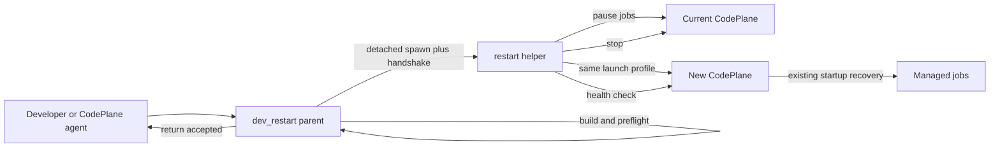
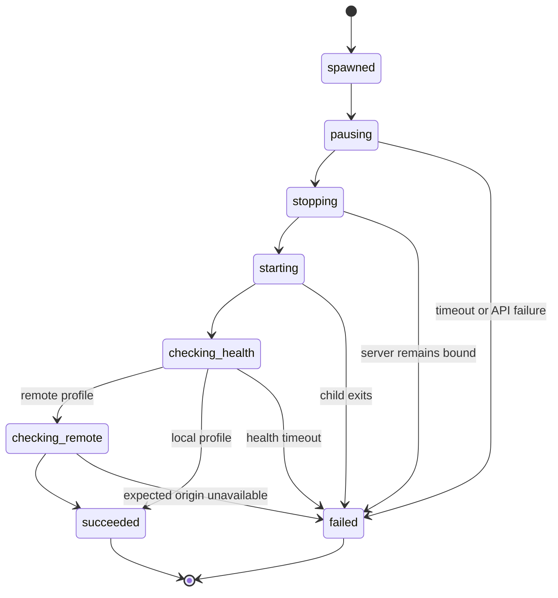

# Architecture Spine: CodePlane Developer Restart

## Design Paradigm

CodePlane developer restart uses a **detached restart helper**.

The invoking process builds and validates first, then starts a helper that is outside the server and agent process groups. The helper pauses jobs, stops CodePlane, restarts the same launch profile, checks health, and exits. Temporary remote disconnection and manual developer recovery are accepted.



## Inherited Invariants

| Inherited | From parent | Binds here |
| --- | --- | --- |
| Local autonomy | Existing CodePlane architecture | No hosted service or Kubernetes dependency. |
| SQLite job state | Existing restart recovery | Running jobs retain their current state for startup recovery. |
| OS-user trust | Existing local mode | This is developer tooling under the logged-in user, not a sandbox boundary. |
| Existing tunnel security | SPEC sections 7 and 21 | Remote restart preserves configured authentication sources but adds no new remote control API. |

## Invariants and Rules

### AD-1: The helper survives the processes it restarts

- **Binds:** Parent script, helper spawn, server stop.
- **Prevents:** The initiating agent or CodePlane shutdown terminating the restart coordinator.
- **Rule:** The parent computes and opens the absolute restart-log path once, then starts the helper in a new OS session/process group with stdin detached and stdout/stderr bound to that inherited log handle. POSIX uses `start_new_session`; Windows uses `DETACHED_PROCESS | CREATE_NEW_PROCESS_GROUP` with no inherited handles except the explicit log handle. The parent returns only after a started marker proves the helper adopted the request. Server shutdown targets only the server-owned PID/process group and cannot include the helper.

### AD-2: Remote interruption is expected

- **Binds:** Browser, SSE, MCP, and managed tunnels.
- **Prevents:** Accidental promises of uninterrupted remote supervision.
- **Rule:** Remote connections may fail from server stop until health returns. No status gateway or reconnect protocol is added. The helper restarts the same remote provider and stable configured tunnel identity when available. A random or non-reusable tunnel is warned before helper spawn and may return at a different origin.

### AD-3: Adoption is the only acceptance boundary

- **Binds:** Parent/helper handoff.
- **Prevents:** Reporting success before any process remains capable of restarting CodePlane.
- **Rule:** The parent atomically writes `<id>.pending.json` and spawns the helper with that exact path. After acquiring the restart lock, the helper writes its PID and process creation time into the request and atomically renames it to `<id>.claimed.json`, then creates `<id>.started.json`. Parent success means only `helper adopted request`, not `server restarted`. Stale request files are never auto-executed.

### AD-4: Helper phases are bounded diagnostics

- **Binds:** Helper sequencing and logs.
- **Prevents:** Indefinite waits and ambiguous local diagnosis.
- **Rule:** The helper logs only `spawned`, `pausing`, `stopping`, `starting`, `checking_health`, `checking_remote`, `succeeded`, or `failed`. Job-list failure aborts before any pause is sent. After the first pause request, individual pause failures are logged and restart continues so a partially paused server is never left serving indefinitely. Stop completes only when the old process identity is absent and the port has no listener. Success requires a request-specific readiness marker containing the new PID after startup recovery and deferred remote validation, plus that PID owning the configured port. Each wait has an explicit timeout. Phase data is local diagnostic evidence, not product state.



### AD-5: Restart preserves the active launch profile

- **Binds:** `cpl up`, parent request, helper start.
- **Prevents:** Restart silently dropping runtime options or applying code from an unintended checkout.
- **Rule:** `cpl up` atomically records a secret-free active launch profile containing executable, working directory, host, port, dev flag, remote flag, provider, tunnel ownership (`managed` or `external`), stable tunnel identity, started PID, process creation time, and closed secret-source records. Secret-source kind is exactly `not_required`, `resolvable`, or `unreplayable`; a required `unreplayable` source or failed resolution always refuses restart. The restart request separately names a native target CodePlane source root, defaulting to the repository containing the invoked `dev_restart.py`. Profile validity requires the recorded process identity to own the configured listener. Preflight runs the recorded native executable and target compile/import command from that source. The helper combines recorded runtime options with the validated target source. Operating-system branching exists only for native process detachment and PID handling.

### AD-6: Build failure never stops the current server

- **Binds:** Frontend build and backend preflight.
- **Prevents:** A development compile error creating an avoidable outage.
- **Rule:** The parent completes frontend build and lightweight backend import/compile preflight before spawning the helper. Failure exits nonzero and leaves CodePlane running. There is no generation staging or rollback. Failure after the helper stops CodePlane is logged and requires a developer to recover from an independent terminal.

### AD-7: Detach before pausing any job

- **Binds:** Initiating job and startup recovery.
- **Prevents:** Self-pause interrupting the only restart coordinator.
- **Rule:** Only the adopted helper sends pause requests. It first retrieves the complete running-job list; list failure aborts before any job is paused. It then sends every pause request, records individual failures without aborting, waits the configured grace period, and proceeds to stop so partial pause cannot strand jobs. Existing startup recovery handles managed jobs left `running`; the helper never sends duplicate resume requests. Existing plan-mode `waiting_for_approval` failure behavior remains an accepted limitation.

### AD-8: Stable remote origin is best effort

- **Binds:** Dev Tunnel and Cloudflare relaunch.
- **Prevents:** Treating a development convenience as an availability guarantee.
- **Rule:** Tunnel ownership is explicit. `managed` means the new `cpl up` starts the recorded provider identity and owns that connector process; `external` means it never scans for a process and instead probes the exact recorded hostname. A named Dev Tunnel or fixed Cloudflare hostname is reused. The helper performs `checking_remote` after local readiness. For a reusable tunnel it probes the recorded origin. Otherwise the parent warns that the origin may change, and the helper waits for the replacement run profile to publish the new origin, logs the change, and probes that origin.

### AD-9: This is not a product API

- **Binds:** Trigger and authorization.
- **Prevents:** Expanding internal tooling into a supported remote lifecycle surface.
- **Rule:** No REST route, MCP tool, frontend control, lifecycle database, or new authorization model is added. The command runs only after an explicit developer instruction, either directly in a terminal or through the existing authorized shell/tool execution of a managed agent.

### AD-10: Local files are diagnostic, not orchestration state

- **Binds:** Request, marker, lock, and log files.
- **Prevents:** Stale files unexpectedly executing work or becoming a second application database.
- **Rule:** `restart.lock` is a JSON file created with `O_CREAT | O_EXCL` and records request ID, helper PID, process creation time, and creation timestamp. A later invocation removes it only when that exact PID plus creation-time identity is absent. The request is consumed only by the helper PID spawned for it. The exact pending, claimed, and started filenames prove handoff state. Nothing scans and executes abandoned requests on startup.

### AD-11: Manual recovery is the final boundary

- **Binds:** Helper failure and helper updates.
- **Prevents:** Recursive infrastructure for a developer-only command.
- **Rule:** The helper does not update or restart itself. If it cannot start CodePlane or verify health, it logs the exact launch command and exits nonzero. A developer uses an independent terminal to recover.

### AD-12: Evidence stays local and secret-free

- **Binds:** Logging and diagnostics.
- **Prevents:** Lost failure evidence and credential leakage.
- **Rule:** The parent resolves `~/.codeplane/logs/dev-restart.log` to one absolute path, opens it, and passes the handle to the helper; the helper never recomputes the path from its environment. Log entries contain timestamp, helper PID, server PID when known, host, port, phase, exit code, and redacted error. They never contain passwords, tunnel tokens, cookies, authorization headers, or the full environment. No domain events or audit records are introduced.

## Consistency Conventions

| Concern | Convention |
| --- | --- |
| Request ID | UUID used only to correlate request, marker, and log lines. |
| Launch source | Explicit native path, defaulting to the invoking CodePlane worktree and validated with the recorded executable. |
| Process ownership | Exact spawned PID/process handle; process-name scans are not ownership. |
| Stop completion | Old PID plus creation time absent, and configured port has no listener. |
| Start completion | Request-specific readiness marker names the new PID, and that PID owns the configured port. |
| Timeouts | Explicit CLI defaults, logged before work begins, overridable by developer flags. |
| Failure | Nonzero helper exit plus local log; no success-shaped fallback. |
| Secrets | References only in launch profile and request; values are re-resolved by normal CodePlane startup. |

## Structural Seed

```text
tools/
  dev_restart.py        # Parent mode plus private --helper mode
backend/
  cli.py                # Writes active launch profile during cpl up
  services/runtime/     # Existing pause and startup recovery
~/.codeplane/
  run.json              # Secret-free active launch profile
  dev-restart/
    restart.lock        # Create-exclusive single-helper lock
    <request-id>.pending.json
    <request-id>.claimed.json
    <request-id>.started.json
    <request-id>.ready.json
  logs/
    dev-restart.log
```

## Assumptions Requiring User Correction

| Assumption | Consequence |
| --- | --- |
| Only CodePlane developers use this command. | No product API, durable operation, remote progress UI, or rollback. |
| Temporary remote disconnection is acceptable. | Browser and MCP users reconnect manually. |
| Manual local recovery is acceptable after failure. | The helper logs a reproducible launch command but does not install a service manager. |
| One restart runs at a time. | A create-exclusive lock rejects concurrency rather than queues it. |

## Deferred

- Exact cross-platform detachment flags are an implementation detail gated by tests proving helper survival after both agent interruption and server process-group termination.
- Exact backend preflight commands are implementation details; they must finish before helper spawn and may not mutate runtime state.
- UI restart controls, remote progress reporting, rollback, package activation, and supervisor installation are explicitly out of scope.
