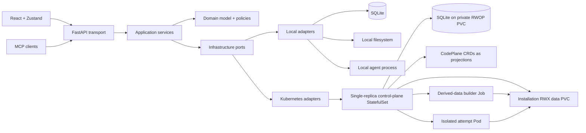
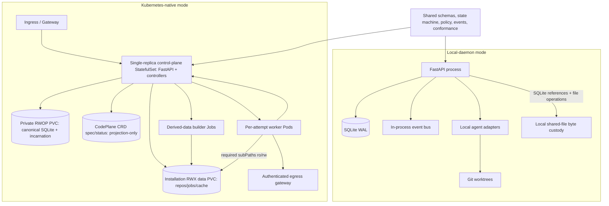
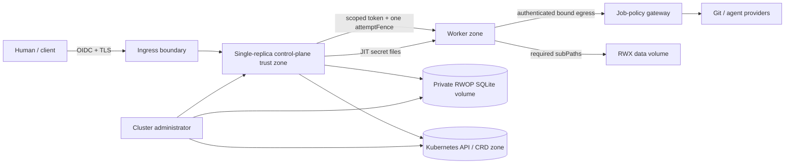
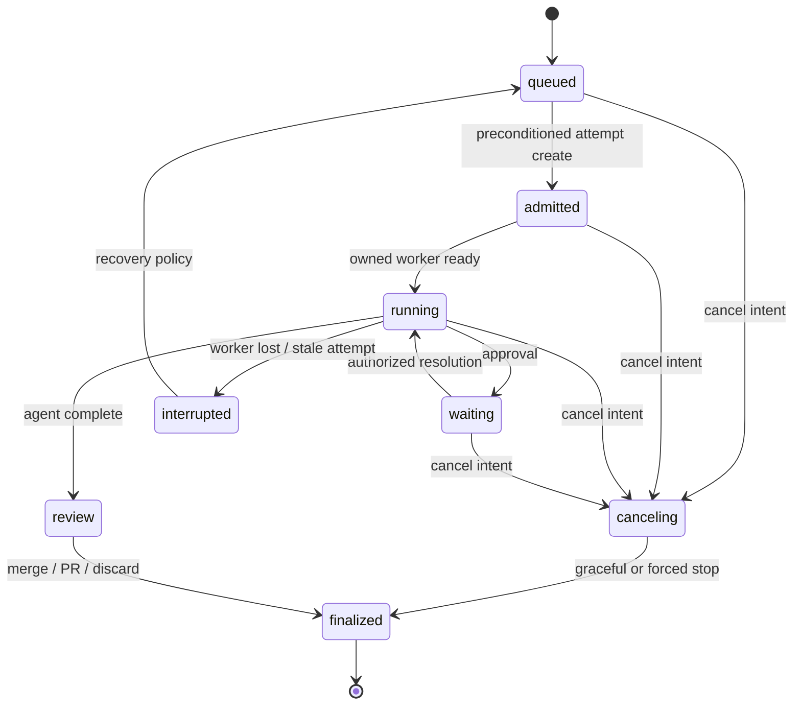

# Architecture Spine — CodePlane Kubernetes-Native and Local-Daemon

## Design Paradigm

CodePlane is a **ports-and-adapters modular control plane with a durable event log and an isolated execution plane**.

- `backend/api` is the inbound REST/SSE/MCP/terminal transport layer.
- `backend/services` owns mode-independent product orchestration and policy.
- `backend/models` owns canonical state, TraceForge events, and API contracts.
- `backend/persistence` implements persistence ports; services do not use database sessions directly.
- `backend/services/adapters` and `backend/services/git` isolate agent, platform, workspace, and Git mechanics.
- The frontend remains a generated-contract React client whose authoritative job state is held in Zustand and updated through one SSE dispatcher.
- Local-daemon composes local adapters in one process. Kubernetes composes the same ports behind one single-replica control-plane and moves agent execution into per-attempt worker Pods.



## Control-Plane / Execution-Plane Boundary

The control plane accepts commands, authorizes them, owns canonical state in SQLite, schedules work, records history, serves queries, and mediates operator interaction. The execution plane owns one job attempt's agent process, private workspace, tool execution, and heartbeat. It may request decisions but cannot mutate authoritative state, approve actions, resolve jobs, or publish directly to clients except through the authenticated worker protocol.

```mermaid
sequenceDiagram
    participant C as Client
    participant A as Control plane (FastAPI + SQLite)
    participant K as Kubernetes API / CRDs
    participant W as Attempt worker
    C->>A: Authorized command
    A->>A: Canonical SQLite transaction (state + history + idempotency)
    A->>K: Project committed SQLite state (preconditioned SSA)
    A->>K: Create attempt Pod bound to attemptFence
    K->>W: Start worker on its subPaths
    W->>A: Authenticated worker events/requests
    A->>A: Validate attemptFence; append history in SQLite
    A-->>C: SSE cursor + TraceForge envelope
```

## Invariants & Rules

### AD-1 — One domain, two adapter compositions

- **Binds:** CAP-1, CAP-2, all implementation units.
- **Prevents:** Kubernetes and local-daemon developing incompatible product semantics.
- **Rule:** Shared services, domain state, API schemas, policy, event kinds, and conformance tests depend only on declared ports. Mode selection occurs only in the composition root; mode branches inside domain or API behavior require an intentional-difference contract.

### AD-2 — Local-daemon is autonomous [ADOPTED]

- **Binds:** CAP-1, CAP-22, CAP-23, CAP-24.
- **Prevents:** Local operation becoming a thin client or degraded compatibility mode.
- **Rule:** Local-daemon runs FastAPI, SQLite, local artifacts, local Git worktrees, local agent credentials, and the in-process event bus without Kubernetes, a cloud account, or any hosted CodePlane service.

### AD-3 — Agent execution is outside the Kubernetes control plane

- **Binds:** CAP-4, CAP-15, CAP-18.
- **Prevents:** Control-plane compromise or scaling directly granting repository tool execution.
- **Rule:** Kubernetes control components never execute agent tools. Each active execution attempt owns one isolated worker Pod and communicates through canonical request, callback, heartbeat, checkpoint, and terminal/preview message schemas. The worker and control plane negotiate a semantic protocol version before credential issuance; required messages carry namespace, installation ID, job UID, Pod UID, execution locality, idempotency key, and exactly one `attemptFence` tuple `(installation incarnation, monotonic claim generation, attempt UID)`, and are mutually authenticated under AD-29.

### AD-4 — One installation is one trusted tenant and the trust/storage boundary

- **Binds:** CAP-7, CAP-15, CAP-20.
- **Prevents:** A non-HA baseline over-claiming hostile same-installation multi-tenancy or ambiguous data ownership.
- **Rule:** One installation is one Kubernetes namespace running one single-replica CodePlane control-plane StatefulSet that hosts FastAPI, orchestration, controllers, and local-style persistence services. That installation/namespace is one trusted tenant and the single trust and storage boundary; the baseline is non-HA and does not claim isolation against a hostile job inside the same installation. Every API request and reconciliation derives identity from the authoritative installation binding rather than trusting request or resource labels. Repository paths and identifiers are unique within the installation. Local-daemon uses one explicit implicit tenant constant as an intentional AD-1 difference. Multi-tenant installations, per-tenant namespaces, and cross-tenant isolation are a Deferred future HA/multi-tenant profile.

### AD-5 — OIDC identities, fixed roles, scoped approval delegation

- **Binds:** CAP-7, CAP-10, CAP-20.
- **Prevents:** Provider-specific identity logic, implicit authority, and self-approved agent actions.
- **Rule:** Kubernetes human authentication uses operator-configured OIDC. Group claims map to `instance_admin`, `tenant_admin`, `operator`, `reviewer`, or `viewer`. Kubernetes RBAC limits service-identity API access, while CodePlane authorization independently evaluates repository, job, channel, and action for every read and mutation. Approval delegation is explicit, expiring, revocable, versioned, action/repository/job scoped, non-transitive, non-re-delegable, and audited; agents and service identities cannot approve their own requests. Approval writes commit under the canonical SQLite transaction that reads current delegation validity, scope, expiry, revocation, and version and records the accepted policy generation and durable audit history; cached authorization never authorizes a commit.

| Role | Allowed scope |
| --- | --- |
| `instance_admin` | Installation lifecycle, global policy, audit access |
| `tenant_admin` | Repositories, quotas, secret references, and policy within the installation |
| `operator` | Create/control jobs, terminals, previews, resolution, eligible approvals |
| `reviewer` | Read jobs/artifacts and decide delegated approvals or review outcomes |
| `viewer` | Read authorized jobs, events, artifacts, and analytics |

### AD-6 — Distinct, short-lived service identities

- **Binds:** CAP-7, CAP-15, CAP-20.
- **Prevents:** Shared ambient credentials and worker privilege escalation.
- **Rule:** The control plane, derived-data builder workloads, and attempt workers use distinct Kubernetes service accounts. Baseline worker Pods set `automountServiceAccountToken: false`, receive no Kubernetes API credential, and have no Kubernetes API RBAC. An adapter that requires Kubernetes API access is a separate reviewed profile, not the baseline; it uses a projected short-lived audience token and per-attempt-scoped RBAC with enumerated resources and verbs. No worker receives cluster-wide credentials.

### AD-7 — In-cluster execution with bounded workload privileges

- **Binds:** CAP-4, CAP-15, CAP-18.
- **Prevents:** Undefined locality, host escape, cross-job access, and unbounded resource use.
- **Rule:** Kubernetes v1 supports managed in-cluster execution only. Worker Pods run non-root from immutable image digests with read-only root filesystem, dropped capabilities, `RuntimeDefault` seccomp, no privilege escalation/host access, only their required subPath mounts, default-deny NetworkPolicy, requests/limits, deadline, and ephemeral-storage limit. All external egress is forced through the chart-supplied authenticated job-policy gateway, which remains at least two ready replicas across failure domains as a preserved protection; every egress destination and mounted credential is derived from and bound to the job's declared repository/provider resources, and undeclared destinations, cluster/node metadata, link-local, and private control networks are denied. Gateway readiness gates admission. Outage or DNS/control dependency loss sets `EgressUnavailable`, pauses new admission, and parks in-flight attempts without releasing active quota or consuming retry budget; policy denial is a distinct audited terminal/reviewable outcome. Policy rollout is generation-bound to attempts.

### AD-8 — Repository ports preserve GitService semantics over the shared volume

- **Binds:** CAP-3, CAP-4, CAP-17, CAP-23.
- **Prevents:** Agents mutating primary checkouts, unsafe concurrent mirror mutation, or mode-specific Git outcomes.
- **Rule:** `RepositoryPort` registers and validates repository identities; `WorkspacePort` materializes isolated workspaces; `GitResolutionPort` implements merge, PR, or discard through `GitService` semantics. The shared bare mirror lives at `/repos/<repo-id>/mirror.git` on the installation RWX data PVC and is classified as repository-scoped `authoritative shared data` for the installation's acquired Git state; the Git remote remains authoritative for published remote refs. Only the repository-acquisition adapter in the RWOP-bound control-plane Pod may mutate it; workers and derived-data builders mount it read-only. Its classification record declares `mutable-singleton`, verified remote identity/ref heads, Git object integrity, backup inclusion for installation continuity, and explicit re-acquisition/revalidation if omitted or damaged. Because a bare Git repository is a structured mutable store rather than one replaceable file, its AD-10 atomic-publication field names this complete Git-native protocol instead of AD-37 generation-pointer replacement: Git lock files, object write/fsync before ref publication, expected-head/ref CAS, `git fsck` before exposing new refs, no prune/repack while active workspace references exist, and interruption quarantine/rebuild before reuse. SQLite records the verified ref-head/object-set checkpoint after publication and never claims a newer checkpoint first. The repository-mutation Kubernetes `Lease` coordinates ownership/liveness but is not a safety fence. Portable `flock` is never a cross-Pod guarantee. Each attempt materializes a private clone/worktree at `/repos/<repo-id>/workspaces/<immutable-attempt-uid>/` mounted read-write only by its own worker and never reused. Local absolute paths are not mountable into Kubernetes. A recovery Git bundle is published as a durable artifact under AD-37 before any remote ref mutation and is retained until resolution success or failure is durably recorded; workspace deletion cannot precede that record.

### AD-9 — Credentials are just-in-time and non-durable

- **Binds:** CAP-3, CAP-6, CAP-15, CAP-17.
- **Prevents:** Credentials leaking through repository URLs, records, caches, logs, or artifacts.
- **Rule:** Repository and agent credentials are operator-owned secret references resolved only for the assigned attempt and declared repository/provider resource, least-privilege scoped to that resource, mounted as read-only files on memory-backed volumes, redacted at ingress and egress, and revoked or unmounted on completion. Scope is verified before mount; a credential broader than the declared job resource is rejected. Embedded URL credentials and credential values in job configuration are rejected.

### AD-10 — Durable data has explicit owners

- **Binds:** CAP-5, CAP-9, CAP-19.
- **Prevents:** Split-brain ownership, etcd bloat, and a mandatory external state service.
- **Rule:** SQLite is the sole canonical authority for state, history, idempotency, product intent, and every shared-file classification, logical-name pointer, hash, provenance, reference, and publication state in both modes; in Kubernetes it lives on a private `ReadWriteOncePod` (RWOP) PVC mounted only by the single control-plane Pod. The installation RWX store is the byte-custody and durability substrate. `SharedFileStoragePort` is only the operation boundary that enforces publication and access against SQLite authority; application ports own domain policy and may wrap it but cannot create a peer catalog or feature-specific storage service. Namespaced CodePlane CRD spec/status remain bounded projections only. Every shared file set has one SQLite classification record fixing: scope (`installation`, `repository`, `job`, `session`, or `attempt`); lifecycle class (`authoritative shared data`, `durable artifact`, `derived cache`, or `disposable workspace`); designated writer role and reader roles; `immutable`, `append-only`, or `mutable-singleton` behavior; required content hash and reference shape; atomic publication protocol; retention and cleanup rule; backup inclusion or rebuild/exclusion rule; and allowed Pod `subPath` plus `readOnly`/read-write access. Ordinary authoritative files use a scope-appropriate AD-34 `shared` path and never replace bytes behind a committed pointer: the writer stages a new immutable content-addressed generation, fsyncs/verifies it, then CAS-switches the SQLite logical-name pointer; conflicts remain addressable. Structured mutable stores may instead declare a domain-native atomic protocol only when their owning generic application port fixes equivalent writer exclusion, write-ahead durability, integrity verification, commit point, crash recovery, and backup semantics; AD-8 is the sole baseline specialization. Immutable/append-only data follows manifest-last publication. Local adapters preserve the same semantics over local files and the Git common directory. No file is available before required bytes are durable and its SQLite reference commits. There is no tenant storage gateway or external state service.

### AD-11 — SQLite is the canonical unit of work; CRDs are preconditioned projections

- **Binds:** CAP-2, CAP-5, CAP-9, CAP-12.
- **Prevents:** Lost updates, dual writes, state/history gaps hidden as success, and idempotency races.
- **Rule:** Both modes commit each authoritative state mutation, its canonical TraceForge history append, its per-job sequence, its idempotency claim, and its audit record in one SQLite transaction with row locking or version compare and column-scoped updates; legal-hold and retention fields cannot be overwritten by lifecycle transitions. A durable SQLite operation ledger records operation ID, idempotency key, canonical request digest, participants, stable event UUID, phases, original result, and history sequence/hash. The digest is a versioned canonical encoding of operation kind, canonical payload, actor/service identity, installation incarnation, target IDs, expected versions/`attemptFence`, and accepted policy generation; a retry under a different actor, policy generation, or incarnation fails rather than returning the stored result, and retries after the declared window return `idempotency_window_expired`. Kubernetes CRD writes are single-resource, resourceVersion-preconditioned projections of committed SQLite only; generation is observed for projection convergence, never used as product-intent input or compare-and-swap. Stable projection field managers own enumerated spec/status fields. Cross-resource convergence is an idempotent reconciliation the single control plane drives exclusively from SQLite; no API reports transition success until the SQLite transaction and any required file rename commit.

### AD-12 — At-least-once delivery converges by replay or snapshot

- **Binds:** CAP-5, CAP-9.
- **Prevents:** Silent stream loss, cross-job ordering assumptions, non-convergent clients, cursor-based existence disclosure, and unbounded backpressure or head-of-line blocking.
- **Rule:** Canonical per-job history is appended through `HistoryPort` (SQLite) in monotonic sequence and delivered at least once; current state is read from SQLite, and `CodePlaneJob.status.projection` is a bounded convergent snapshot reconciled from it naming installation incarnation and durable sequence/hash. Cursors are opaque authenticated tokens bound to installation incarnation, stream scope, and last SQLite sequence/hash; a mismatch fails without existence disclosure, and prior-incarnation cursors never validate. Replay pins immutable history for a bounded read; compaction honors the pin or returns `replay_window_exceeded` before claiming continuity, distinct from a retention miss which returns an explicit snapshot condition. Slow SSE clients are disconnected to replay rather than silently dropped; transport keepalives are never persisted domain events. Terminal liveness binds to worker and attempt records, not an API replica.

### AD-13 — Reconciliation and attempt identity fence execution

- **Binds:** CAP-8, CAP-12, CAP-18.
- **Prevents:** Duplicate workers, stale writers, and repository/identity starvation.
- **Rule:** The control plane reserves `CodePlaneJob.status.activeClaim` from canonical SQLite with a monotonically increasing claim generation before any child is created. Exactly one wire fence exists: `attemptFence = (installation incarnation, monotonic claim generation, attempt UID)`. Attempt and directly-owned worker Pod names derive deterministically from installation incarnation, job UID, and claim generation so retries adopt rather than duplicate without crossing a restore. The attempt controller creates one directly owned Pod with `restartPolicy: Never`, active deadline, and immutable template, then CAS-binds that Pod UID in attempt status before credential issuance; loss terminates the attempt and recovery mints a new claim generation and attempt, while every other Pod is rejected/deleted. `attemptFence` is not a credential and no attempt is re-fenced in place. Every callback and file/publication commit compares the message fence to current SQLite transactionally before append or publication. Repository/ref publication retains Git expected-head/CAS; the repository-mutation `Lease` is coordination only under AD-8. Weighted admission is deterministic weighted share with aging, per-repository and per-identity queued and active quotas, stable tie-breaking, and no persisted queue-position churn. A controller leader `Lease` is used only if the operator runs more than one control-plane replica in a Deferred HA profile.

### AD-14 — Cancellation and cleanup are durable, ordered, and idempotent

- **Binds:** CAP-8, CAP-12, CAP-18.
- **Prevents:** Orphaned agents, leaked credentials or volumes, and erased failure evidence.
- **Rule:** Cancellation first commits desired-state intent and durable operation/history to SQLite. One cleanup orchestrator advances: stop/checkpoint worker; publish and integrity-verify every pending authoritative shared file or durable artifact required by policy; commit outcome/history, terminal publication state, file references, and retention tombstone in SQLite; revoke attempt credentials; release repository/ref and shared-file publication `Lease`s; finalize retained RWX files; quarantine/delete the immutable-attempt-UID workspace and delete the Pod. Lost-attempt workspaces, stale temp files, and unreferenced bytes are reclaimed only after lifecycle-class retention, SQLite reference, and hold rechecks. Where a successor consumes a handoff artifact, it cannot receive credentials until predecessor publication is durable or policy records an explicit `PublicationFailed`/no-handoff outcome; this is an application rule, not the storage model. Same-namespace ownerReferences follow Job → Attempt → Pod. Each finalizer has one controller/external responsibility, N/N-1 adoption, and bounded retry. Force-finalize requires a retention-safe tombstone and immutable break-glass audit; if storage is unavailable or namespace deletion bypasses normal order, cluster-admin disaster handling must preserve detectable degraded inventory rather than claim complete cleanup.

### AD-15 — Single-replica scale envelope [ASSUMPTION]

- **Binds:** CAP-8, CAP-18, CAP-21.
- **Prevents:** Untestable claims of scalability and quota defaults that assume multiple writers.
- **Rule:** The release gate tests one control-plane replica sustaining 50 concurrent active jobs, 1,000 queued jobs, and 500 concurrent SSE clients, bounded by single-writer SQLite commit throughput and at most one derived-data build per cache identity at a time. Quotas exist per repository and per identity and reject or queue deterministically. Serialized CRs are at most 256 KiB, fixed managed-field owners at most eight, and queue position is never persisted. Terminal attempt/approval CRs archive then GC within 24 hours and retain at most three summaries of each kind per job; import/backup epochs retain the latest 20 for 30 days; terminal job CRs archive then GC within 30 days unless held; Pods GC within one hour after evidence commit. Admission rejects before CodePlane CR serialized payload exceeds 1 GiB/installation or a per-kind LIST exceeds 64 MiB, and qualification requires p95 LIST/relist below five seconds plus post-churn convergence under those thresholds.

### AD-16 — Retention is class-specific [ASSUMPTION]

- **Binds:** CAP-5, CAP-6, CAP-11, CAP-19.
- **Prevents:** Backend-specific deletion behavior and accidental loss of audit evidence.
- **Rule:** Defaults are 365 days for canonical lifecycle history and audit, 90 days for transcripts and telemetry, 30 days for durable artifacts and explicitly retained workspace outcomes, and seven idle days for derived caches. Authoritative shared data follows its owning domain's retention and backup policy; durable artifacts inherit the longest retention or legal hold derived from explicit job/session/attempt, import/export/backup, lineage, or legal-hold references; derived caches remain undeletable while referenced or mounted; disposable workspaces are deleted after durable outcome publication unless explicitly retained and reclassified as durable artifacts. Holds are recomputed when a reference is added or removed. Installation policy may shorten non-audit classes or extend any class. Deletion records a preconditioned SQLite tombstone, quarantines the path, revalidates references, mounts, and legal hold under the applicable `Lease`, then unlinks idempotently; a new reference/hold cancels deletion. Before history compaction, AD-31 checkpoint roots and audit evidence are committed and retained under their applicable class.

### AD-17 — Latency, restart window, RTO, and RPO are mode-specific [ASSUMPTION]

- **Binds:** CAP-9, CAP-11, CAP-12, CAP-19, CAP-21.
- **Prevents:** Applying HA availability claims to a single-replica control plane or a workstation.
- **Rule:** The baseline is a single-active, non-HA control plane and does not claim continuous HA availability; a planned restart or upgrade has a bounded unavailability window targeting under 60 seconds to reschedule the StatefulSet Pod, remount the private RWOP PVC, and recover the SQLite WAL. While running, Kubernetes targets p95 query latency below 500 ms, accepted command latency below one second, and committed-event-to-SSE visibility below two seconds under AD-15 load. Baseline RTO 60 minutes covers Pod, node, and logical-deletion failures while the CSI backend remains available; RPO equals the two-volume snapshot cadence (at most 15 minutes, with no PITR and explicitly no cross-volume atomicity). Cluster or storage-backend disaster recovery is a separately qualified operator profile requiring an independently protected copy. CSI `VolumeSnapshot` is used when available; quiesced copy fallback has its own measured SLO. Local mode guarantees crash-consistent restart and documented recovery, not HA.

### AD-18 — Observability and audit are correlated but distinct

- **Binds:** CAP-7, CAP-11, CAP-21.
- **Prevents:** Diagnosis requiring direct database inspection or audit being reconstructed from lossy logs.
- **Rule:** Components emit structured logs and OTLP traces correlated by installation ID, job ID, session ID, event ID, request ID, and execution ID; a tenant ID is not required because the installation is one tenant. High-cardinality IDs are forbidden as Prometheus labels and may appear only in logs, traces, or exemplars. Metrics and alerts cover reconciliation lag, oldest queue age, starvation, API throttling, stale attempts, SQLite/WAL and PVC pressure/pending, history lag, finalizer age, snapshot/restore freshness, and egress denial. Audit is immutable application data recording actor, effective role, delegation, action, target, decision, reason, and time and joins the AD-31 integrity chain. Health separately reports liveness, readiness, and dependency degradation.

### AD-19 — One authenticated ingress, protocol-specific transport rules

- **Binds:** CAP-10, CAP-15, CAP-21.
- **Prevents:** Channels bypassing authorization or incompatible proxy behavior.
- **Rule:** Kubernetes exposes one ClusterIP control service for the single-replica control plane behind operator-managed Ingress (`networking.k8s.io/v1`) or Gateway API (`gateway.networking.k8s.io/v1`). TLS is mandatory off-cluster; DNS and certificates remain operator-owned. REST, UI, SSE, MCP Streamable HTTP, terminal WebSocket, and preview proxy share identity and authorization middleware. SSE disables buffering and honors cursors; terminals bind to one authorized job worker. Preview and other server-side fetch paths are same-origin, job-scoped, disabled by default, and deny loopback, RFC1918/ULA, link-local, cloud metadata, cluster-service, control-plane, and operator-configured private ranges after DNS resolution and on every redirect, with DNS-rebinding resistance.

### AD-20 — Secret-store baseline and rotation semantics

- **Binds:** CAP-6, CAP-15, CAP-20.
- **Prevents:** Product dependence on one external vault and partial rotation of active jobs.
- **Rule:** Kubernetes Secrets are the required baseline; Secrets Store CSI references are optional. APIs persist only provider, reference, version metadata, and redacted labels. Rotation changes the active reference for new attempts; an active attempt either completes on its leased immutable secret version or is explicitly canceled and restarted. Secret values never enter APIs, events, logs, metrics, traces, UI, exports, or artifacts.

### AD-21 — OCI Helm packaging has no external state prerequisite

- **Binds:** CAP-13, CAP-16, CAP-19, CAP-21.
- **Prevents:** Undiagnosable installs, hidden state services, and PostgreSQL/S3 lock-in.
- **Rule:** Ship a versioned OCI Helm application chart using chart API v2 plus a version-matched OCI CRD bundle. The chart installs the single-replica control-plane StatefulSet, authenticated egress gateway, RBAC, service accounts, Services, NetworkPolicies, disruption budgets, the private RWOP state PVC and installation RWX data PVC (or their StorageClass/PVC configuration), and optional ingress resources; the control plane creates bounded derived-data builder Jobs when required. A baseline has no external state service and no tenant storage gateway. Operators provide Kubernetes, RWOP-capable private storage, installation-scoped RWX storage, OIDC for production human access, ingress/DNS/TLS where off-cluster access is needed, enforcing NetworkPolicy/CNI, and node-metadata protection. CSI exposes no flag proving POSIX or durability semantics: a post-install, cross-node/cross-Pod executable probe must demonstrate RWX read-after-fsync visibility, temp-file plus atomic-rename visibility, directory-fsync behavior, crash/remount durability, and kubelet `subPath` mount/reconnect behavior. Installation fails if the probe and documented backend guarantees cannot establish them; async/tiered or object-backed filesystems that acknowledge before durable persistence are unsupported, and stale mounts are monitored.

### AD-22 — Expand-migrate-contract upgrades with bounded skew

- **Binds:** CAP-13, CAP-16, CAP-19.
- **Prevents:** Destructive rollback, mixed-version schema failure, and workers outrunning control-plane compatibility.
- **Rule:** SQLite schema and RWX layout changes are expand-migrate-contract; CRD `v1alpha1` evolves additively without conversion webhooks. Every RWX path migration uses a resumable SQLite ledger recording source path/hash, destination generation/path/hash, phase, and operation ID: copy to a new immutable generation, fsync and verify, CAS-switch the SQLite pointer, retain an N/N-1 compatibility read window, then quarantine and GC old bytes only after reference/hold/mount rechecks. Restart adopts the ledger by operation ID. Rollback before pointer switch deletes/quarantines the new unreferenced generation; after switch it CAS-restores the old verified pointer while the compatibility window remains, otherwise restore/forward-fix is required. Backup barriers cannot capture an in-flight pointer switch. An explicit installer workflow claims each cluster-scoped CRD by resourceVersion CAS on a lifecycle annotation, inventories installation/version acknowledgements, then server-side applies the matched bundle before the application chart; ordinary Helm lifecycle is not claimed to manage CRDs. A future non-additive CRD version first deploys and proves an N/N-1 conversion webhook and CA against old/new objects, then mutates served/storage versions, migrates with checkpoints, and contracts only after acknowledgement. Worker and control protocols support N and N-1; pre-upgrade checks block rollout below the active protocol floor until attempts drain or are explicitly interrupted.

### AD-23 — Portable export has a versioned manifest

- **Binds:** CAP-5, CAP-6, CAP-14.
- **Prevents:** Identifier drift, secret exfiltration, and ambiguous partial imports.
- **Rule:** Cross-instance export is a checksummed and signed versioned manifest containing portable CRD projection provenance, JSONL TraceForge history exported from SQLite, configuration/policy without secret values, authoritative shared data selected for portability, durable artifacts and their SQLite path/hash/provenance references, repository bindings, and optional Git bundles. Import verifies an operator-trusted source key before mutation; unsigned packages are accepted only as same-instance disaster-recovery backups under explicit reduced-trust operator action with immutable audit, never as trusted cross-instance history. Canonical UUIDs, per-job sequence, AD-31 hashes, artifact lineage and type-specific compatibility, and content hashes survive; Kubernetes UIDs/resourceVersions, cursors, RWX paths, and secret references are remapped. Derived caches are excluded by default because they are rebuildable; optional cache transfer is accepted only after the destination independently revalidates the complete AD-36 identity manifest and byte integrity. Disposable workspaces are excluded unless explicitly retained and exported as durable artifacts. A durable `CodePlaneImportSession` keyed by manifest hash records source, remap table, expected object hashes, and per-object phases. Imported resources remain scheduling-disabled and inert until included bytes, history, references, policies, and collisions revalidate, then each activates through a preconditioned final step. A collision is idempotent only when canonical hashes match.

### AD-24 — Repository/ref mutation has one owner

- **Binds:** CAP-3, CAP-14, CAP-17, CAP-23.
- **Prevents:** Two attempts or two modes concurrently resolving incompatible changes to the same target ref.
- **Rule:** Within the installation, only the RWOP-bound control-plane repository-acquisition adapter mutates the shared bare mirror; workers and derived-data builders mount it read-only. A Kubernetes repository-mutation `Lease` coordinates mirror/ref work but is not a fence; AD-8 Git locks, expected-head/ref CAS, fsck, quarantine, and rebuild are the safety contract. Merge, PR creation, push, and discard retain Git expected-head/CAS while durable resolution intent/status live in canonical SQLite. Independent local and Kubernetes instances cannot coordinate ownership; operators must assign repository/ref ownership and concurrent cross-instance mutation is unsupported.

### AD-25 — Native mirroring and workstation-only capabilities stay explicit [ADOPTED]

- **Binds:** CAP-2, CAP-10, CAP-23, CAP-24.
- **Prevents:** Silent removal of local capabilities or unsafe imitation in cluster mode.
- **Rule:** Native Copilot/Claude CLI mirroring, workstation PTYs, local voice transcription, Dev Tunnel, Cloudflare tunnel, and localhost preview remain local-only for the first Kubernetes release. Kubernetes supplies managed-job terminals and previews, authenticated sharing, and optional Web Push with a durable VAPID secret; it does not ingest sessions running on developer machines. Differences appear in API capability discovery and release documentation.

### AD-26 — Migration is additive and conformance-gated

- **Binds:** CAP-1, CAP-2, CAP-13, CAP-14, all migration work.
- **Prevents:** A big-bang Kubernetes rewrite or local regressions hidden until final integration.
- **Rule:** Delivery phases are: (1) extract state, history, identity, execution, workspace, repository, and generic shared-file seams plus cross-mode lifecycle fixtures; (2) add the surviving CRDs, ownership/condition conventions, the single-replica SQLite-canonical adapters, the canonical RWX layout, and controllers; (3) add the versioned worker protocol, fenced attempts, direct-Pod adapter, lifecycle-declared `subPath` mounts, read-only artifact/cache injection, and short-`Lease` publication where cross-Pod writers require it; (4) add generic derived-data builder Jobs, OIDC/RBAC, ingress, terminal/preview, observability, Helm packaging, and two-volume backup/restore; (5) add export/import over SQLite plus included RWX classes, derived-cache rebuild, repository ownership controls, and lifecycle-class retention hardening. CodeRecon indexes and session-handoff flows are representative fixtures for the generic seam, not separate infrastructure phases. Each phase keeps local adapters green and the API/event schema backward compatible.

### AD-27 — Existing application conventions remain binding [ADOPTED]

- **Binds:** All shared backend and frontend implementation.
- **Prevents:** Deployment work bypassing established seams or duplicating contracts.
- **Rule:** Preserve thin FastAPI routes, service orchestration, repository-only persistence, `AgentAdapterInterface`, `GitService`, Pydantic `CamelModel` API contracts, domain events, `structlog`, Zustand selectors, the central SSE dispatcher, generated TypeScript types, and virtualized large lists. The default action-policy preset is `supervised` in both modes; another shipped default requires an intentional-difference contract. Infrastructure extension adds ports/adapters rather than provider logic to routes, domain entities, or React components.

### AD-28 — Architecture claims require executable acceptance evidence

- **Binds:** CAP-1 through CAP-24.
- **Prevents:** A nominally complete deployment whose structural decisions are untested.
- **Rule:** A release cannot claim either mode until every applicable acceptance criterion below and the decision-to-capability matrix pass in CI or a documented environment qualification run. Every AD must govern at least one acceptance criterion and CI validates coverage. Intentional differences are assertions, not skipped tests.

### AD-29 — Worker and control identities are mutually bound

- **Binds:** CAP-4, CAP-7, CAP-12, CAP-15, CAP-18, CAP-20.
- **Prevents:** Namespace-token impersonation, forged claims, callbacks from unscheduled Pods, and workers trusting an imposter control plane.
- **Rule:** Baseline workers have no service-account token or Kubernetes API access. The control plane creates the Pod and issues a short-lived renewable attempt credential only after live-verifying namespace/installation binding, service account identity from the created Pod record, direct Pod → ExecutionAttempt ownership, the CAS-bound accepted Pod UID, protocol, and current `attemptFence`. A separately reviewed Kubernetes-API adapter profile may bootstrap with a projected audience token and per-attempt RBAC, after which the same checks apply. Credential renewal and every callback are bound to the one `attemptFence`; a new claim generation invalidates the old fence, and no `callbackEpoch` or second fence exists. The fence is not the bearer secret. The configured control identity is a stable Service-level trust anchor that workers authenticate before sending data, and every connection revalidates the current chain so rotation does not break attempts.

### AD-30 — The installation namespace is the trust boundary; siblings are not hostile tenants

- **Binds:** CAP-5, CAP-7, CAP-15, CAP-20.
- **Prevents:** Over-claiming same-installation isolation or an over-broad service credential reaching the host/cluster.
- **Rule:** The installation namespace is one trusted tenant and the trust/storage boundary. Least-privilege Kubernetes RBAC scopes service accounts; baseline workers have `automountServiceAccountToken: false`, no Kubernetes API RBAC, and no route to the API, control plane, node/cluster metadata, or private networks by default. Declared `subPath` mounts prevent accidental or casual sibling access but are not a hostile same-installation storage boundary. AD-10 classification records are the write/access allowlist: only the RWOP-bound control-plane repository-acquisition adapter mutates mirrors; each derived cache has one designated builder writer and read-only consumers; durable artifacts have one designated publisher; mutable repository-scoped singleton files have one designated writer and a short publication `Lease` when writes can cross Pods; each worker otherwise writes only its immutable-attempt workspace. Intentional shared surfaces are documented and integrity-checked rather than called isolated. RWX paths derive from immutable installation/repository/job/session/attempt identities, not labels. Local-daemon uses AD-4's single implicit tenant. Hostile-job isolation, cross-tenant isolation, and broader API-enabled worker profiles are Deferred and separately reviewed.

### AD-31 — Canonical events form a cryptographic chain

- **Binds:** CAP-2, CAP-5, CAP-9, CAP-11, CAP-14, CAP-19.
- **Prevents:** Undetected canonical-event insertion, deletion, reordering, identity substitution, or mutation across persistence, export, and restore.
- **Rule:** Each canonical entry hashes a versioned canonical encoding of its identity, installation incarnation, job, sequence, prior hash, operation ID, kind, payload, metadata, and provenance; genesis and algorithm identifiers are fixed by the export schema. In both modes the append, uniqueness/head update, per-job sequence, and audit commit occur in the same SQLite transaction as state, and SQLite durably fsyncs before acknowledgment; any referenced RWX file bytes are written temp file, fsync, atomic rename, parent-directory fsync before the DB reference transaction. Stale callbacks cannot append: current SQLite `attemptFence` is compared transactionally before append or publication, and cancellation/replacement mints a new claim generation rather than mutating a second epoch. History ahead of projection repairs forward; projection ahead or hash mismatch fails closed except inside the restore barrier while a new installation incarnation is established and projections are rebuilt, after which the guard re-arms. Retention truncation commits a signed checkpoint root binding cut boundaries, history epoch, algorithms, signer, and prior checkpoint before deleting prefix history; checkpoint verification material is retained as long as every dependent suffix, hold, export, and backup. Replay, export, and restore verify the chain.

### AD-32 — Local-daemon isolation is an OS-user boundary

- **Binds:** CAP-3, CAP-6, CAP-15, CAP-23, CAP-24.
- **Prevents:** Claiming sandbox guarantees the current daemon cannot provide or treating best-effort process separation as a security boundary.
- **Rule:** Local-daemon trusts the logged-in OS user; managed agent processes inherit that user's authority and may access any user-readable file or credential, so CodePlane does not claim sandboxing against malicious agent code. It still uses per-job working directories, repository/path allowlists, minimum declared credential injection, redaction, and process cleanup as best-effort containment. Stronger isolation is a separately qualified sandbox adapter and cannot be inferred from local mode.

### AD-33 — Kubernetes API resources project the canonical control-plane model

- **Binds:** CAP-5, CAP-7, CAP-8, CAP-9, CAP-12, CAP-13, CAP-16, CAP-18, CAP-19, CAP-20, CAP-21.
- **Prevents:** A hidden database control plane, ad hoc annotations, unbounded CRDs, and shared-file metadata leaking into etcd.
- **Rule:** The closed v1 namespaced inventory is `CodePlaneJob`, `CodePlaneExecutionAttempt`, `CodePlaneApproval`, `CodePlaneRepositoryBinding`, `CodePlaneBackupEpoch`, and `CodePlaneImportSession`; built-ins are Lease, Pod, PVC, Secret, and VolumeSnapshot. Every CRD spec and status is a bounded projection of committed canonical SQLite and is never accepted as product intent or treated as a peer system of record, so all shared-file classifications, references, paths, hashes, provenance, retention, and publication state live in SQLite plus RWX bytes, not CRDs. Authenticated APIs commit SQLite first; direct CRD changes are rejected or reverted. The ownership/lifecycle matrix below is normative. `observedGeneration` acknowledges a projection revision only; generation-matched `metav1.Condition`s express projection progress/completion, while installation incarnation plus projection sequence/hash identifies durable current state read from SQLite. Informers perform initial list, watch from list resourceVersion, resume, full relist/enqueue on expiration/410, and orphan adoption. Kubernetes Events and status arrays are never canonical history.

### AD-34 — Two persistent volumes are the Kubernetes durability boundary

- **Binds:** CAP-5, CAP-9, CAP-11, CAP-15, CAP-19, CAP-21.
- **Prevents:** Requiring a storage gateway, unsafe multi-writer state, direct worker history mutation, and portable-lock dependence.
- **Rule:** Baseline durability rests on two PVCs. A private `ReadWriteOncePod` (RWOP) state PVC holds canonical SQLite state, history, idempotency, shared-file metadata/references, and durable installation incarnation and is mounted only by the single control-plane Pod. One installation-scoped `ReadWriteMany` store provides byte custody under exactly these namespaces: `/installation/shared/<relative-path-or-generation>/`; `/repos/<repo-id>/mirror.git`; `/repos/<repo-id>/workspaces/<attempt-uid>/`; `/repos/<repo-id>/shared/<artifact-type-or-relative-path>/`; `/jobs/<job-id>/artifacts/<artifact-id-or-name>`; `/jobs/<job-id>/sessions/<session-id-or-sequence>/...`; and `/cache/<scope>/<identity>/...`. Installation authoritative data uses `/installation/shared`; repository authoritative/shared data uses the repository `shared` root (with the mirror governed separately by AD-8); job/session/attempt authoritative generations use the relevant job artifact/session root and carry their narrower scope in SQLite. Immutable canonical IDs or content hashes are path keys; human names and sequences are metadata or validated aliases. No top-level `/sessions` or `/indexes` namespace exists. Pods mount only the `subPath`s and access modes declared by AD-10; workspace writers receive only their attempt path, durable/authoritative consumers mount read-only, and derived-data builders receive only a temporary build path plus publication authority for one cache identity. SQLite remains metadata/reference/publication-state authority; RWX remains byte custody; `SharedFileStoragePort` enforces operations. Cross-node/cross-Pod qualification proves RWX fsync visibility, atomic rename, directory fsync, crash/remount durability, and kubelet `subPath` behavior. There is no tenant storage gateway or shard takeover/fencing.

### AD-35 — One single-replica control plane holds installation authority

- **Binds:** CAP-7, CAP-8, CAP-13, CAP-16, CAP-20, CAP-21.
- **Prevents:** Cluster-wide tenant reconcilers, active/active control baseline, confusing human authorization with workload RBAC, and ordinary Helm rollback corrupting CRDs.
- **Rule:** One single-replica CodePlane control-plane StatefulSet in the installation namespace owns FastAPI, orchestration, controllers, reconciliation, scheduling, and canonical persistence (SQLite on the private RWOP PVC). There is no installation bootstrap/tenant-enrollment controller and no active/active controller topology in the baseline. Human OIDC authorization is enforced by CodePlane APIs; Kubernetes RBAC authorizes control-plane and derived-data builder service identities, while baseline workers have no Kubernetes API access. ClusterRole verbs/resources for the CRD lifecycle are enumerated without wildcards, and the CRD OCI lifecycle is explicit rather than delegated to ordinary Helm rollback. Active/active or leased-owner control-plane HA is a Deferred future profile.

### AD-36 — Derived shared data is a rebuildable filesystem cache

- **Binds:** CAP-3, CAP-5, CAP-11, CAP-12, CAP-14, CAP-17, CAP-19, CAP-21, CAP-23, CAP-24.
- **Prevents:** Derived bytes becoming authoritative, incompatible generations being reused, consumers corrupting shared caches, feature-specific cache infrastructure, or GC deleting an in-use generation.
- **Rule:** A derived dataset intentionally published for cross-process, cross-attempt, or restart reuse is lifecycle-class `derived cache` under AD-10 and is stored at `/cache/<scope>/<identity>/...` as an identity-manifested filesystem file or directory; unpromoted derived bytes inside an attempt remain disposable workspace data. The manifest binds source identities and immutable source versions, dataset/schema version, relevant configuration, producing tool/model/image digest, file inventory, and checksums; consumers select only an exact compatible identity and verify checksums before use. One designated builder role holds a short Kubernetes `Lease` for that cache identity, writes a sibling temporary path, fsyncs all bytes/directories, verifies the complete manifest, and atomically renames the generation into place before SQLite records it ready. Consumers mount only the published generation read-only; no cache-specific CRD, metadata model, platform service, or query abstraction is required. Missing, stale, corrupt, or incompatible generations deterministically trigger rebuild or an application-declared proceed-without-cache rule. GC first CAS-transitions SQLite state from `ready` to `deleting`, rejecting new references and mount grants; under the same identity `Lease` it verifies zero references, holds, and current/pending mounts, then renames to a unique quarantine path and rechecks. It either deletes or atomically restores that same generation and `ready` state; phases are persisted for restart adoption and the identity cannot be reused until completion. Derived caches are excluded from authoritative backup validity/export by default and may transfer only after destination identity/checksum revalidation. CodeRecon indexes are one acceptance fixture; build outputs, analysis caches, generated indexes, and future derived datasets use this contract.

### AD-37 — Durable shared artifacts and repository files are generic, hash-referenced publications

- **Binds:** CAP-2, CAP-5, CAP-9, CAP-12, CAP-14, CAP-19, CAP-23, CAP-24.
- **Prevents:** Pod loss erasing durable output, ambiguous ownership or compatibility, last-writer-wins data loss, and feature-specific artifact infrastructure.
- **Rule:** Every durable artifact is lifecycle-class `durable artifact`, published under `/jobs/<job-id>/artifacts/<artifact-id-or-name>` or `/jobs/<job-id>/sessions/<session-id-or-sequence>/...`, and is immutable or append-only. The designated publisher stages bytes outside the final path, fsyncs files, publishes by atomic rename, fsyncs the parent directory, and only then commits SQLite metadata containing scope, relative path, content hash, provenance, producer, source job/session/attempt, behavior, retention/hold state, and references; multipart artifacts publish all blobs before a manifest-last commit. A compatibility field is present only for artifact types whose consumer contract requires one. Consumers receive read-only `subPath` mounts or control-plane injection and verify the SQLite-bound hash. Repository-scoped shared files under `/repos/<repo-id>/shared/<artifact-type-or-relative-path>/` are individually classified as durable artifacts or authoritative shared data. Immutable and append-only files use manifest-last publication. A mutable-singleton authoritative file has one designated writer; cross-Pod publication acquires a short repository/path `Lease`, writes a new immutable content-addressed generation, fsyncs/verifies it, then CAS-switches the SQLite logical-name pointer. It never replaces bytes behind a committed reference. Losing generations remain conflict candidates for explicit resolution, and readers resolve only the committed generation; old generations GC only after reference/hold/mount rechecks. Session summaries, agent handoff packages, plans, logs, checkpoints, test results, exports, generated reports, and repository `session-handoff/` records are examples, not infrastructure categories. When a successor attempt consumes a handoff artifact, the application may impose lineage, selection, compatibility, fan-out, and `attemptFence` binding before credential issuance; those rules do not define the general shared-file model. Authoritative shared data and durable artifacts are included in backup/restore and signed export/import according to policy and survive Pod/workspace loss.

## CRD Ownership and Lifecycle Contract

All kinds use `codeplane.io/v1alpha1`, are namespaced within the one installation namespace, expose `/status`, cap objects at 256 KiB, use list-map conditions keyed by `type`, and are bounded projection-only views of committed canonical SQLite. The authenticated API writes product intent to SQLite first; projection managers then own only their listed CRD fields. Direct CRD changes are never accepted as product intent and are rejected or reverted. Ownership transfer requires a versioned migration.

| Kind | Parent / cardinality | Projection spec owner | Projection status owner and conditions | Retention / finalizer |
| --- | --- | --- | --- | --- |
| `CodePlaneJob` | Installation; AD-15 queued/active limits | `job-projection-spec` | `job-status`: projection/`Accepted`/`Ready`; `admission-status`: claim/`Admitted`; `history-status`: heads/`HistoryReady`; `cleanup-status`: phase/`CleanupReady` | Terminal 30 days unless held; cleanup finalizer |
| `CodePlaneExecutionAttempt` | Job; one active plus three summaries | `attempt-projection-spec` | `attempt-status`: Pod UID/`attemptFence`/`PodBound`, `Ready`, `Interrupted` | Archive then 24-hour GC; attempt finalizer |
| `CodePlaneApproval` | Job; active plus three terminal summaries | `approval-projection-spec` | `approval-status`: `PolicyValid`, `Decided` | Archive then 24-hour GC; no external finalizer |
| `CodePlaneRepositoryBinding` | Installation; configured quota | `repository-projection-spec` | `repository-status`: `Ready`, `CredentialsValid`, bounded shared-file degradation summary | Active/reference lifetime; repository finalizer |
| `CodePlaneImportSession` | Installation; one active, latest 20 terminal | `import-projection-spec` | `import-status`: bounded phase/head plus checksummed immutable storage-manifest reference; `Staged`, `Verified`, `Committed` | 30 days; import finalizer |
| `CodePlaneBackupEpoch` | Installation; one active, latest 20 terminal | `backup-projection-spec` | `backup-status`: bounded phase/head plus checksummed two-volume manifest reference; `Quiesced`, `Captured`, `Verified` | 30 days; backup finalizer |

## Durable Data Ownership

| Data class | Authoritative owner | Kubernetes bytes | Local bytes | Recovery / deletion rule |
| --- | --- | --- | --- | --- |
| State, canonical history, idempotency, product intent, installation incarnation | SQLite (`HistoryPort` + state) | Private RWOP PVC, control-plane only | SQLite | AD-31 integrity, checkpoint, two-volume backup, retention |
| Bounded externally observable lifecycle | Namespaced CRDs (projection-only view of SQLite) | Bounded etcd objects only; excluded from backup | SQLite | Overwrite/recreate from SQLite; direct CRD writes rejected/reverted |
| Authoritative shared data | Domain policy + SQLite metadata/reference/publication state | RWX byte custody under installation/repository/job/session roots | Owning local filesystem path | New immutable generation + SQLite logical-pointer CAS; conflict preservation; included in backup/export |
| Shared Git mirror | `RepositoryPort` policy + SQLite mirror metadata | RWX byte custody at `/repos/<repo-id>/mirror.git` | Local repository cache | Control-plane-only mutable authoritative installation replica; backup included; re-acquire/revalidate if damaged; remote owns published refs |
| Durable artifacts | Application policy + SQLite metadata/reference/publication state | RWX byte custody under `/jobs/...` or repository `shared/...` | Local artifact or Git common-directory path | Immutable/append-only; hash/provenance referenced; included in backup/export; held references prevent deletion |
| Derived caches | Application policy + SQLite readiness/reference/publication state | RWX byte custody at `/cache/<scope>/<identity>/...` | Local cache path | Identity-manifested/checksummed; read-only consumers; SQLite-deleting then Lease/quarantine/recheck GC; rebuildable and backup-optional |
| Disposable workspace | `WorkspacePort` policy + SQLite lifecycle reference | RWX byte custody at `/repos/<repo-id>/workspaces/<immutable-attempt-uid>/` | Private Git worktree | Excluded from backup/export; never reused; delete after durable publication and zero active/retained references unless reclassified as artifact |

## Dual-Mode Component Topology

| Shared capability | Local-daemon adapter | Kubernetes adapter |
| --- | --- | --- |
| State/unit of work | SQLAlchemy + SQLite WAL, serialized writer | SQLite on private RWOP PVC via single control-plane; authenticated API commits SQLite first and CRD spec/status are projection-only |
| Event/history | In-process bus; SQLite replay | SQLite canonical history + bounded CRD status projection + SSE |
| Shared files/artifacts | SQLite metadata/references + local byte custody through application ports | SQLite metadata/reference authority + generic `SharedFileStoragePort` operations + RWX byte custody |
| Durable session/repository artifacts | Local artifacts and Git common-directory files | Immutable/append-only job/session artifacts or repository `shared/...` files, mounted/injected read-only after publication |
| Derived data/caches | Local cache directories | `/cache/<scope>/<identity>/...` + bounded builder Jobs + read-only consumers; no feature-specific service |
| Scheduler | `RuntimeService` queue/concurrency | Single control-plane reconciler, admission conditions, attempts, Kubernetes `Lease` serialization |
| Execution | Local process via agent adapter | One direct worker Pod per execution attempt |
| Repository | Registered path/clone + Git worktree | RepositoryBinding + shared `mirror.git` (`Lease` + Git CAS) + private attempt worktree subPath |
| Identity | Explicit single OS-user trust boundary; configured remote auth | OIDC human identity + mutually authenticated worker/service identity |
| Secrets | CLI stores, config/env references | Kubernetes Secret or Secrets Store CSI reference |
| Ingress | Localhost; optional Dev Tunnel/Cloudflare | ClusterIP + operator ingress/gateway and TLS |
| Observability | `structlog`, health, artifacts, optional OTLP | Logs + Prometheus + OTLP + durable audit |



## Consistency Conventions

| Concern | Convention |
| --- | --- |
| Identifiers | Canonical entity/event IDs are UUID strings and survive export/import; resource UIDs/versions, Leases, PVC names, and RWX file paths are adapter-local. |
| Time | UTC RFC 3339 on wires and CRD fields; deadlines use monotonic clocks within a process and explicit Kubernetes timestamps across processes. |
| Events | TraceForge envelope, immutable UUID, open dotted `kind`, per-job sequence and AD-31 hash chain; no snake_case translation; application events may reference immutable AD-37 artifacts such as `context.handoff`. |
| State mutation | Both modes use one canonical SQLite unit of work; Kubernetes additionally performs preconditioned single-resource CRD projection writes and observable idempotent reconciliation. |
| Errors | Stable machine code, human message, request ID, retryability, and field details; no secret/provider raw error leakage. |
| Configuration | Defaults < installation < repository < job; secrets are references and never configuration values; default policy is `supervised`. |
| Authorization | Deny by default; Kubernetes RBAC governs service identities and CodePlane OIDC governs humans; delegation is revalidated against current SQLite state at approval commit. |
| Logging | Structured `structlog`; no credential, prompt-secret, raw authorization header, or terminal keystroke content by default. |
| Idempotency | Idempotency keys, results, and versioned canonical digests bind operation, payload, actor/service, installation incarnation, targets, expected versions/`attemptFence`, and policy generation in SQLite; only identical retries return the stored result. |
| External cursors | Opaque authenticated tokens bound to installation incarnation, stream scope, and SQLite position; prior-incarnation cursors never validate and tokens are never portable or parsed outside persistence. |
| Ownership | SQLite is canonical state/history/idempotency and shared-file metadata/reference/publication authority; CRDs own bounded projections; RWX or local storage has byte custody; `SharedFileStoragePort` enforces operations and application ports own domain policy without creating a peer catalog; Git remote owns published refs. |

## Stack

| Name | Version |
| --- | --- |
| Python | 3.12.x |
| FastAPI | 0.136.3 locked baseline; supported range `>=0.115,<1` |
| SQLAlchemy | 2.x |
| Pydantic | 2.x |
| TraceForge toolkit | 0.1.x |
| React | 18.3.x |
| Zustand | 5.x |
| Kubernetes | 1.34-1.36 |
| Helm chart format | API v2 |
| Helm CLI qualification | 3.21.x and 4.2.x |
| CSI PersistentVolume API | Kubernetes v1 with private RWOP support plus executably qualified installation RWX behavior |
| VolumeSnapshot API | snapshot.storage.k8s.io/v1 when installed |

Kubernetes 1.34-1.36 are the three maintained minors at authoring. PersistentVolumes/PVCs and RWOP are stable Kubernetes v1 APIs. RWX durability and kubelet `subPath` behavior are established by AD-21's executable cross-node/cross-Pod probe, not a claimed CSI capability flag. VolumeSnapshot v1 is used only when the cluster installs the snapshot CRDs/controller. The repository already binds the application stack above; Kubernetes clients, controllers, CRDs, and storage adapters enter only in AD-26 implementation phases.

## Kubernetes Packaging and Operational Envelope

- **Supported platform:** conformant Kubernetes 1.34-1.36 on Linux `amd64`; `arm64` support is conditional under Assumption A-4.
- **Distribution:** signed container images and OCI Helm chart; all artifacts mirrorable for disconnected installation.
- **Baseline profile:** Kubernetes API, private RWOP storage, and installation-scoped RWX storage that passes the executable fsync/atomic-rename/crash-remount/directory-fsync/`subPath` probe, plus enforcing NetworkPolicy/CNI and node-metadata protection. The chart supplies the single-replica control-plane StatefulSet, the HA authenticated egress gateway, and internal Services; the control plane creates derived-data builder Jobs as needed. No external database, object store, or storage gateway is required.
- **Production prerequisites:** OIDC issuer and, for off-cluster access, ingress/gateway, DNS, and TLS. Private repository/provider credentials remain operator references. Preflight and post-install qualification publish machine-readable installation conditions.
- **Controller footprint:** the version-matched CRD OCI bundle is applied first; Helm installs the single-replica control-plane StatefulSet, authenticated egress gateway, Services, advisory Leases, the RWOP and RWX PVCs, RBAC, NetworkPolicies, quotas/limits, and disruption budgets; the control plane creates attempt Pods and bounded derived-data builder Jobs.
- **Availability:** the baseline is single-active and non-HA; the control-plane StatefulSet runs one replica, and a planned restart or upgrade has a bounded unavailability window (AD-17). The authenticated egress gateway keeps at least two replicas across failure domains as a preserved protection. Workers are never replicated within an attempt. Active/active control-plane HA is a Deferred future profile.
- **Upgrade:** the explicit CRD workflow completes compatibility checks before control-plane rollout; workers drain or remain N-1 compatible; SQLite schema and RWX layout migrations expose checkpoints.
- **Rollback:** image/chart rollback is allowed while prior CRD/storage/protocol versions remain served; CRD rollback is a separate validated workflow, and snapshot restore or forward-fix is required after the contract gate.
- **Removal:** control-plane uninstall does not remove CRDs, custom resources, PVCs, or snapshots by default; an explicit audited cleanup finalizes resources and applies retention policy.

## Security and Trust Boundaries



- Cluster administrators and storage administrators are trusted infrastructure operators and can access encrypted-at-rest storage; CodePlane application RBAC does not defend against them.
- The installation namespace is one trusted tenant and the trust/storage boundary; the baseline does not defend against a hostile job inside the same installation and does not claim same-installation multi-tenant isolation. Declared `subPath` mounts prevent accidental/casual sibling access, not malicious storage escape; mirror and repository-context are documented intentional shared surfaces with AD-30 write ownership.
- Agent code and repository content are untrusted relative to the host and cluster. NetworkPolicy limits lateral paths as defense-in-depth; the authenticated gateway policy is the external-egress authorization boundary. Baseline workers use `automountServiceAccountToken: false`, have no Kubernetes API RBAC, and cannot reach the API, control plane, other attempts' declared subPaths, cluster/node metadata, or private networks by default. API-enabled adapters are separate reviewed profiles with per-attempt-scoped RBAC.
- Local managed agents are not sandboxed from the logged-in OS user; AD-32 is an explicit accepted boundary, not parity with Kubernetes isolation.
- Ingress input, MCP clients, terminal traffic, Git content, agent events, artifact names, and export bundles are validation boundaries.
- Repository/agent providers remain external trust domains; credential scope and egress policy must be least privilege.
- Previewed applications are untrusted and never share the control-plane origin without the authorization proxy and response-header sanitization.
- Stronger tenant isolation, an active/active control plane, and per-tenant storage gateways are a Deferred future HA/multi-tenant profile, not implicit v1 guarantees.

## Backup, Recovery, and Retention

1. A `CodePlaneBackupEpoch` commits an installation-wide barrier in canonical SQLite. The control plane rejects new scheduling and publication, drains or durably parks accepted operations, revokes publication credentials, stops/deletes derived-data builder Jobs, and terminates workers or otherwise removes their volume mounts. Before capture it verifies through the Kubernetes API that no non-control Pod retains any read-write mount to the installation RWX PVC; control-plane publication is disabled throughout. Each accepted operation must reach committed SQLite projection or an enumerated recovery-safe parked phase with participants, preconditions, and next action durable. Deadline expiry aborts capture, records `Failed`, and resumes safely; timeout never permits a snapshot.
2. After positive quiescence, one SQLite transaction freezes the committed reference/publication-state set for authoritative shared data and durable artifacts; pending or unreferenced bytes are never promoted by backup. The control plane WAL-checkpoints SQLite, fsyncs the frozen included byte set, and records its paths/hashes. It then snapshots or copies both the private RWOP state volume and installation RWX data volume. CSI `snapshot.storage.k8s.io/v1` snapshots are created and awaited when supported; fallback copy writes to separate protected capacity and is valid only under its qualified SLO. Derived caches are optional/rebuildable, and disposable workspaces are excluded unless explicitly retained as durable artifacts; temp/quarantine/conflict candidates are inventoried separately and included only by explicit retained-state policy. Exclusion is valid only after all non-control read-write mounts are absent.
3. The two independent volume captures are bound in a single checksummed manifest; there is explicitly no cross-volume atomicity. The manifest binds chart/image/CRD versions, the SQLite checkpoint root, RWX file hashes, snapshot identities, capture time, prerequisite profile, and secret-reference remapping requirements. Partial capture never advances last-known-good.
4. etcd/CodePlane CR state is intentionally excluded from backup. Restore restores both volumes, validates the manifest and every included hash, monotonically rotates and durably commits a new installation incarnation, deletes/recreates or authoritatively overwrites surviving CodePlane CRs under the `codeplane-restore` field manager after preserving old metadata only as provenance, clears repository/ref and shared-file publication `Lease`s, and reconstructs every CRD projection from verified SQLite. The projection-ahead guard is suspended only inside this restore barrier and re-arms at the new incarnation. Old workers, credentials, deterministic Pod names, `attemptFence` values, and cursors cannot validate. Derived-cache references restore as absent/rebuild-required unless optional captured bytes pass complete AD-36 identity and checksum validation.
5. Scheduling remains disabled globally until SQLite state/history, every referenced authoritative shared file and durable artifact, policy, repository binding, and parked operation verify; parked operations resume or fail explicitly before preconditioned job activation. Missing authoritative/durable bytes remain explicit degraded conditions, while missing derived caches follow their application-declared rebuild or proceed-without-cache rule.
6. Baseline drills cover the AD-17 failure scope; full cluster/storage-backend recovery requires the enhanced independent-copy profile. The operator-selected CSI/snapshot implementation remains outside CodePlane.
7. Local backup enters a mutation barrier, drains or durably parks accepted operations, freezes shared-file publication, then captures a stopped/checkpointed SQLite database or online-backup snapshot plus authoritative shared data and durable artifacts selected by lifecycle policy. A manifest binds the SQLite snapshot to included paths/hashes; the set is validated rather than called cross-store atomic, and any drift or missing byte set rejects capture before scheduling resumes. Derived caches may be omitted and rebuilt; disposable workspaces are excluded unless retained as artifacts. Copying a live database or `~/.codeplane` tree is unsupported.

## Scheduling, Cancellation, and Cleanup



These reconciliation substates live in job/attempt status and do not replace the canonical shared `JobState` machine. They project into existing job states and canonical TraceForge history.
Local-daemon recovery from `interrupted` uses the AD-2 `server_restart` resume-in-place path rather than Kubernetes attempt replacement.

## Cross-Mode Export, Import, and Interoperability

| Portable | Portable with remap | Not portable |
| --- | --- | --- |
| Canonical IDs, jobs, sessions, TraceForge history, approvals, policy, audit, repository logical identity, authoritative shared data and durable artifacts selected by policy | Secret references, Kubernetes UIDs/resourceVersions, RWX paths/cursors, user/group bindings, execution locality, ingress URLs | Secret values, active Leases, running processes, local absolute paths, terminal sessions, tunnel state, derived-cache bytes by default, disposable workspaces |

- Cross-instance import validates the required trusted signature, schema version, checksums, AD-31 chains, repository identity, object availability, and ID collisions before mutation.
- Import validates and stages included RWX bytes, hashes, provenance, lineage, and type-specific compatibility before applying CRD projections; per-resource preconditions and import conditions expose partial failure and idempotent compensation without claiming a multi-resource transaction.
- Derived-cache bytes are rebuilt from imported source identity by default. Optional cache transfer is accepted only after exact AD-36 manifest identity and content-integrity validation.
- Running jobs export only after pause/checkpoint; otherwise the manifest marks them non-resumable.
- Cross-mode history remains queryable, but execution locality and source instance remain immutable provenance.
- Local and Kubernetes instances may exchange packages; they do not coordinate live scheduling or repository/ref ownership.

## Local-Only and Kubernetes-Analogue Treatment

| Capability | Local-daemon | Kubernetes-native v1 |
| --- | --- | --- |
| Native CLI mirroring | Required | Intentionally unsupported |
| Interactive terminal | Workstation PTY | Authorized worker WebSocket terminal |
| Voice transcription | Local optional dependency | Intentionally unsupported |
| Dev Tunnel / Cloudflare tunnel | Supported | Replaced by cluster ingress |
| Port preview | Localhost proxy | Authorized job-worker preview proxy |
| Public share token | Existing read-only behavior | Replaced by authenticated share; anonymous public share disabled |
| Web Push | Optional local VAPID | Optional with durable Kubernetes secret |
| Offline operation | Core local workflows | Disconnected install supported; Git/agent provider use still needs declared egress |
| Repository intelligence (derived-cache fixture) | In-process CodeRecon with repository/worktree indexes | `/cache/repository/<identity>/...` generations + bounded builder Job + injected read-only CodeRecon tools |
| Job/session handoff (durable-artifact fixture) | Immutable local artifact selected before resume/follow-up | `/jobs/<job-id>/sessions/...` artifact + SQLite metadata selected and injected read-only before attempt execution |
| Repository `session-handoff/` records (shared-file fixture) | Git common-directory records survive worktrees/sessions | `/repos/<repo-id>/shared/session-handoff/...` mounted at the expected Git common-directory path and conflict-safely published under a short `Lease` |

## Migration and Compatibility Strategy

| Phase | Deliverable | Compatibility gate |
| --- | --- | --- |
| 1. Shared seams | State, history, scheduler, workspace, identity, secret, repository, and generic shared-file ports with lifecycle classifications | Existing local lifecycle plus CodeRecon and handoff representative fixtures remain behaviorally unchanged |
| 2. Kubernetes control model | Surviving CRDs, status/conditions, SSA ownership, single-replica SQLite-canonical adapters, RWX file layout, reconcilers | SQLite/local and Kubernetes adapters pass shared semantic, ownership, and integrity fixtures |
| 3. Worker plane | Versioned worker protocol, fenced attempts, direct-Pod adapter, lifecycle-declared subPath mounts, read-only artifact/cache injection, short-`Lease` publication | Duplicate-worker, stale-callback, Pod-loss durability, cache mutation denial, cancellation, restart, and subPath isolation tests |
| 4. Cluster product | Derived-data builder Jobs, repository shared-file publication, OIDC/RBAC, ingress, terminal/preview, observability, Helm, two-volume backup/restore | Generic cache reuse/invalidation/rebuild/GC, singleton conflict preservation, clean-install, rolling-upgrade, rollback, and restore qualification |
| 5. Interoperability | Export/import over SQLite plus included RWX lifecycle classes, derived-cache rebuild, repository ownership controls, retention hardening | Bidirectional artifact fixture round-trip, compatibility rejection where declared, provenance preservation, and non-portable-item report |

API and CRD changes remain additive for at least N-1. Event consumers ignore unknown dotted kinds and envelope fields. Stored SQLite/CRD/history versions remain readable until the explicit contract release. Worker handshake rejects unsupported protocol ranges before an attempt is created.

AD-36 and AD-37 are generic target conformance contracts delivered through these phases. Current CodeRecon indexes and summary/changed-file handoff assembly are representative brownfield fixtures that must map into the shared lifecycle without defining its terminology or infrastructure.

## Architecture Acceptance Criteria

| AC | Testable criterion | Governing decisions |
| --- | --- | --- |
| AC-1 | The same lifecycle fixture produces equivalent states, approvals, review/resolution, dotted event kinds, and audit provenance in both modes. | AD-1, AD-2, AD-11, AD-27 |
| AC-2 | Local installation completes managed and mirrored jobs offline except for explicitly selected Git/agent network use, with no Kubernetes or hosted dependency. | AD-2, AD-25 |
| AC-3 | On each supported Kubernetes and Helm version, preflighted baseline installation proves a second Pod cannot concurrently mount the private RWOP state PVC and runs the cross-node/cross-Pod RWX fsync, atomic-rename, directory-fsync, crash/remount, stale-mount, and kubelet `subPath` probes before completing a private-repository job through the single control plane and a derived-data builder fixture. Failure blocks installation. No external database, object store, or storage gateway is present. | AD-4, AD-7, AD-9, AD-21, AD-22, AD-33 through AD-37 |
| AC-4 | Concurrent-job tests verify every shared file set has a complete AD-10 classification, enforce its designated writer/readers, behavior and allowed `subPath` access, deny writes outside each immutable-attempt workspace, and document intentional shared surfaces without claiming hostile same-installation isolation. Generic immutable, append-only, and mutable-singleton fixtures inject failure before rename, after byte fsync, before/after SQLite pointer CAS, and during conflict preservation; the last committed pointer always resolves to matching bytes. Egress, metadata, secret, forged status/ref, cache-poisoning, and local-sandbox boundary tests still fail closed. | AD-3, AD-7, AD-8, AD-24, AD-30, AD-32, AD-34, AD-36, AD-37 |
| AC-5 | RBAC and application tests deny cross-installation reads or mutations, self-approval, revoked/expired delegation at commit, terminal/MCP/preview bypass, forged Pod identity, and stale worker tokens. | AD-5, AD-6, AD-19, AD-29, AD-30, AD-33 |
| AC-6 | Fault injection around operation claim, SQLite commit/fsync, projection update, the single `attemptFence`, compaction, and reconciliation yields the original idempotent result, convergent repair, or explicit fail-closed condition; different actor/policy/incarnation digest replays and mutation/reordering/checkpoint/join mismatches fail verification. | AD-11, AD-12, AD-18, AD-31, AD-33, AD-34 |
| AC-7 | SSE disconnect, epoch-bound replay, compaction at every emission boundary, expiry, projection handoff, slow clients, duplicate events, watch 410/normal closure/deletion outage/restart/relist, and orphan adoption converge without gaps or a cross-installation oracle. | AD-12, AD-17, AD-31, AD-33 |
| AC-8 | Pausing and restarting reconciliation at every claim/attempt/direct-Pod boundary leaves one active claim and one accepted Pod UID, rejects/deletes every replacement, transactionally rejects stale or prior-incarnation `attemptFence` values before append/publication, preserves starvation bounds, and stays within AD-15 API/etcd budgets through churn/relist. | AD-13, AD-15, AD-29, AD-31, AD-33, AD-35 |
| AC-9 | Graceful local CLI shutdown pauses sessions and startup resumes in place with `server_restart`; Kubernetes worker/control/node interruption yields explicit recoverable or terminal evidence within the AD-17 restart window. | AD-2, AD-13, AD-14, AD-17 |
| AC-10 | Cancellation during clone, tool execution, approval, artifact upload, and resolution terminates within policy and finalizes resources exactly once. | AD-14 |
| AC-11 | Secret scans across APIs, events, logs, traces, artifacts, exports, environment, cache, and terminated Pod specs find no injected values; credential and egress scopes match each declared job resource; rotation behavior matches AD-20. | AD-7, AD-9, AD-20 |
| AC-12 | Backup fault injection proves the SQLite barrier rejects publication, drains/parks operations, revokes writer grants, stops builders/workers, verifies no non-control Pod retains any read-write mount to the RWX PVC, and aborts rather than captures on timeout. Restore includes authoritative shared data and durable artifacts, excludes/rebuilds derived caches, excludes disposable workspaces unless retained as artifacts, validates both volumes/manifests/chains/files, rotates installation incarnation, rebuilds CR projections from SQLite, and invalidates old workers/cursors/fences. | AD-10, AD-16, AD-17, AD-18, AD-31, AD-34, AD-36, AD-37 |
| AC-13 | Concurrent installers, webhook/CA outage, CRD claim/application, N/N-1 rollout, uninstall/reinstall, and rollback are fault-tested. RWX migration injects crashes before/after copy, fsync/verify, SQLite pointer CAS, restart adoption, rollback, and old-generation GC; every recovery resolves the committed hash to matching bytes and backup refuses an in-flight pointer switch. Unsafe conversion/protocol/downgrade changes fail before mutation, local adapters stay green at each phase, and Helm never claims to revert CRDs. | AD-21, AD-22, AD-26, AD-33, AD-35 |
| AC-14 | Bidirectional signed export/import preserves canonical IDs, history chains, policy, provenance, hashes, lineage and declared type compatibility for included authoritative/durable files; remaps Kubernetes/RWX identities and cursors; excludes disposable workspaces; rebuilds or fully revalidates derived caches; exposes partial failure; and idempotently rejects conflicting collisions. | AD-23, AD-24, AD-31, AD-33, AD-36, AD-37 |
| AC-15 | Load qualification meets AD-15 single-replica concurrency and AD-17 p95 latency objectives while Prometheus, OTLP, logs, and audit identify one induced failure without direct DB access. | AD-15, AD-17, AD-18 |
| AC-16 | Capability discovery and documentation report every local-only or Kubernetes analogue exactly as AD-25; unsupported parity is never silently absent. | AD-25 |
| AC-17 | Local `cpl setup`, `doctor`, `up`, `down`, `restart`, `info`, and `version` execute without Kubernetes/hosted dependencies; diagnostics/version are accurate, restart preserves resumable state, and stop/removal never silently damages SQLite or filesystem artifacts. | AD-2, AD-27 |
| AC-18 | Egress-gateway replica loss, total outage, DNS failure, and partial policy rollout at AD-15 load pause admission, preserve in-flight quota without retry storms, resume safely, and remain distinguishable from an audited policy denial. | AD-7, AD-13, AD-18, AD-21 |
| AC-19 | For CodeRecon, build-output, and analysis-cache fixtures, exact manifest identities are reused; any source/schema/config/tool identity change invalidates reuse; interrupted builds never publish; consumers are read-only; corrupt/missing generations rebuild or follow an explicit application policy; and Lease-serialized quarantine/recheck GC cannot delete referenced or mounted generations. | AD-8, AD-10, AD-16, AD-28, AD-33, AD-34, AD-36 |
| AC-20 | Durable-artifact fixtures (session summary/handoff, plan, log, checkpoint, test result, export, report) survive worker/workspace loss with verified SQLite path/hash/provenance and read-only consumption. Repository `session-handoff/` fixtures prove append-only publication and mutable-singleton conflict preservation under a short `Lease`. A successor handoff fixture additionally proves its application-level lineage/compatibility/selection/`attemptFence` checks without making them generic storage requirements. | AD-10, AD-12, AD-14, AD-16, AD-23, AD-28, AD-33, AD-34, AD-37 |

## Capability → Architecture Map

| Capability / Area | Lives in | Governed by |
| --- | --- | --- |
| CAP-1 dual modes | Composition root, release packaging | AD-1, AD-2, AD-21, AD-26 |
| CAP-2 shared semantics | Domain/services, conformance suite | AD-1, AD-11, AD-27, AD-28, AD-31, AD-37 |
| CAP-3 repository isolation | Repository/workspace/Git ports plus generic shared-file/cache seam | AD-8, AD-9, AD-24, AD-36 |
| CAP-4 execution locality | Execution port, worker protocol | AD-3, AD-7, AD-29 |
| CAP-5 durability | SQLite canonical state/history/file metadata plus lifecycle-classified RWX bytes | AD-10, AD-11, AD-16, AD-31, AD-33, AD-34, AD-36, AD-37 |
| CAP-6 configuration/secrets | Config and secret ports | AD-9, AD-20, conventions |
| CAP-7 identity/authorization | Auth middleware, RBAC, policy service, audit | AD-4, AD-5, AD-6, AD-29, AD-30, AD-33, AD-35 |
| CAP-8 scheduling | RuntimeService or single control-plane reconciler/attempts | AD-13, AD-14, AD-15, AD-33, AD-35 |
| CAP-9 live/replay | SQLite history, artifact references, CRD status, SSE dispatcher | AD-11, AD-12, AD-31, AD-33, AD-34, AD-37 |
| CAP-10 ingress | Local server/tunnels or cluster ingress | AD-5, AD-19, AD-25 |
| CAP-11 diagnostics | Health, logs, metrics, traces, audit, shared-file/cache conditions | AD-15, AD-17, AD-18, AD-31, AD-36 |
| CAP-12 interruption recovery | Runtime recovery, attempts, durable artifacts, cache rebuild, conditions, finalizers | AD-13, AD-14, AD-29, AD-33, AD-36, AD-37, AC-9 |
| CAP-13 lifecycle | CLI package or Helm/CRD/SQLite migrations | AD-21, AD-22, AD-26, AD-33, AD-35, AC-17 |
| CAP-14 interoperability | Export/import, durable-file portability, derived-cache rebuild, repository ownership | AD-23, AD-24, AD-31, AD-36, AD-37 |
| CAP-15 security boundaries | Identity, worker isolation, secrets, ingress | AD-3 through AD-9, AD-19, AD-20, AD-29 through AD-32 |
| CAP-16 Kubernetes operations | OCI chart, CRDs/controllers, and qualification | AD-21, AD-22, AD-33, AD-35 |
| CAP-17 Kubernetes repositories | Clone/mirror/workspace plus shared-file/cache adapters | AD-8, AD-9, AD-36 |
| CAP-18 Kubernetes placement/limits | Single reconciler, attempts, direct Pods, worker policy | AD-7, AD-13 through AD-15, AD-29, AD-33 |
| CAP-19 Kubernetes durability | SQLite RWOP volume, lifecycle-classified RWX files, snapshots, cache rebuild, backup/restore | AD-10, AD-16, AD-17, AD-22, AD-31, AD-33, AD-34, AD-36, AD-37 |
| CAP-20 Kubernetes tenancy | Installation namespace, RBAC, OIDC, roles, service identities | AD-4 through AD-6, AD-29, AD-30, AD-33, AD-35 |
| CAP-21 Kubernetes operations/SLO | Control plane, derived-data builders, ingress, telemetry, packaging, scale | AD-15, AD-17 through AD-22, AD-33 through AD-36 |
| CAP-22 local CLI lifecycle | Existing CLI/lifespan | AD-2, AC-9, AC-17 |
| CAP-23 local repositories/mirroring | Existing Git/adapters/ingest/terminal plus generic local shared-file/cache mappings | AD-2, AD-8, AD-25, AD-32, AD-36, AD-37 |
| CAP-24 local data/offline | Existing SQLite/filesystem/config/tunnels and lifecycle-classified local files | AD-2, AD-10, AD-25, AD-32, AD-36, AD-37 |

## Assumptions Requiring User Correction

| Assumption | Bound decision | Correction trigger |
| --- | --- | --- |
| A-1: Initial qualification is 50 concurrent jobs, 1,000 queued, and 500 SSE clients on one control-plane replica. | AD-15 | Product launch targets or infrastructure budget require another envelope, or multiple replicas are needed. |
| A-2: Retention defaults are 365/90/30/7 days by data class. | AD-16 | Compliance, cost, or customer policy requires different minima. |
| A-3: Single-replica latency targets are p95 500 ms/1 s/2 s, restart window under 60 s, RTO 60 min, RPO equal to a 15-minute snapshot cadence. | AD-17 | Commercial or operational commitments differ, or an HA profile is required. |
| A-4: Linux `arm64` is not claimed by default; it becomes supported only when every selected agent image has a published immutable `arm64` digest and passes AC-3 qualification. | Packaging baseline | Product launch requires `arm64`, or the image/qualification matrix changes. |

These assumptions are implementation defaults, not unresolved structural gaps. Changing one requires updating its AD, acceptance thresholds, and affected capacity or security tests.

## Deferred

- Exact CSI implementation, StorageClass parameters, VolumeSnapshot controller/class, ingress/gateway controller, certificate controller, OIDC provider, and Secrets Store CSI provider are operator choices because the standard APIs and bound guarantees prevent implementation divergence.
- An optional external adapter may replace RWX byte custody behind `SharedFileStoragePort`, but no provider/API is named or required by the baseline. SQLite remains the sole metadata/reference/publication authority; the adapter cannot add a peer catalog or weaken publication, migration, backup/restore, export/import, conflict, retention, or integrity ordering.
- Worker image build pipeline and base distribution are implementation choices, but scheduling uses an approved immutable digest under AD-7; optional signature admission and stronger sandbox runtime are operator choices that may strengthen, never replace, the baseline.
- Filesystem encoding inside the fixed canonical namespaces, cache query formats, eviction thresholds, conflict-resolution UX, and optional external-adapter layout remain adapter choices; lifecycle classification, identity, access topology, writer authority, publication atomicity, conflict preservation, durability, backup class, and recovery behavior are fixed by AD-10 and AD-34 through AD-37.
- **Future HA / multi-tenant profile (out of v1 baseline scope):** active/active control planes, hostile tenants, or cross-installation writers may require distributed shared-storage metadata, publication coordination, byte services, and cache GC. Those mechanisms are chosen generically when that profile is designed; dedicated CodeRecon/index, handoff, artifact-type CRDs, query services, or generation services are neither assumed nor inevitable.
- UI layout and operator workflow presentation are owned by UX work; generated contracts, capability discovery, authorization, and intentional differences remain binding.
- Remote developer workers and Kubernetes ingestion of developer-machine native sessions are future capabilities and require a new trust/protocol decision; they are not implicit v1 parity.
