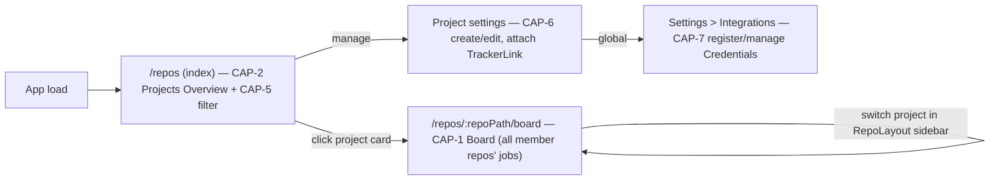

# UI Flows — Multi-Project Boards

Diagrams and screen-shape detail supporting SPEC.md. This companion is spec-authored; bmad-spec owns it. Routes below are resolved against the existing `/repos/:repoPath` shell (`RepoLayout`) per `ARCHITECTURE-SPINE.md` AD-2/AD-3, not new top-level screens.

## Screen map



`/repos` (bare index, no `repoPath`) always renders the overview grid, including for a single Project (decided; no skip case) — replacing `RepoLayout`'s current silent auto-redirect to the first repo. The grid's unit is now **Project** (CAP-6), not raw repo; there is no bare/unassigned repo — every repo is added as a member of some Project, and a single-repo Project is the common case, looking like today's per-repo card but always backed by a real `ProjectRow`.

## CAP-1 — Project-scoped board

New component `RepoBoard.tsx`, a child route `/repos/:repoPath/board` rendered inside `RepoLayout`'s existing `<Outlet />` (same slot as `RepoJobs`, `RepoHealth`, `RepoCost`, `RepoSettings`). Project switching uses `RepoLayout`'s existing sidebar (now listing Projects, CAP-6) — no new tab strip, no duplicate picker. Reuses `KanbanColumn.tsx` unchanged; filters `activeJobs` / `signoffJobs` / `attentionJobs` (via the shared classifier, AD-1) by `job.repo IN project.repo_paths` (a single-repo Project reduces to the original `job.repo === repoPath` filter).

```
RepoLayout sidebar (filterable, CAP-5) | RepoBoard content (this project's repos, combined)
-----------------------------------------+------------------------------------------------
[ 🔍 filter projects...                ] |
[ my-app              (active)         ] | In Progress | Awaiting Input | Failed
[ codeplane                            ] | (KanbanColumn x3, filtered to project.repo_paths)
[ payments (2 repos)                   ] |
-----------------------------------------+------------------------------------------------
                                            tabs within a project: Overview | Jobs | Board | Health | Cost | Settings
```

State: `repoPath` remains the existing React Router param, now resolved to a Project id/slug (AD-2, unchanged mechanism) — no new query-string or client-only selection state. Board tab lives alongside the existing `Overview`/`Jobs`/`Health`/`Cost`/`Settings` tabs on that same Project.

## CAP-2 / CAP-3 / CAP-5 — Projects overview

New component `ProjectsOverview.tsx`, rendered at the bare `/repos` index route (inside `RepoLayout`'s `<Outlet />`, replacing the current auto-redirect-to-first-repo effect). A text filter box (CAP-5) narrows the card grid by name in real time.

```
🔍 [ filter projects...                    ]

Needs attention across all projects: 4                          <- CAP-3 rollup badge

+----------------------+  +----------------------+  +------------------------+
| my-app               |  | codeplane            |  | payments  🔗2 repos    |
| ● 2 in progress       |  | ● 0 in progress       |  | ● 1 in progress         |
| ▲ 1 awaiting input    |  | ▲ 0 awaiting input    |  | ▲ 0 awaiting input      |
| ✕ 0 failed            |  | ✕ 3 failed            |  | ✕ 0 failed              |
| updated 12m ago       |  | updated 2h ago        |  | [Jira] 6 open  updated 1d ago |
+----------------------+  +----------------------+  +------------------------+
```

Each card is clickable and routes to `/repos/:repoPath/board` (CAP-1) for that Project. Cards for Projects with zero jobs (CAP-4) render the same shape with all-zero counts and a "no jobs yet" affordance instead of a relative timestamp. A Project with one or more TrackerLinks attached (CAP-7) shows one provider chip per link (e.g. `[Jira] 6 open`, `[GitHub] 2 open`) sourced from the last poll of each, alongside — not replacing — the job counts.

## CAP-6 — Project registry (settings)

New settings surface (extends the existing repo-registration flow, does not replace it): create/rename a Project, assign/reassign member repos (enforced: a repo belongs to at most one explicit Project), and attach existing TrackerLinks (CAP-7) to it. Unassigned repos keep working exactly as today via their implicit 1:1 Project — this surface is opt-in, not a migration gate.

## CAP-7 — Global Credentials & per-Project TrackerLinks

Two distinct surfaces, not one:

- **Settings > Integrations** (new, global, lives outside any Project): register a Credential — pick a provider (GitHub Projects / Jira / Azure DevOps), give it a label (e.g. "Acme Jira"), a base URL, and paste a PAT (no OAuth, per SPEC.md constraints). This list of Credentials is shared across every Project; a Credential shows which Projects currently reference it and blocks deletion while any do.
- **Project settings** (CAP-6 surface): "Attach tracker" picks an *existing* Credential from a dropdown (never re-enters a PAT) and supplies the external ref for that specific link (a Jira project key, an Azure DevOps project name, a GitHub Project number). A Project can attach more than one TrackerLink — e.g. a Jira link and a GitHub Projects link side by side, each shown as its own chip.

Inbound state (ticket counts, board columns) renders on the Project's overview card and board per TrackerLink, without approval. Any outbound write (a job completion transitioning a linked ticket, e.g.) creates a normal entry in the existing `codeplane_approval` queue instead of applying directly — the user reviews and approves/rejects it like any other pending approval today.

## CAP-8 through CAP-11 — Task Recipes on the Project board

Not a separate screen. `TaskLink` cards (CAP-9/CAP-10) render inside the *same* `RepoBoard` column grid as regular job cards (CAP-1), fetched by the same board via a second call (`GET /settings/projects/:id/task-links`, AD-11). CAP-5's filter box applies to them identically to any other card.

```
RepoBoard content — Project "payments" (2 repos), mixed job + recipe cards
--------------------------------------------------------------------------
 In progress                | Awaiting input          | Failed
 ┌────────────────────────┐ | ┌─────────────────────┐ |
 │ job: fix-webhook-retry │ | │ job: audit-refunds   │ |
 │ (regular job card)     │ | └─────────────────────┘ |
 └────────────────────────┘ |                          |
 ┌────────────────────────┐ |                          |
 │ ⛓ recipe: "add SCA"    │ |                          |
 │ chained · frontend repo│ |                          |
 │ ✓ deps satisfied        │ |                          |
 └────────────────────────┘ |                          |
 ┌────────────────────────┐ |                          |
 │ ⛓ recipe: "SCA tests"  │ |                          |
 │ chained · backend repo │ |                          |
 │ ⏳ waiting on "add SCA" │ |                          | (greyed out, not yet started)
 └────────────────────────┘ |                          |
```

Ingestion (CAP-9) is triggered from `ProjectSettings` ("Ingest tasks"), Project-scoped: it walks every member repo of the Project, parses each repo's BMAD stories or spec-kit `tasks.md`, and creates/updates one `TaskLink` per task node, namespaced by `(project_id, repo_path, story_node_id)`. A `depends_on` edge may point at a task node in a sibling member repo — the wireframe above shows exactly this: the backend repo's "SCA tests" task depends on the frontend repo's "add SCA" task, both inside the same `payments` Project, both visible on one board.

When a `TaskLink`'s dependencies are all satisfied, its recipe's `spawn_task` output route (CAP-8) fires through the existing job-creation path (AD-10) — the card transitions from greyed-out/waiting to a live job card automatically, no manual step. A recipe's `tracker_write` output route (CAP-11) never writes directly; it creates a normal `codeplane_approval` entry, identical in shape to CAP-7's tracker write-backs.

## Data flow

`ProjectsOverview` calls the new batch endpoint `GET /settings/projects/summary` (replaces the earlier repo-only `GET /settings/repos/summary` shape, AD-3) once on load — an array of the extended summary shape (AD-4: `awaitingInputCount`, `failedCount`, `activeJobCount`, plus a `trackerSummaries: []` array, one entry per attached TrackerLink, when CAP-7 links exist) for every Project, including ones with no jobs (CAP-4). There is no repo outside a Project to account for separately. `RepoBoard` filters the existing `jobs` store slice (already populated by `fetchJobs`) by `job.repo IN project.repo_paths`, through the same status classifier as `DashboardScreen`'s `KanbanBoard` (AD-1) — no new store shape for job data, no duplicate classification logic; it additionally calls `GET /settings/projects/:id/task-links` (AD-11) for CAP-10's chained cards, rendered in the same pass. Tracker sync (CAP-7) runs as a separate backend poller, iterating every `TrackerLinkRow` and populating its `trackerSummary` entry, independent of the job-status pipeline. `IntegrationsSettings` calls its own `GET/POST/DELETE /settings/credentials` endpoints, entirely separate from the Project summary endpoint — a Credential's existence and connection status is never bundled into `GET /settings/projects/summary`.

## CAP-12 — Chat: a persistent, git-free entity that can launch Jobs and/or gate a Task Recipe chain

Chats do not render on the Kanban board (CAP-1) — they have no `In progress`/`Awaiting input`/`Failed` state, since nothing is running by default. They can be started two ways: from a Project board (`RepoLayout`'s new **Chats** tab, a sibling to the existing per-repo `RepoJobs`/`RepoHealth`/`RepoCost` tabs — defaults `project_id` to that Project) or from the global nav (defaults `project_id` to null, unscoped), always overridable in the creation dialog:

```
Project "payments" — tabs: [ Board ]  [ Chats ]  [ Health ]  [ Cost ]  [ Settings ]

Chats tab — flat list, newest first, no columns
------------------------------------------------
 ┌───────────────────────────────────────────┐
 │ "should we retry webhooks with backoff?"   │   last message 2m ago
 │                     [Launch Job]  [Attach to chain] │
 └───────────────────────────────────────────┘
 ┌───────────────────────────────────────────┐
 │ "sca exemption thresholds"                 │   last message 1d ago
 │                     [Launch Job]  [Attach to chain] │
 └───────────────────────────────────────────┘
```

Opening a Chat is a plain conversational view — no repo picker, no branch name, no worktree indicator, because none exist yet. Two independent actions cross into Job/execution territory, and neither replaces or consumes the Chat:

- **Launch Job** takes the transcript, opens the existing new-Job dialog pre-filled with a seed prompt derived from it (prompting for a repo/Project first if the Chat is still unscoped), and creates a new Job (with its own worktree/branch) once confirmed. The Chat stays open in its tab afterward — nothing stops the user from launching a second, unrelated Job from the same Chat later.
- **Attach to chain** links the Chat to a specific `TaskLink` chain (picked from the Project's recipe cards, prompting for a Project first if still unscoped) in gating mode, described below.

Until either action is taken, nothing in the Chat has ever touched `GitService`.

### Attach to chain — narration and gating over a Task Recipe chain

Attaching is offered from the same chained-card wireframe shown under CAP-8-11 — an "Attach a Chat to watch this chain" affordance on a `TaskLink` card. Attaching one adds a narration strip above the board and changes what happens when the chain's dependencies become satisfied:

```
Project "payments" board, with a Chat attached to the "add SCA → SCA tests" chain
--------------------------------------------------------------------------------------------
 🧭 Chat "sca exemption thresholds": "add SCA" completed. "SCA tests" is ready to start — held for your approval.
                                                                          [Approve]  [Reject]
 ...
 ┌────────────────────────┐
 │ ⛓ recipe: "SCA tests"  │
 │ chained · backend repo │
 │ ⏸ held — awaiting approval  (instead of auto-starting)
 └────────────────────────┘
```

Without an attached Chat, this exact chain behaves exactly as CAP-10 already describes: the moment "add SCA" completes, "SCA tests" auto-starts, no strip, no approval. Attaching a Chat changes nothing about execution itself — it only decides whether `spawn_task`'s dispatch goes straight through or waits in the existing `codeplane_approval` queue (AD-12), and narrates what it's watching from the same Chat conversation. Detaching it at any time returns the chain to CAP-10's default ungated behavior.

