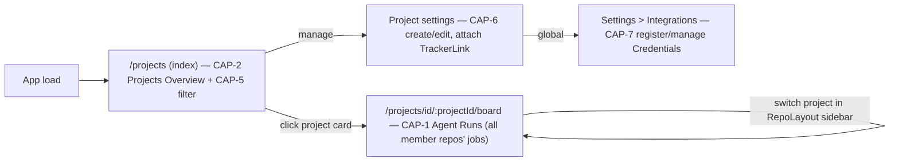

# UI Flows — Multi-Project Boards

> **Design revision — 2026-08-17.** Project IDs are the canonical route identity.
> This document describes a Project/workspace and Agent Runs experience; it does not
> promise that the Agent Runs board is a replacement for an external ticket board.

Diagrams and screen-shape detail supporting SPEC.md. This companion is spec-authored; bmad-spec owns it. Routes below use the stable Project-ID shell and nested repository analytics routes.

## Screen map



`/projects` always renders the overview grid, including for a single Project (no skip case). The grid's unit is **Project**, not raw repo. Every registered repository belongs to one Project; there is no implicit or unassigned repository state.

## CAP-1 — Project-scoped board

`RepoBoard.tsx` is the Project's **Agent Runs** board at `/projects/id/:projectId/board`. Project switching uses the Project sidebar; no duplicate picker. It filters jobs by `job.repo IN project.repo_paths` and renders TaskLinks in the same board, while tracker summaries remain clearly labeled integration context.

```
RepoLayout sidebar (filterable, CAP-5) | RepoBoard content (this project's repos, combined)
-----------------------------------------+------------------------------------------------
[ 🔍 filter projects...                ] |
[ my-app              (active)         ] | In Progress | Awaiting Input | Failed
[ codeplane                            ] | (KanbanColumn x3, filtered to project.repo_paths)
[ payments (2 repos)                   ] |
-----------------------------------------+------------------------------------------------
                                            tabs within a project: Overview | Jobs | Board | Health | Cost | Settings
```

State: `projectId` is the only Project selection state and lives in the URL. Repository analytics are nested beneath the Project route and use an explicit member-repository selector. Board tabs are `Overview | Agent Runs | Chats | Settings`; `Jobs | Health | Cost` are repository-scoped views beneath the selected Project.

## CAP-2 / CAP-3 / CAP-5 — Projects overview

New component `ProjectsOverview.tsx`, rendered at the bare `/projects` index route (inside the Project shell's `<Outlet />`). A text filter box (CAP-5) narrows the card grid by name in real time.

```
🔍 [ filter projects...                    ]

Needs attention across all projects: 4                          <- CAP-3 rollup badge

+----------------------+  +----------------------+  +------------------------+
| my-app               |  | codeplane            |  | payments  🔗2 repos    |
| ● 2 in progress       |  | ● 0 in progress       |  | ● 1 in progress         |
| ▲ 1 awaiting input    |  | ▲ 0 awaiting input    |  | ▲ 0 awaiting input      |
| ✕ 0 failed            |  | ✕ 3 failed            |  | ✕ 0 failed              |
| updated 12m ago       |  | updated 2h ago        |  | [Jira] 6 open  updated 1d ago |
+----------------------+  +----------------------+  +------------------------+
```

Each card is clickable and routes to `/projects/id/:projectId/board` (CAP-1) for that Project. Cards for Projects with zero jobs render the same shape with all-zero counts and a "no runs yet" affordance. Tracker chips are labeled integration summaries and never imply that the Agent Runs columns contain all external tickets.

## CAP-6 — Project registry (settings)

Project Settings creates/renames Projects, manages membership, attaches/detaches TrackerLinks, and triggers task ingestion. Repository membership is exclusive. Removing a repository requires confirmation, blocks or explains active-work consequences, and reports what happens to historical Jobs, TaskLinks, indexing, and tracker links. A Project cannot be saved with zero repositories.

## CAP-7 — Global Credentials & per-Project TrackerLinks

Two distinct surfaces, not one:

- **Settings > Integrations** (new, global, lives outside any Project): register a Credential — pick a provider (GitHub Projects / Jira / Azure DevOps), give it a label (e.g. "Acme Jira"), a base URL, and paste a PAT (no OAuth, per SPEC.md constraints). This list of Credentials is shared across every Project; a Credential shows which Projects currently reference it and blocks deletion while any do.
- **Project settings** (CAP-6 surface): "Attach integration" picks an *existing* Credential from a dropdown, shows provider-specific reference fields, validates the reference through a provider test, and saves only after the test succeeds. A Project can attach more than one TrackerLink; each link has an explicit provider, reference, sync state, refresh action, and detach action.

Inbound state renders as integration context on the Project overview, Agent Runs board, and TaskLink details, without approval. Any outbound write creates a normal approval entry. Approval execution then invokes the selected TrackerLink's provider adapter exactly once; the UI reports pending, applied, rejected, or failed rather than claiming dispatch when no provider call occurred.

## CAP-8 through CAP-11 — Task Recipes on the Project board

Not a separate screen. `TaskLink` cards (CAP-9/CAP-10) render inside the *same* `RepoBoard` column grid as regular job cards (CAP-1), fetched by the same board via a second call (`GET /settings/projects/:id/task-links`, AD-11). CAP-5's filter box applies to them identically to any other card.

```
RepoBoard content — Project "payments" (2 repos), mixed job + recipe cards
--------------------------------------------------------------------------
 In progress                | Awaiting input          | Failed
 ┌────────────────────────┐ | ┌─────────────────────┐ |
 │ job: fix-webhook-retry │ | │ job: audit-refunds   │ |
 │ (regular job card)     │ | └─────────────────────┘ |
 └────────────────────────┘ |                          |
 ┌────────────────────────┐ |                          |
 │ ⛓ recipe: "add SCA"    │ |                          |
 │ chained · frontend repo│ |                          |
 │ ✓ deps satisfied        │ |                          |
 └────────────────────────┘ |                          |
 ┌────────────────────────┐ |                          |
 │ ⛓ recipe: "SCA tests"  │ |                          |
 │ chained · backend repo │ |                          |
 │ ⏳ waiting on "add SCA" │ |                          | (greyed out, not yet started)
 └────────────────────────┘ |                          |
```

Ingestion (CAP-9) is triggered from `ProjectSettings` ("Ingest tasks"), Project-scoped: it walks every member repo of the Project, parses each repo's BMAD stories or spec-kit `tasks.md`, and creates/updates one `TaskLink` per task node, namespaced by `(project_id, repo_path, story_node_id)`. Manual assignment is also available from synced ticket details. A `depends_on` edge may point at a task node in a sibling member repo; the board shows the source, repository, dependencies, and linked Job.

Synced ticket details are reachable from each integration summary and expose the ticket
reference, provider, current state, linked TaskLinks, and **Assign task** action. A
ready root TaskLink exposes **Start task**; dependent nodes use the same action only
when their dependencies are satisfied. Both actions return to the Project Agent Runs
board with the new TaskLink/Job state visible.

Ready root tasks expose a Start action. When a dependent TaskLink's dependencies are all satisfied, its `spawn_task` route atomically claims the node and uses the existing job-creation path; a failed or discarded Job does not satisfy a dependency. A `tracker_write` route creates a normal approval entry targeting the TaskLink's explicit TrackerLink/ticket pair.

## Data flow

`ProjectsOverview` calls one Project-summary batch endpoint. `RepoBoard` filters all member-repository Jobs and loads Project TaskLinks. Health, Cost, Jobs, and index state require a selected member repository and visibly identify that repository. Tracker sync runs independently at a fixed 60-second cadence plus manual refresh. Credential management is global; TrackerLink management is Project-scoped and supports attach, test, refresh, detach, and deletion-block messaging.

## CAP-12 — Chat: a persistent, git-free entity that can launch Jobs and/or gate a Task Recipe chain

Chats do not render as Agent Runs board cards — they have no `In progress`/`Awaiting input`/`Failed` state, since nothing is running by default. They can be started from a Project's **Chats** tab or global navigation, with Project context defaulted but always overridable:

```
Project "payments" — tabs: [ Board ]  [ Chats ]  [ Health ]  [ Cost ]  [ Settings ]

Chats tab — flat list, newest first, no columns
------------------------------------------------
 ┌───────────────────────────────────────────┐
 │ "should we retry webhooks with backoff?"   │   last message 2m ago
 │                     [Launch Job]  [Attach to chain] │
 └───────────────────────────────────────────┘
 ┌───────────────────────────────────────────┐
 │ "sca exemption thresholds"                 │   last message 1d ago
 │                     [Launch Job]  [Attach to chain] │
 └───────────────────────────────────────────┘
```

Opening a Chat is a plain conversational view. Messages use `{role, content}` and show explicit sending, assistant-response, and failure states. Two independent actions cross into Job/execution territory, and neither replaces or consumes the Chat:

- **Launch Job** takes the transcript, opens the existing new-Job dialog pre-filled with a seed prompt derived from it (prompting for a repo/Project first if the Chat is still unscoped), and creates a new Job (with its own worktree/branch) once confirmed. The Chat stays open in its tab afterward — nothing stops the user from launching a second, unrelated Job from the same Chat later.
- **Attach to chain** links the Chat to a specific `TaskLink` chain (picked from the Project's recipe cards, prompting for a Project first if still unscoped) in gating mode, described below.

Until either action is taken, nothing in the Chat has ever touched `GitService`. Chat and Job detail views retain Project, repository, and chain breadcrumbs, and every view has a shareable deep link.

### Attach to chain — narration and gating over a Task Recipe chain

Attaching is offered from the same chained-card wireframe shown under CAP-8-11 — an "Attach a Chat to watch this chain" affordance on a `TaskLink` card. Attaching one adds a narration strip above the board and changes what happens when the chain's dependencies become satisfied:

```
Project "payments" board, with a Chat attached to the "add SCA → SCA tests" chain
--------------------------------------------------------------------------------------------
 🧭 Chat "sca exemption thresholds": "add SCA" completed. "SCA tests" is ready to start — held for your approval.
                                                                          [Approve]  [Reject]
 ...
 ┌────────────────────────┐
 │ ⛓ recipe: "SCA tests"  │
 │ chained · backend repo │
 │ ⏸ held — awaiting approval  (instead of auto-starting)
 └────────────────────────┘
```

Without an attached Chat, this exact chain behaves exactly as CAP-10 already describes: the moment "add SCA" completes, "SCA tests" auto-starts, no strip, no approval. Attaching a Chat changes nothing about execution itself — it only decides whether `spawn_task`'s dispatch goes straight through or waits in the existing `codeplane_approval` queue (AD-12), and narrates what it's watching from the same Chat conversation. Detaching it at any time returns the chain to CAP-10's default ungated behavior.
