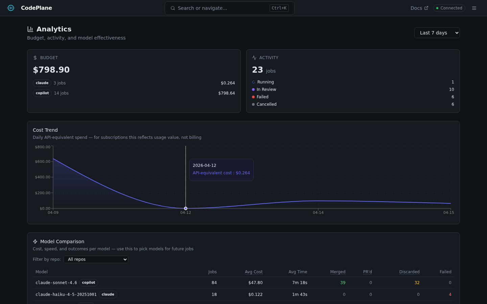
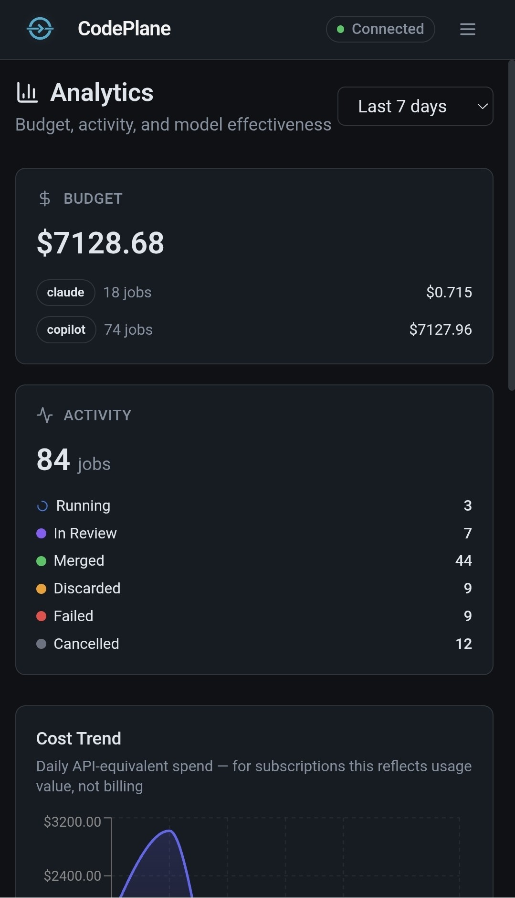
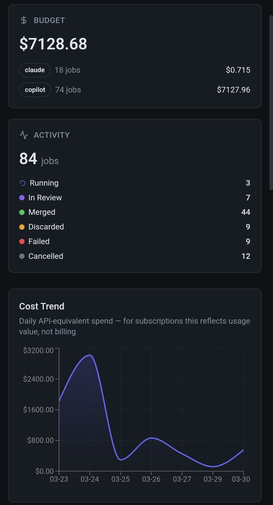
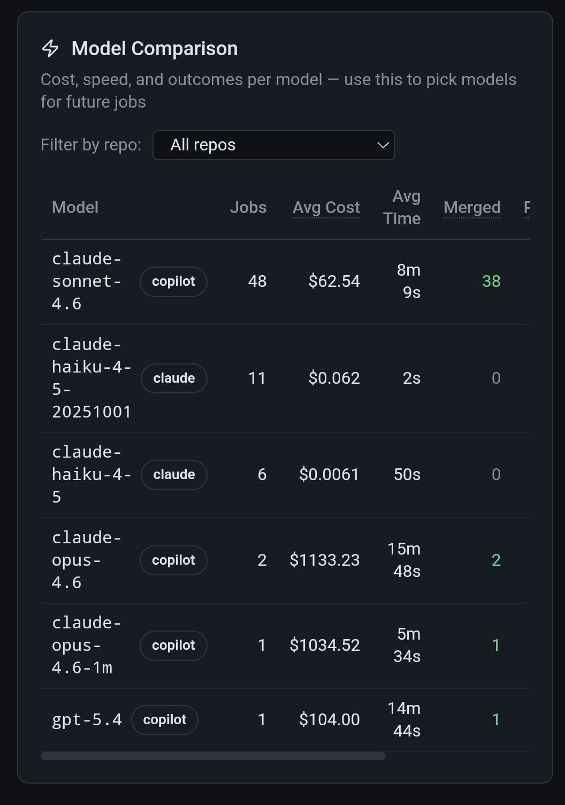
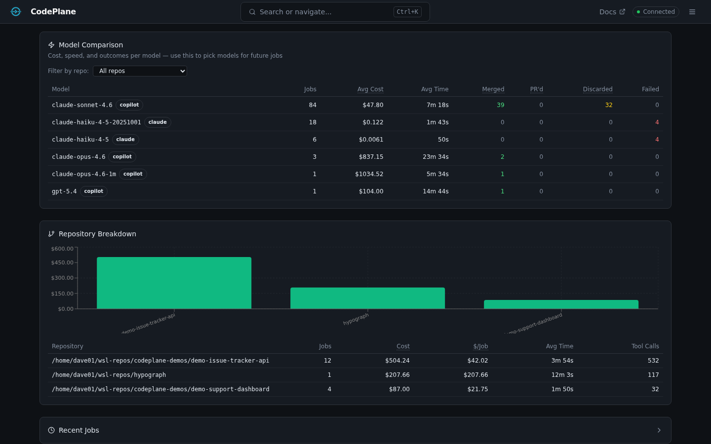
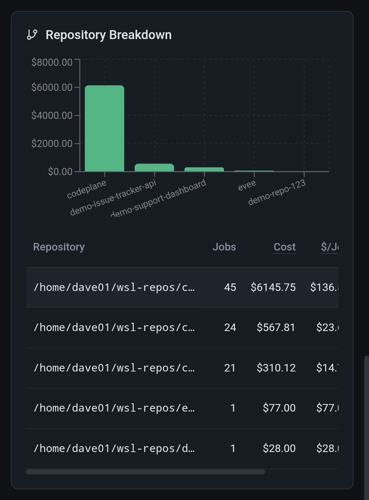
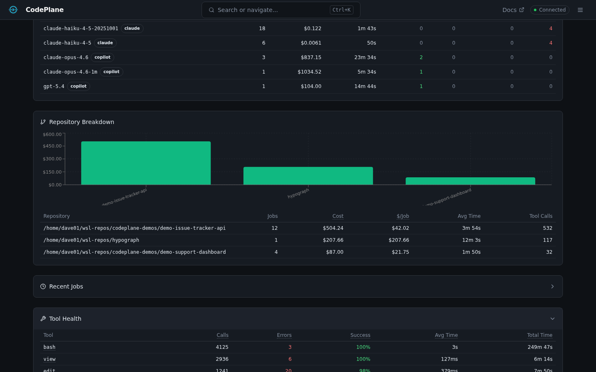
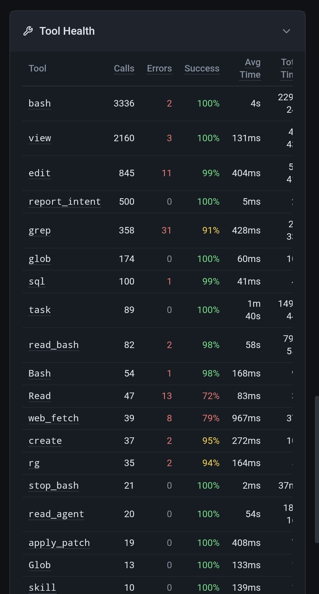
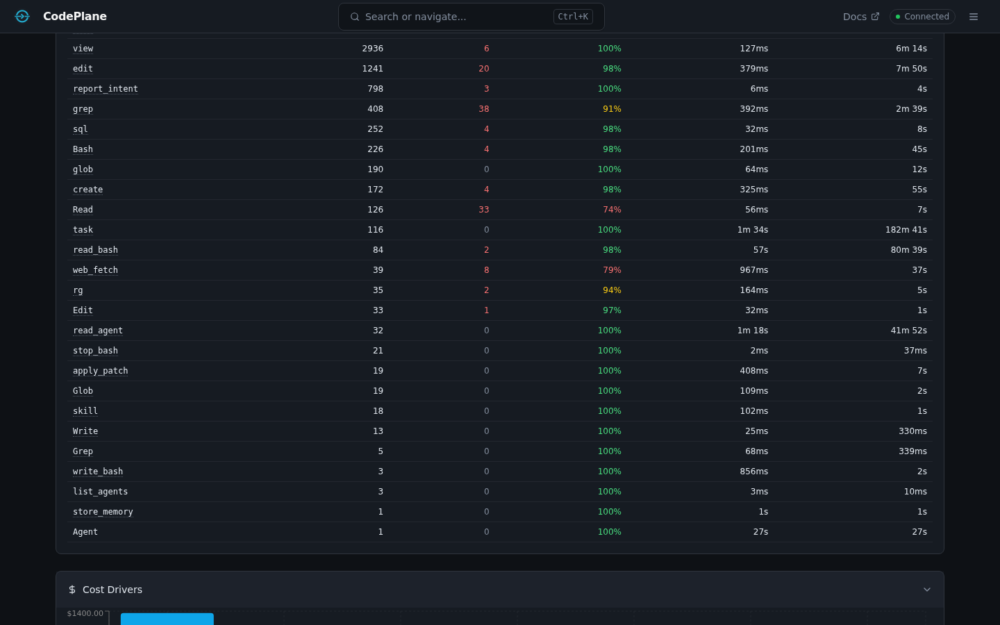
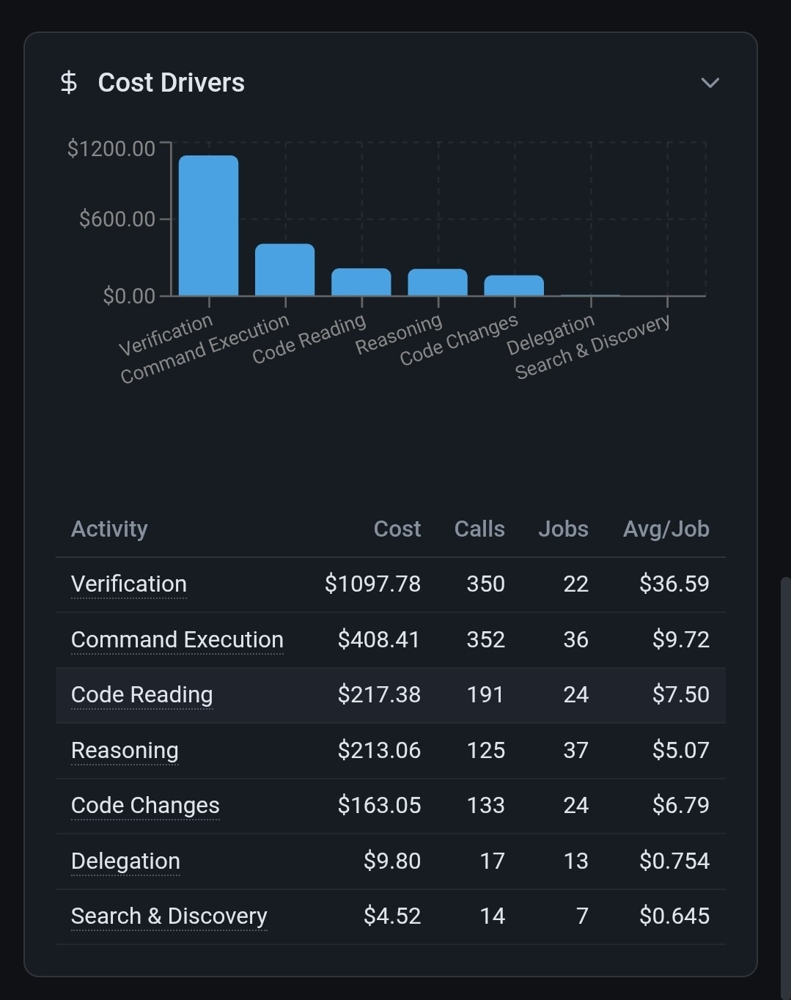

---
hide:
  - navigation
---

# Analytics & Cost Tracking

CodePlane tracks every token, tool call, and dollar across all jobs — giving you fleet-wide visibility into what your coding agents cost and how they perform. Open the analytics dashboard with **Alt+A**.

---

## Scorecard

The scorecard is the top-level summary. It shows per-SDK budget totals, job activity breakdown, and daily cost trends over a configurable period (7–365 days).

- **Budget by SDK** — Total spend for each SDK (Copilot, Claude, etc.) with cost trends
- **Activity breakdown** — Jobs by resolution: running, merged, PR created, discarded, failed, cancelled
- **Copilot quota** — If you use Copilot, the scorecard tracks premium request consumption and alerts when quota exceeds 80%
- **Daily cost trend** — Area chart showing spend over time

!!! tip "Understanding costs"
    For subscription plans (like Claude Max or Copilot Business), CodePlane shows what the same usage **would cost at API rates**. This gives you a consistent cost metric for comparing models and optimizing agent behavior, even when you're on a flat-rate plan.

---

## Model Comparison

Compare models head-to-head on cost, speed, and outcomes.

| Metric | Description |
|--------|-------------|
| **Avg Cost** | Average USD per job for each model |
| **Avg Duration** | Average job runtime |
| **Cost/min** | Spend efficiency — lower is better |
| **Cost/turn** | How much each agent turn costs on average |
| **Resolution rates** | Per-model breakdown of merged / PR'd / discarded / failed |

Filter by repository to compare model performance on specific codebases.

---

## Repository Breakdown

See which repos drive the most spend and activity.

- Cost, job count, and token totals per repository
- Tool calls and average job duration
- Premium request consumption (Copilot)

---

## Tool Health

Monitor the reliability and latency of every tool your agents use.

- **Call counts** — How often each tool is invoked
- **Failure rate** — Percentage of calls that errored (flagged when ≥20%, critical at ≥50%)
- **Latency** — Average, p50, p95, and p99 durations
- **Tool categories** — file_write, file_read, file_search, git, shell, browser, agent, system

---

## Cost Drivers

Identify which jobs, models, and repos contribute the most to your spend.

---

## Token & Cache Metrics

Every job tracks token usage in detail:

- **Input tokens** and **output tokens** (separately)
- **Cache read tokens** and **cache write tokens** (prompt caching)
- **Cache hit rate** — percentage of input tokens served from cache
- Per-model and per-repo token aggregations
