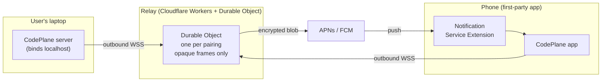

# CodePlane Mobile: Relay Transport and First-Party Apps

**Status:** Proposed. Not accepted, not implemented.

**Date:** 2026-08-13

This document proposes an architecture. It is published for review, and nothing in it has been
built. Where a claim was verified against source or vendor documentation, the appendix says so;
where it rests on inference, the appendix says that too.

---

## 1. Summary

CodePlane ships first-party iOS and Android apps. Those apps reach the user's laptop through
a **single hosted relay** that both sides dial outbound over WSS/443. All traffic across the
relay is end-to-end encrypted under keys exchanged out of band via QR pairing, so the relay
can decrypt nothing it carries.

The relay is the only transport. There is no direct path, no VPN, and no tunnel provider.

The apps are Capacitor shells running the existing React application unchanged, because that
application already has full control parity on a phone (§4). There is no desktop app: a
desktop client reaches localhost directly and would need neither the relay nor push.

Three properties follow:

- **It traverses managed networks.** Outbound HTTPS is the only thing that reliably crosses
  corporate networks, device management policy, and always-on VPNs. Whether it is *permitted*
  to on a work-managed device is a separate question, and §13 treats it as a gate rather than
  assuming it away.
- **Onboarding is one step.** Scan a QR code. No domain, no nameserver delegation, no VPN
  profile, no provider selection.
- **The relay is load-bearing.** If it is down, the product does not work. This is the
  accepted cost of the design and §10 addresses it directly.

Infrastructure is not the constraint: the relay costs roughly $55/month at 10,000 heavy users
(§13). The real price is that CodePlane must operate that service indefinitely, because every
installed app breaks without it. §11 keeps that from also being a single point of failure for
users, by open-sourcing the relay and exposing `relay_url` as a setting.

---

## 2. Constraints

### An own-brand app requires an operated push proxy

APNs `.p8` keys and FCM service-account credentials are **publisher-wide** secrets. They
cannot ship inside a `pip install`-able self-hosted package, because every installer would
then hold a credential capable of pushing to every user's device.

Delivering a notification to a phone requires an installed app that owns a push token. There
are exactly three candidates: the browser (Web Push, which is what CodePlane uses today), a
third party's app (ntfy, Telegram, Pushover), or your own. Choosing your own makes a hosted
proxy mandatory rather than optional.

### Tailscale cannot serve as the transport

VERIFIED, <https://tailscale.com/docs/reference/faq/other-vpns>:

> **Device limitations**: Not all devices support using multiple VPNs simultaneously. For
> example, **iOS and Android enforce a limit of running only one VPN at a time. As a
> result, it is not possible to have more than one active VPN on these platforms.**

and

> in most cases, you can't use Tailscale alongside other VPNs without a workaround

The workarounds Tailscale documents, userspace networking mode and split-tunnel DNS, are
host-side. Neither applies to a phone. On mobile the single-VPN limit is an OS constraint
with no workaround at all, and MDM policy frequently blocks VPN profile installation
outright.

This fails precisely for CodePlane's core demographic: developers on corporate managed
laptops and phones.

### What survives

On a managed device behind a corporate VPN, the only reliable channel is **plain outbound
HTTPS to a public hostname**. Every remaining option therefore requires ingress that is
either heavily configured (Cloudflare named tunnel: domain, nameserver delegation, Access
policy) or operated by CodePlane.

Since an own-brand app already commits to operated infrastructure, the marginal cost of that
same infrastructure carrying transport is small. Both constraints converge on one relay
carrying everything.

### Why relay-only rather than direct-first with relay fallback

- One code path, one protocol, one set of failure modes to diagnose remotely.
- Uniform onboarding with no branching setup story.
- It **retires** an existing complexity centre rather than adding to one (§11).

The accepted downside is availability dependence, addressed in §10.

---

## 3. Topology



Both endpoints dial **out**. Neither accepts an inbound connection. This is what makes the
design survive NAT, CGNAT, corporate firewalls, MDM, and always-on VPNs: it is
indistinguishable from ordinary web traffic.

The CodePlane server binds localhost only and is never publicly reachable.

### Why a persistent connection rather than push-then-pull

The obvious cheaper-looking design is to hold no stream at all: send a push when something
happens, and let the phone pull the details. It does not work, for a reason worth stating
plainly because it is easy to miss.

**Pull from where?** The laptop is behind NAT with no inbound path. That premise is what
created the relay in the first place. For any pull to reach the laptop, the laptop must
already be reachable, and nothing can wake it on demand: APNs and FCM address mobile devices,
not a Python process on someone's machine. So the laptop's outbound connection is not a design
choice, it is forced. Push-then-pull removes the phone's stream, which the design already
avoids holding, and leaves the laptop's untouched.

The alternative would be for the relay to cache state the laptop pre-pushes, so the phone
pulls from the relay instead. That fails against the parity invariant in §4. A control surface
covering 86 API operations, arbitrary workspace file browsing, and terminal sessions cannot be
pre-computed, because the user can navigate anywhere. It also converts the relay from a dumb
pipe into a stateful cache holding user data, which is precisely the property §5 exists to
avoid.

The remaining question is whether the laptop should poll instead of holding a socket. Billing
answers it, in the opposite direction to intuition:

| Transport | Messages/user/month | Billed | 10,000 users |
| --- | --- | --- | --- |
| WebSocket, heavy usage (§13) | 500,000 | 25,000 after 20:1 | **~$37/month** |
| HTTP poll every 60s | 43,200 | 43,200 at 1:1 | ~$65/month, plus 60s latency |
| HTTP poll every 5s | 518,400 | 518,400 at 1:1 | ~$778/month |

HTTP requests bill one for one; inbound WebSocket messages bill at twenty to one. Polling is
therefore more expensive than streaming at every useful interval, and slower. A persistent
socket is the cheap option here, not the extravagant one.

The enabling fact is that an idle WebSocket costs nothing: the runtime holds the connection
while the object hibernates, and incoming protocol pings are not billed. An attached-but-quiet
phone and a connected-but-idle laptop are both free.

What survives from the push-then-pull instinct is correct and already in the design: when no
phone is attached, nothing streams and only a push crosses the relay (§7). The instinct is
right about the idle case. It is only wrong about the attached one, where streaming is both
cheaper and the reason to watch an agent work at all.

---

## 4. Client architecture

### Full parity is an invariant

CodePlane's web UI has full control parity on a phone. This is a product invariant, not a
current state available to be traded away.

Parity is enforced structurally rather than by policy. Only three phone-specific components
exist: `MobileJobList`, `JobDetailMobile` (which exports `MobileBottomNav` and
`MobileFooterActions`), and `MobileSyntaxView`. They are not a separate application.
`MobileJobList` renders alongside `KanbanBoard` inside the shared `DashboardScreen`
(:83-84), and `JobDetailMobile`'s exports are imported directly into the shared
`JobDetailScreen` (:29). Every other screen, 56 components including
`AddRepoModal`, `IntegrationsSettings`, `PolicySettingsPanel`, `RepoSettings`,
`SidecarDefinitionForm`, `TerminalDrawer`, and `TriggerPipelineEditor`, carries responsive
breakpoints and renders on a phone today.

There is one application with responsive rendering, not a desktop application plus a
cut-down mobile one.

The consequence is direct: **the phone needs the entire API surface.** All 86 exported
functions in `frontend/src/api/client.ts`, not a subset. Any design shipping a narrower
mobile capability set is a regression against the product that exists today.

### The relay is indifferent to surface size

The relay is an opaque encrypted byte pipe. It cannot read any frame it carries, so its size
and complexity are **independent of API surface**: identical whether it tunnels twenty
operations or eighty-six.

This is what makes the parity invariant affordable. Carrying the full surface costs nothing
at the transport layer. Any cost lands entirely in the client.

### The client is Capacitor running the existing React app

The parity invariant decides the client architecture on its own. A native mobile UI would mean
reimplementing 56 responsive components before reaching the surface CodePlane already has on a
phone, and shipping anything less is a regression. So the app is a Capacitor shell running the
existing React application unchanged: `useSSE.ts` unchanged, `client.ts` unchanged, backend
unchanged. Native code is confined to push registration, Notification Service Extension
decryption, and notification action handling.

Capacitor is the specific choice because a plain WebView wrapper loses push. WebKit leaves
`window.Notification` and `window.PushManager` undefined inside a webview, and Chromium's own
tests assert the same for Android WebView. Capacitor sidesteps this by using native APNs and
FCM plugins rather than Web Push, which keeps lock-screen action buttons available. Push is
the entire reason for going native, so a wrapper that loses it defeats the purpose.

The cost of this choice is App Store guideline 4.2 exposure, since the app substantially is a
web application. Mitigations are in §13. They are design decisions built into the iOS app from
its first commit rather than a response to a rejection, and §17 explains why iOS ships after
Android rather than before it.

### A `fetch` wrapper cannot carry the surface

Requests to the laptop origin must reach the relay WebSocket, and that cannot be arranged by
wrapping `fetch`. Two client functions return URL strings rather than
promises, and the browser loads them as subresources without application code ever being
involved:

| Builder | Consumed as |
| --- | --- |
| `downloadArtifactUrl` (`client.ts:477`) | `href={...}` at `ArtifactViewer.tsx:455` |
| `workspaceFileRawUrl` (`client.ts:517`) | `src={...}` at `WorkspaceBrowser.tsx:443, 450, 459` |

A `fetch` wrapper never observes these requests, so artifact downloads and workspace file
previews would fail on the phone while every other call succeeded, and they would fail
silently. Interception must happen at or below the network layer, where subresource loads are
visible.

### Interception is the wrong mechanism; a loopback server is the right one

The obvious mechanism, a Capacitor custom scheme handler, does not survive reading Capacitor's
source. Its HTTP interception is structurally incapable of carrying SSE.
`WebViewAssetHandler.handleCapacitorHttpRequest` issues `URLSession.shared.dataTask(with:)`
with a completion handler, then calls `didReceive(response)`, `didReceive(data)` and
`didFinish()` together in one shot. That API buffers the entire body and fires once, on
completion. An event stream never completes, so the callback never fires and not one event is
delivered. This is not a bug to patch around; it is the shape of the code.

The underlying primitive is capable, and a production Capacitor app proves it. Apple documents
that `WKURLSchemeTask.didReceive(_:)` may be called "multiple times to deliver data
incrementally", and AFFiNE's iOS app tunnels a WebSocket into its webview as a live
`text/event-stream` by calling it once per message and withholding `didFinish()`. Streaming
through a hand-written scheme handler is not speculative.

It is still the wrong path, because interception fails on both platforms, for different
reasons, and neither is fixable in application code.

On iOS, WebKit refuses to let an app intercept `http` or `https` at all. Registering a handler
for a scheme WebKit already handles raises `invalidArgumentException`. Interception therefore
sees only traffic already on a custom scheme, so absolute URLs have to be rewritten in
JavaScript first. AFFiNE does exactly that, which is why its web application is demonstrably
not unchanged on iOS. A JavaScript rewrite cannot reach `` or `<a href>`, so the
failure in the table above returns by a different route.

On Android the obstacle is blunter. `WebResourceRequest` exposes exactly six methods:
`getMethod`, `getRequestHeaders`, `getUrl`, `hasGesture`, `isForMainFrame` and `isRedirect`.
There is no accessor for the request body. Every POST and PUT across an 86-operation control
surface would reach the interceptor stripped of its payload.

So the app intercepts nothing. **The app terminates the relay natively and serves the
React application over plain HTTP on loopback.** The WebView loads
`http://127.0.0.1:<port>`, and every request from the page is an ordinary network load.

- Capacitor supports this directly rather than by subversion. `CAPBridgeViewController.loadView`
  calls `assetHandler.setServerUrl(configuration.serverURL)`, so a configured server URL is a
  first-class path.
- SSE streaming, `src=` and `href=` subresource loads, ranged artifact downloads, and request
  cancellation all behave exactly as they do in the browser today, because they are the same
  mechanism. "The React app runs unchanged" becomes literally true rather than aspirational.
- It remains a secure context. The W3C definition returns "Potentially Trustworthy" for any
  origin whose host matches `127.0.0.0/8` or `::1/128`, and notes explicitly that port has no
  effect. `crypto.subtle` stays available.
- App Transport Security does not block it. Apple's `NSAllowsLocalNetworking` documentation
  states that from iOS 10 onward ATS "allows all three of these connections by default",
  IP-address loads among them, so no arbitrary-loads escape hatch is needed.

Two costs are real and must be designed for.

**The listener is reachable by other apps on the device.** Loopback is not a private channel.
Bind `127.0.0.1` only, require a per-launch random bearer token injected by the shell, and
reject requests whose `Origin` or `Host` does not match. Omitting this turns the app into a
local privilege-escalation path onto the user's laptop.

**The port is part of the origin, so it cannot be randomized per launch.** Web storage,
IndexedDB, and Service Worker registrations are keyed by origin, and a fresh port each launch
silently discards all of them. Either pin a fixed high port and handle collision, or hold
persisted state in native storage and inject it rather than assuming browser storage survives.

Routing stays origin-based, so new backend routes need no client change and parity cannot
silently regress.

### What a duplex transport makes possible later

Two REST calls exist today only because SSE is unidirectional. `useSSE.ts:77` calls
`fetchJobSnapshot` after every reconnect to close the replay-window gap, and `useSSE.ts:205`
calls `fetchJob` when an event references a job the client does not hold. Over a duplex
connection the server knows the client's last event ID at reconnect and can send both
unprompted.

This is an optimization the relay enables, not a reason to design a protocol. It stays
unbuilt until the transport is proven.

---

## 5. Cryptography and pairing

### Pairing

The local server displays a QR code; the app scans it. The QR carries:

| Field | Purpose |
| --- | --- |
| `relay_url` | Which relay to dial. Defaults to hosted, overridable (§11) |
| `pairing_id` | Durable Object routing key |
| `psk` | Pre-shared key material for the end-to-end channel |
| `server_pubkey` | Laptop's long-term public key, for authentication |

Because the code is displayed on one screen and read by another camera, key material never
transits any network. This out-of-band channel is the strongest part of the design.

`psk` rotates on unpair. A scanned QR is single-use wherever practical.

### Channel

Every frame between laptop and phone is sealed with AEAD (AES-256-GCM or
XChaCha20-Poly1305) under keys derived from the pairing. The relay holds no key material.

The relay observes pairing ID, frame sizes, and timing. That is genuine metadata leakage and
should be disclosed as such rather than papered over with an unqualified "zero knowledge"
claim.

### Effect on the privacy position

"Your code never leaves your machine" ceases to be literally true: ciphertext of the user's
code transits Cloudflare.

The accurate replacement is **"End-to-end encrypted. We cannot read it, and you can run the
relay yourself."** The second clause (§11) is what keeps the first credible.

This claim is the product's main differentiator and must not be allowed to drift by
accident.

---

## 6. Push

### Category selection happens after decryption

The design requirement is that the relay learn nothing, including *what kind* of notification
it is carrying. Since the notification category determines whether Approve/Reject buttons
appear, a plaintext category would leak the notification type even with an encrypted body.

It does not have to be plaintext. VERIFIED against Apple's symbol declaration for
`UNMutableNotificationContent.categoryIdentifier`:

```swift
var categoryIdentifier: String { get set }
```

Apple's discussion text endorses exactly this use: category identifiers exist "to create
actionable notifications with custom action buttons to redirect your notifications through
... your notification service" extension.

### Flow

1. The laptop encrypts `{type, title, body, job_id, nonce}` into an opaque blob.
2. The laptop sends the blob to the relay. The relay signs an APNs JWT (ES256) and forwards
   it with `mutable-content: 1` and a **generic** fallback body.
3. APNs delivers. iOS wakes the `UNNotificationServiceExtension`.
4. The extension reads the key from the Keychain (App Group shared container), decrypts, and
   sets `title`, `body`, **and `categoryIdentifier`**.
5. iOS renders the correct action buttons on the lock screen.

The relay sees an opaque blob and never learns an approval was requested.

### Constraints

| Constraint | Value | Consequence |
| --- | --- | --- |
| APNs payload limit | 4096 bytes (VERIFIED) | Notifications carry a short summary and a pointer, never a diff |
| FCM payload limit | 4096 bytes (VERIFIED) | Same |
| NSE execution budget | 30 seconds (VERIFIED) | On timeout iOS renders the **unmodified** payload |
| AEAD + base64 overhead | ~33% plus nonce and tag | Budget roughly 2.5 KB of real plaintext |

The timeout carries a security implication that is easy to miss. **The fallback body is what
the user sees when decryption fails**, so it must be generic: "CodePlane needs your
attention" and nothing more. It must never contain a job name, repository name, or command.

### Android

Symmetric, using **data-only** FCM messages with no `notification` block, so the app builds
the notification itself and can decrypt client-side. Action buttons via
`NotificationCompat.Action` and `PendingIntent.getBroadcast()` into a `BroadcastReceiver`.

Platform caveats:

- The receiver runs on the main thread against an ANR limit around ten seconds. Use
  `goAsync()`, or hand off to `WorkManager` for the outbound call.
- Data-only messages are subject to Doze and App Standby. Send `priority: high`. Google
  throttles high priority for users who habitually ignore notifications.
- Data-only messages are **dropped entirely** if the user force-stops the app.

### Claims requiring confirmation before build

Asserted during research without citation. Treat as unverified:

- iOS shows at most two action buttons on the lock screen and four when expanded.
- A non-`.foreground` action tap relaunches a force-quit app in the background.
- The background execution budget for handling a notification action is roughly 30 seconds.

The second is load-bearing (§16).

---

## 7. Relay implementation

Cloudflare Workers plus Durable Objects, one Durable Object per pairing.

VERIFIED, <https://developers.cloudflare.com/durable-objects/best-practices/websockets/>:

- "Durable Objects can act as WebSocket servers that connect **thousands of clients per
  instance**"
- "A single Durable Object instance can coordinate between multiple clients"
- Hibernation WebSocket API: "Clients remain connected while the Durable Object is not in
  memory" and "**Billable Duration (GB-s) charges do not accrue during hibernation**"

Implementation notes:

- Use `state.acceptWebSocket(ws)`, **not** `ws.accept()`. The latter blocks hibernation.
- On wake, in-memory state resets and the constructor re-runs. Keep the constructor trivial
  and use `serializeAttachment` / `deserializeAttachment` for anything that must survive.
  A dumb pipe should hold near-zero state, which is the design intent.
- APNs JWT signing uses the standard `SubtleCrypto` API available in Workers:
  `crypto.subtle.sign()` with ES256 (ECDSA P-256). The `.p8` lives in a Worker secret.

### Hibernation must be designed for

Hibernation only pays if the Durable Object is genuinely idle. CodePlane emits a heartbeat
every thirty seconds per running job (`_HEARTBEAT_INTERVAL_S = 30`,
`backend/services/runtime/service.py:200`), for session health display and stall detection.

Forwarded naively, that wakes the Durable Object twice a minute for every pairing with a
running job, and the economics above evaporate.

The governing policy generalises beyond heartbeats:

> **The laptop forwards live-UI traffic over the relay only while a phone is attached.
> Otherwise the only thing that crosses is a push notification.**

Events exist to update a live UI. With no phone attached there is no UI to update, so
forwarding is waste. The relay can tell the laptop whether a client is connected, making this
inexpensive to implement.

Two platform mechanisms make this cheaper than the policy alone would.

- `state.setWebSocketAutoResponse()` handles a ping/pong pair inside the runtime without
  waking the object. Cloudflare states these "will not incur additional wall-clock time, and
  so they will not be charged." Liveness probing is therefore free, and only real traffic
  needs to reach application code.
- Incoming WebSocket messages are billed at a 20:1 ratio, and outgoing messages and protocol
  pings are not billed at all. Since the laptop-to-phone event stream is outbound from the
  object's perspective, the busiest direction is the free one.

Under this policy the Durable Object hibernates whenever the phone is not actively open,
which for a supervise-while-away tool is the overwhelming majority of wall-clock time. Push
delivery is unaffected: a push is a single wake, not a sustained stream.

Two consequences:

- Reconnect must be cheap, because the phone reattaches often and each reattach triggers a
  snapshot rather than a replay from a long-idle stream.
- The phone can never assume it has seen every event, and must treat
  reconnect-plus-snapshot as the source of truth. This is already how `useSSE.ts` behaves
  (line 77).

### Precedent

**Home Assistant** is the canonical open-source example of a self-hosted tool operating a
central push proxy: the local instance POSTs to `mobile-apps.home-assistant.io`, which holds
the APNs and FCM credentials and forwards. Their implementation is public under
`home-assistant/companion.home-assistant` and is worth reading for its abuse-prevention model
in particular.

---

## 8. Wire protocol

A single multiplexed WebSocket carries framed messages. The transport needs multiplexing regardless
of how opaque the payload is, because one WebSocket carries many concurrent requests plus a
live event stream. Inside the AEAD envelope:

| Kind | Direction | Purpose |
| --- | --- | --- |
| `req` / `res` | phone to laptop | Request and response, correlated by `id` |
| `event` | laptop to phone | One event, carrying the name currently on the SSE `event:` line |
| `ping` / `pong` | both | Liveness and hibernation wake |

The frame kinds are transport-level and say nothing about which endpoint is being called, so
this remains a generic tunnel: adding a backend route requires no protocol change.

Two incidental gains over SSE:

- `useSSE.ts:5` records a workaround: "EventSource does not support custom request headers,"
  which is why `Last-Event-ID` is smuggled through a query parameter (lines 52-53). Over
  WebSocket that constraint disappears.
- The 50 `addEventListener` registrations (lines 93-222) collapse into one switch on the
  frame's event name, should the UI ever move native.

### Replay stays on the laptop

`Last-Event-ID` handling (lines 168-170) must survive. The relay **must not** buffer or
replay. The phone sends its last event ID in the frame and the laptop owns replay exactly as
it does today. This keeps the relay stateless and cheap, and means a relay restart loses
nothing.

---

## 9. Abuse and authentication

The threat is a compromised or malicious local server spamming pushes to arbitrary device
tokens, which burns APNs reputation and can get the Apple developer account banned.

Required controls:

- **Device tokens are never addressable by the sender.** The laptop knows only its
  `pairing_id`; the relay resolves pairing to token internally.
- **Per-pairing registration secret**, established at QR pairing, HMAC-signing every relay
  request. Unsigned or badly signed frames are rejected.
- **Rate limiting per pairing**, on both push count per day and frame bytes per minute.
- **Unpair revokes immediately**, destroying the Durable Object and the stored token.

CodePlane's current authentication is a single shared password, enforced by Starlette HTTP
middleware (`backend/services/auth/middleware.py:374`), with no user or device table and no
revocation. A real per-device credential model is therefore new work, not a port. Three
properties of the existing implementation shape that work.

**Localhost is unconditionally trusted.** `LOCALHOST_ADDRS` at `middleware.py:62` covers
`127.0.0.1`, `::1`, and `localhost`, and requests from those origins are never challenged, so
that same-machine tools and CLIs need no credentials. The laptop-side relay agent runs on the
same machine and would inherit that trust for free, which is the wrong outcome: it would make
the agent an unauthenticated full-privilege client, and every protection for the user's
machine would collapse onto pairing crypto and the agent's own correctness. The agent should
hold a real credential and present it like any other client, so that compromising the agent
does not silently confer more authority than compromising a phone.

**Session tokens do not survive a restart.** `_session_tokens` at `middleware.py:81` is an
in-memory dictionary. On the desktop this is invisible, because a restart happens while the
user is present. For a phone it is a recurring logout every time the laptop restarts or the
process is recycled, which is frequent on a machine that sleeps. The per-device credential
must therefore be persisted, not modelled on the existing session token.

**WebSocket upgrades take a different path.** Starlette does not route upgrades through the
HTTP middleware, so each endpoint calls `check_websocket_auth` (`middleware.py:234`)
independently. Any credential change has two enforcement points, and terminal sessions reach
the phone through the second one.

---

## 10. Availability and failure modes

| Failure | Effect |
| --- | --- |
| Relay down | **Product does not work.** No UI, no approvals, no notifications |
| Cloudflare regional outage | Same |
| CodePlane stops operating the relay | **Every install breaks** |

Four requirements follow, all of which must be designed in rather than retrofitted:

1. **The laptop degrades gracefully.** Losing the relay must not take the server down. Note
   that `backend/lifespan.py:302-312` currently SIGTERMs the process rather than serve
   without an identity gate; relay loss is not an exposure event and must not reach that
   path. Audit before implementing.
2. **The local web UI keeps working on localhost and LAN**, with no relay involved. This is
   the escape hatch when the relay is unavailable and must never be removed.
3. **Relay uptime is a product SLA.** Publish a status page and treat it accordingly.
4. **The relay protocol is versioned from day one.** Installed mobile apps cannot be
   force-updated, so the relay speaks old protocol versions approximately forever.

Requirement 4 is the one most often underestimated. An old app on someone's phone is a
permanent compatibility obligation.

---

## 11. Self-hostable relay

Relay-only removes CodePlane's ability to run standalone, which materially changes what the
product is. The remedy adds no second code path:

**Open-source the relay and expose `relay_url` as a setting.**

- The client always speaks exactly one protocol. Pointing it elsewhere is a configuration
  value, not a second transport, so the single-code-path property holds.
- Enterprises and privacy-motivated users can run the entire stack themselves.
- The claim in §5 becomes defensible rather than aspirational.
- Precedent: this is ntfy's model. Home Assistant notably does not do it, and their
  central-only proxy is a recurring user complaint.

Self-hosters must supply their own APNs and FCM credentials, which implies their own app
build. That is acceptable: the escape hatch serves the minority who need it while the hosted
default serves everyone else.

---

## 12. What this retires

Once the relay is the sole transport, the following become candidates for deletion:

- `backend/services/sharing/tunnel_service.py`: the entire provider abstraction
  (`RemoteProvider` at :29-32, `TunnelOwnership` at :35-47), subprocess lifecycle
  management, watchdogs, restart replay
- Provider selection in `backend/cli.py`, which declares `click.Choice(["devtunnel", "cloudflare"])`
  in **two** separate places, at lines **140** and **1015**
- A third hardcoded `_VALID_PROVIDERS` frozenset at `backend/services/dev_restart/launch_profile.py:37`, enforced separately at `:193`
- Secret-source plumbing for tunnel credentials
- The cloudflare-specific guard at `backend/lifespan.py:1543`
- Dependency provisioning for the tunnel binaries in `backend/services/setup/dependencies.py`
- Provider passthrough in `tools/dev_restart.py` and the provider branch in
  `backend/services/auth/middleware.py`

The provider concept is more widely spread than the four canonical sites suggest. It appears
in seven production modules and about 130 further references across ten test modules, which
is the actual scope of any retirement.

The triplicated provider list is itself evidence that this area has been difficult to
maintain: a change that misses `launch_profile.py:37` fails only on restart, never at
startup. Note also that the frozenset carries three values (`local`, `devtunnel`,
`cloudflare`) against the `click.Choice` pair, so the lists were already out of agreement
before any of this.

Nothing here is deleted until the relay is proven in production. But the work should be
scoped knowing deletion is available, because it changes the cost-benefit materially.

---

## 13. Costs and gates

### Fixed

| Item | Cost |
| --- | --- |
| Apple Developer Program | $99/year |
| Google Play Developer | $25 one-time |
| APNs | Free at any volume |
| FCM | Free at any volume |
| Workers Paid plan | $5/month base |

### Relay running cost

Cloudflare's published rates, on the Workers Paid plan (a $5/month account minimum): 1 million
Durable Object requests included per month then $0.15/million, and 400,000 GB-s of compute
duration included then $12.50/million GB-s. Duration bills 128 MB of allocated memory
regardless of actual usage, so one active second costs 0.125 GB-s. Storage is free at this
scale: the relay persists a pairing record and a device token, against a 5 GB-month included
allowance.

Bandwidth does not appear in the model because Cloudflare does not charge for it: "There are
no additional charges for data transfer (egress) or throughput (bandwidth)." For a design whose
entire job is moving bytes, that is the single most favourable term available, and it is the
main reason this platform suits the workload better than a conventional VPS relay would.

#### Duration is charged per handler execution, not per connected second

This distinction decides the entire cost model, so it is worth stating exactly. Cloudflare:
"Durable Objects that are idle and eligible for hibernation are not billed for duration, even
before the runtime has hibernated them." An open but quiet WebSocket therefore costs nothing.
Billing accrues only while an event handler is actually running.

The relay is a byte pipe. Its handler forwards an opaque frame and returns, so per-message
execution is on the order of single-digit milliseconds. Duration is consequently a function of
**message count**, not of how long anyone keeps the app open. Session length is close to
irrelevant.

#### Assumed usage: heavy

The model below assumes a user who supervises agents continuously rather than checks in
occasionally: several jobs running through the working day, an event stream that is genuinely
busy while attached, and roughly **500,000 inbound messages per pairing per month**. That is
about 16,000 messages a day, equivalent to an event every five seconds around the clock, and
it is deliberately pessimistic for a tool used during working hours.

| Scale | Billed requests | Duration | Monthly total |
| --- | --- | --- | --- |
| 1,000 users | 25M, ~24M over allowance: $3.60 | 125k GB-s, inside allowance: $0 | **~$9** |
| 10,000 users | 250M, ~249M over: $37 | 1.25M GB-s, ~850k over: $12.50 | **~$55** |
| 100,000 users | 2.5B, ~$375 | 12.5M GB-s, ~$163 | **~$540** |

Requests dominate, and the 20:1 ratio on inbound messages is what keeps even that small. The
Apple developer fee outweighs infrastructure until well past 10,000 users.

#### The failure mode costs four orders of magnitude more

The numbers above hold only if the relay uses the WebSocket Hibernation API. Cloudflare is
explicit about the alternative: "Calling `accept()` on a WebSocket in an Object will incur
duration charges for the entire time the WebSocket is connected."

The laptop holds its connection continuously, so under `ws.accept()` every pairing bills all
2,592,000 seconds in a month: 324,000 GB-s per user.

| Scale | With `state.acceptWebSocket()` | With `ws.accept()` |
| --- | --- | --- |
| 1,000 users | ~$9/month | **~$4,050/month** |
| 10,000 users | ~$55/month | **~$40,500/month** |
| 100,000 users | ~$540/month | **~$405,000/month** |

One method call separates a rounding error from a company-ending bill. This is why §7 states
it as a hard requirement rather than a recommendation, and why the relay prototype in §17 must
measure billed duration rather than assume it.

Two secondary levers follow from requests being the dominant term. The forwarding policy in §7
is a direct cost control, since suppressing heartbeat traffic when no phone is attached removes
messages from the billed count. And `setWebSocketAutoResponse()` moves liveness pings out of
billing entirely.

### The gates are not financial

**App Store Review Guideline 4.2, Minimum Functionality:**

> Your app should include features, content, and UI that elevate it beyond a repackaged
> website. If your app is not particularly useful, unique, or "app-like," it doesn't belong
> on the App Store.

Reviewers routinely reject apps that present a bare "enter your server address" screen and do
nothing when unconnected. Following Home Assistant, Tailscale, and Bitwarden precedent, the
mitigations are native onboarding, a native settings surface for key and device management, a
native local history of approvals, and native UI frameworks in place of a bare webview shell.

**The managed-device gate.** Going native makes the compliance posture worse, and the reason
has nothing to do with how well the transport is encrypted.

Both the browser flow and the native flow egress corporate source through a third party. They
differ in where the data comes to rest. A browser session can be opened inside the managed
container: an Android work profile browser, or a managed browser under a mobile application
management policy. Data arriving there inherits the container's controls: copy-paste
restriction, screenshot suppression, no personal-cloud backup, remote wipe. An app installed
from a public store lands in the personal profile and inherits none of them. Same bytes,
outside the boundary the organization is accountable for.

End-to-end encryption protects the data from CodePlane and from Cloudflare. It is silent on the
question a device policy actually asks, which is whether corporate data reached an endpoint the
organization cannot manage or wipe.

Four policy families are implicated, roughly in order of severity:

*Unmanaged endpoint.* Most bring-your-own-device policies permit corporate data on a personal
device only inside the managed container. Cached job output, workspace file previews, and
downloaded artifacts land in app storage on the personal profile and back up to personal cloud
accounts.

*Data loss prevention.* §6 renders decrypted job and repository names on the lock screen of
that device, where they are screenshot-able, backed up, and visible to anyone holding it.

*Third-party processing.* A permanent relay makes CodePlane a subprocessor of source code,
which enterprises gate behind vendor review and a data processing agreement.

*Detection.* Stated bluntly because it is easy to miss: an end-to-end encrypted tunnel from a
managed laptop to a personal phone through a third-party relay is structurally
indistinguishable from an exfiltration tool. A corporate egress proxy sees opaque bytes it
cannot inspect. Benign intent does not change the shape, and a security team reading its own
logs is entitled to treat it as what it resembles.

An individual working on their own projects is unaffected by all four. The gate is specific to
managed devices, and it is a gate rather than a wall, because each item has a design answer:

- **Managed distribution.** Ship through Managed Google Play and Apple Business Manager so
  administrators can deploy into the work profile instead of users installing beside their
  personal apps. Android Enterprise makes this comparatively cheap, and Android now ships first
  (§17), so the managed path can be proven on the easier platform.
- **Managed app configuration.** Honor iOS managed app configuration and Android managed
  configurations, so an administrator can pin `relay_url` to a self-hosted deployment, refuse
  pairing to unmanaged devices, and force notification content suppression.
- **Content suppression as policy, not preference.** §6 already supports a body carrying no job
  or repository name. That has to be enforceable from the laptop side rather than left to the
  user.
- **Laptop-side control is the strongest lever**, because the laptop is the managed device. If
  pairing can be disabled by configuration deployed through existing device management, the
  organization decides whether any of this happens, which is the difference between a
  sanctioned tool and shadow IT.
- **Self-hosting stops being optional.** §11 argues for it on availability and independence
  grounds. It is also the enterprise answer, since a relay inside the corporate boundary
  removes the third-party processing objection and the opaque-egress objection together.

None of this is on the critical path for a first release. All of it is on the critical path
before the product is recommended for work on a managed device, and the doc should not pretend
otherwise.

**The permanent operational obligation.** A service that must run indefinitely or every
installed app breaks. At tens of dollars a month the money is noise; the commitment is not. This is the real
price of the design, and §11 exists so that it is not also a single point of failure for
every user.

---

## 14. Blast radius

Small and well-factored. Most rows are untouched, because the loopback transport leaves the
application code alone.

| Surface | Location | Change required |
| --- | --- | --- |
| SSE producer | `backend/api/events.py:24`, `:83-85` | Unchanged |
| Share SSE | `backend/api/share.py:86`, `:123-125` | Unchanged, but see §16 |
| SSE consumer | `frontend/src/hooks/useSSE.ts:56` | Unchanged |
| Share consumer | `frontend/src/components/SharedJobView.tsx:98` | Unchanged |
| Event dispatch | `dispatchSSEEvent` (`useSSE.ts:182, 187, 216`) | Unchanged |
| Store and normalizer | `store/`, `store/sseNormalize.ts` | Unchanged |
| HTTP auth | `backend/services/auth/middleware.py:374` | Per-device credential model |
| WebSocket auth | `check_websocket_auth` (`middleware.py:234`) | Separate path, same model |

Should App Store 4.2 later force screens to migrate natively, the 50 `addEventListener`
registrations at `useSSE.ts:93-159` collapse into a single frame switch. That is a migration
cost, not a cost of this design.

Every event funnels through a single `dispatchSSEEvent` call, and the codebase convention is
a single central event dispatcher feeding Zustand. The store, the normalizer, and every
component are untouched.

---

## 15. Prerequisites

Independent of the relay, valuable immediately, and foreclosing nothing:

1. **Fix `frontend/public/logo-512.png`.** It is byte-identical to `logo-192.png` (both MD5
   `6D9E925A87641CFD9A7A8244AB1C2473`) and is in fact 192x192, while `manifest.json` (two icon entries, `:17-21` and `:23-27`)
   declares it `512x512` with `purpose: maskable`. This produces a blurry splash screen, a
   degraded install prompt, and adaptive-icon cropping. Source `mark.png` is 1024x1024.
   Cost: minutes.
2. **Ship an install prompt.** There are zero references to `beforeinstallprompt`, "Add to
   Home", or `display-mode` anywhere in `frontend/src`. Users are never told the PWA can be
   installed.
3. **Add a manifest `id` member.** WebKit uses it for identity across installs.

These improve the current product now and remain useful as a fallback surface after the apps
ship.

---

## 16. Decisions and remaining gates

These were open until the code settled them. They are recorded because each one is cheap now
and expensive to retrofit.

**No desktop app.** A desktop application runs on the same machine as the server and reaches
localhost directly, so it needs neither the relay nor push. It would be packaging convenience
only, and packaging convenience does not justify a second shell to maintain. The browser
remains the desktop surface. Tauri is not adopted.

**Share links survive unchanged.** `backend/api/share.py` does not construct absolute URLs. It
serves origin-relative routes under `/share/{token}/`, and the public origin came from the
tunnel, which is external to it. The relay already terminates public TLS, so a share link
becomes a relay URL resolving to a pairing plus a token with no device credential attached.
The backend needs no change. Note that `share_service.py:37` holds tokens in an in-memory
dictionary, so share links already die on restart today, exactly as session tokens do (§9).
Both want the same persistence fix.

**The Durable Object is keyed by laptop, and a laptop accepts several phones.** One user with a
work laptop and a personal laptop, or a phone and a tablet, is not exotic. Keying by pairing
would make every additional device a separate object with its own connection to the same
laptop, which multiplies the hibernation cost that §7 exists to protect. Keying by laptop makes
fan-out a local concern of one object.

**Relay loss must not trip the self-SIGTERM invariant.** `lifespan.py:302-312` shuts the server
down when it detects no Cloudflare Access gate, which is correct for a publicly exposed tunnel
and wrong for the relay: a relay outage is a connectivity failure, not an exposure. The guard
is Cloudflare-specific and retires with the providers (§12). Until it does, the relay path must
not enter it.

**The phone distinguishes laptop-asleep from relay-down.** The outbound WSS drops when the
laptop sleeps. This is benign, since jobs run on the laptop and stop with it, so there is
nothing to notify about. But collapsing it into a generic disconnected state reads to the user
as unreliability, which is the specific impression this product cannot afford.

### Questions the research closed

Three facts were unverified. All three are now answered from primary sources, and one of them
changed the design.

**A force-quit iOS app is relaunched in the background for an action tap.** Apple states that
"when the user selects an action, the system launches your app in the background and calls the
delegate's `userNotificationCenter(_:didReceive:withCompletionHandler:)` method", with no
force-quit exception attached. The decisive evidence is the asymmetry: Apple attaches an
explicit force-quit exception to the *system-initiated* path and only there. On
`application(_:didReceiveRemoteNotification:fetchCompletionHandler:)` it states "the system
does not automatically launch your app if the user has force-quit it. In that situation, the
user must relaunch your app or restart the device." No equivalent sentence exists on the
action-handling path, which is user-initiated.

The residual caveat is honest: Apple never writes one sentence combining "action button" and
"force-quit". The conclusion rests on unconditional launch language plus a documented exception
that exists only on the other path. It is strong, and it is inference. An on-device test is
hours of work and settles it permanently, so §17 keeps it early rather than treating it as
theory.

**The consequence is that silent push cannot be load-bearing.** Apple is explicit that
background notifications are "low priority", that "the system doesn't guarantee their
delivery", that one should not "send more than two or three per hour", and that "if something
force quits or kills the app, the system discards the held notification". Any design element
that quietly assumed a silent wake-and-sync is invalid. The design does not depend on one, and
must not acquire the dependency later.

**The 30-second budget is real but belongs to a different handler.** The documented figure,
"up to 30 seconds of wall-clock time", is attached to the background-push handler, not to
notification action handling, whose documentation states no numeric budget at all. Treating 30
seconds as the action-handler budget is folklore. The action handler must therefore wrap the
relay call in `beginBackgroundTask(withName:expirationHandler:)`, which is the documented
mechanism, and must not call the notification completion handler until the relayed request
finishes. Apple's warning is unambiguous: "Failure to end the task explicitly will result in
the termination of the app."

Relatedly, "up to four buttons" is documented in the Human Interface Guidelines. The widely
repeated "two on the lock screen" is not documented anywhere in Apple's material. Design
Approve and Reject to be the first two actions and treat anything beyond them as
non-guaranteed.

**Capacitor cannot intercept SSE, and interception was the wrong mechanism entirely.** This one
changed §4. Capacitor's own HTTP interception buffers whole responses through a completion
handler and cannot deliver an event stream at all, which its issue tracker confirms and its
source shows. Streaming through a hand-written scheme handler is nonetheless proven in
production. It is still wrong, because iOS forbids intercepting `https` (forcing a JavaScript
rewrite that cannot reach `` or `<a href>`) and Android's `WebResourceRequest` exposes
no request body at all. Serving the React app over loopback HTTP makes SSE, subresource loads,
ranged downloads, and POST bodies work by construction rather than by recovery. §4 carries the
reasoning and the two costs it imposes.

The step 4 gate in §17 survives, with its content changed: it is no longer "can a webview
intercept a stream", which is settled, but "does a hibernating Durable Object carry
request/response and SSE at acceptable latency".

---

## 17. Sequence

Ordered so that risks capable of invalidating the approach surface first, and so that nothing
early is wasted if screens later migrate to native UI.

1. **PWA fixes** (§15). Hours, immediate value, zero risk.
2. **Force-quit action probe.** One throwaway app, one action button, one force quit. This is
   an iOS question but not an App Store question: `simctl push` delivers a payload to the
   Simulator with no paid account, and a personal team covers a physical device. Confirm on
   real hardware before betting, since Simulator process lifecycle is not guaranteed to match.
   Hours, and it converts the strongest remaining inference in this document into an observed
   fact before anything depends on it.
3. **Relay prototype**: one Durable Object, WSS from both sides, echoing opaque frames.
   Prove the hibernation economics before building on them.
4. **Loopback transport**, with the unmodified React mobile UI talking to the laptop through
   the relay.
5. **Pairing and cryptography**: QR, key exchange, AEAD envelope, per-device credential
   model (§9).
6. **Android.** First shipping platform.
7. **iOS app and Notification Service Extension**, then TestFlight and submission.
8. **Retire the tunnel providers** (§12), only after the relay is proven in production.

Step 4 is the go/no-go gate. Its content is no longer whether a webview can carry a stream,
which §4 settles, but whether a hibernating Durable Object carries request/response and SSE at
acceptable latency. If a generic tunnel cannot, the fallback is an explicitly framed protocol
rather than an opaque one: multiplexing and flow control move into the relay protocol instead
of riding on raw byte carriage. What the fallback must not become is a narrow protocol covering
a chosen subset of endpoints, because §4 establishes parity as an invariant and any subset is a
regression. Steps 1, 2, 3, and 5 survive that outcome unchanged.

### Why Android ships before iOS

An earlier revision put iOS first on the reasoning that App Store rejection invalidates
everything downstream, so it should be discovered early. That reasoning does not hold, on two
counts.

**Rejection does not invalidate the architecture.** The relay, the loopback transport, pairing,
cryptography, and the push proxy are all shared. If iOS were refused outright, Android still
ships on the identical spine. Apple controls one surface, not the design.

**An early submission is not a test of 4.2; it is a false negative.** Guideline 4.2 asks
whether an app has "features, content, and UI that elevate it beyond a repackaged website."
That judgment is a function of how finished the app is. A week-three shell fails it for reasons
the shipped product would not, teaching nothing about the real outcome and spending a rejection
to learn it. The mitigations in §13 are design decisions, built into the iOS app from its first
commit rather than bolted on after a refusal, and they are only assessable once they exist.

Android meanwhile has no gatekeeper standing between a change and an observation. A debug build
installs in seconds, registration is a console step, and there is no provisioning, review, or
distribution queue. It therefore validates the whole architecture end to end faster and more
cheaply than iOS can, which leaves the iOS-specific unknowns as the only ones outstanding when
iOS begins, attacked over a proven spine instead of concurrently with transport bugs.

One Apple item does not wait. Developer Program enrollment is administrative lead time rather
than engineering, and it is painful to discover late, so it starts alongside step 1 and runs in
the background. Start the paperwork first and the code last.

---

## Appendix. Provenance of factual claims

Every claim in this document falls into one of three classes. The distinction matters because
an earlier revision mixed them silently and carried five incorrect file paths and counts.

**Verified against this repository at HEAD.** Read directly, with the reading recorded:
`client.ts` export count, the three phone-specific components and the 56 responsive ones,
the shared-screen composition proving parity is structural, the 50 SSE listeners, the raw-URL
builders and their four consumers, `_HEARTBEAT_INTERVAL_S`, the provider triplication and its
seven production sites, the localhost bypass and in-memory session tokens, the `lifespan.py`
Cloudflare guard and self-SIGTERM block, and all five PWA defects including the icon
dimensions and hashes.

**Verified against primary external sources.** Quoted from vendor documentation and vendor
source, not paraphrased from memory: the Tailscale single-VPN limitation, the WebKit push
restriction in webviews, `categoryIdentifier` mutability, APNs and FCM payload caps,
Notification Service Extension timeout behavior, Durable Object hibernation semantics and
billing, App Store guideline 4.2, developer program pricing, Apple's background-launch and
force-quit language on both the action and silent-push paths, the documented 30-second
background-push budget, `beginBackgroundTask` semantics, the Human Interface Guidelines
four-button figure, the W3C potentially-trustworthy-origin algorithm, Apple's ATS
local-networking statement, `WKURLSchemeTask` incremental delivery, WebKit's refusal to
register handlers for schemes it already handles, the six-method `WebResourceRequest`
interface, and Capacitor's own `WebViewAssetHandler` and `CAPBridgeViewController` source.

**Asserted but not confirmed.** Two items remain, both narrowed and both stated as inference
rather than fact where they appear:

1. **Background relaunch of a force-quit app on an action tap.** Supported by unconditional
   launch language plus an explicit force-quit exception that Apple attaches only to the
   system-initiated path, but never stated in one sentence covering the exact combination.
   §17 step 2 exists to convert this into an observation.
2. **The execution budget for the action handler.** Apple documents no number for it. The
   design does not rely on one; it uses the documented `beginBackgroundTask` mechanism instead.

The previously listed unknowns are closed: the lock-screen button count is documented only as
"up to four" expanded and the "two" figure is folklore, the share feature provably does not
assume public reachability, and stream carriage no longer depends on webview interception at
all.

Nothing in the first two classes should be restated from memory in a revision. Re-read it.
