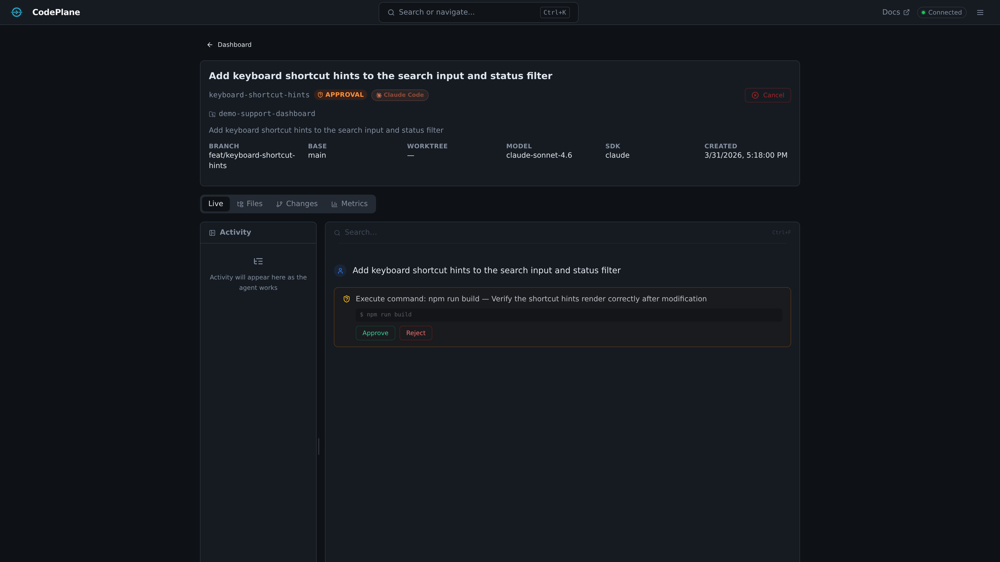

# Approvals

CodePlane's approval system lets you gate risky agent operations behind operator approval, giving you control over what the agent can do.

Use approvals to constrain blast radius, not to click through every action out of habit. If you are evaluating a new model, repository, or workflow, start stricter and relax once you understand the agent's behavior.

## How It Works

When an agent attempts a risky action, the SDK's permission callback fires. Depending on the permission mode, CodePlane either auto-approves or prompts the operator.

If approval is required, a banner appears at the top of the job detail view:

<div class="screenshot-desktop" markdown>

</div>

## Approval Actions

| Action | Effect |
|--------|--------|
| **Approve** | Allow this specific operation to proceed |
| **Reject** | Block this operation — the agent may try an alternative approach |
| **Trust Session** | Auto-approve all remaining operations for this job |

## Permission Modes

Configure how CodePlane handles agent permissions:

| Mode | Behavior |
|------|----------|
| `auto` | SDK handles permissions automatically (default) |
| `read_only` | Agent can only read files; all writes require approval |
| `approval_required` | Every risky operation requires explicit operator approval |

Recommended default while evaluating CodePlane: `approval_required`.

### What Triggers Approval?

In `approval_required` mode, the following operations prompt for approval:

- File writes and deletions
- Shell command execution
- Network requests (URLs)
- MCP tool invocations (mutations)

### Hard-Gated Commands

Some commands **always** require explicit approval regardless of permission mode or trust grants:

- **`git merge`**, **`git pull`**, **`git rebase`**, **`git cherry-pick`** — These bypass CodePlane's merge controls
- **`git reset --hard`** — Destructive history rewrite

Even if you've clicked "Trust Session", these commands will still prompt for approval. The operator must explicitly approve each one.

### Configuring Permission Mode

Set the default in your global config:

```yaml
# ~/.codeplane/config.yaml
agent:
  permission_mode: approval_required
```

Or per-repository:

```yaml
# .codeplane.yml in repo root
agent:
  permission_mode: read_only
```

## Approval Flow

1. Agent attempts a risky action
2. CodePlane intercepts via the SDK's permission callback
3. An `approval_requested` event is emitted
4. The UI shows the approval banner with details
5. Operator approves or rejects
6. An `approval_resolved` event is emitted
7. The agent continues (if approved) or adapts (if rejected)

The job enters the `waiting_for_approval` state while waiting for a response. It returns to `running` once resolved.
