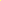

# Code Review

CodePlane provides tools to review the code changes an agent makes, both during and after execution.

## Diff Viewer

The **Diff** tab shows all files modified by the agent with syntax-highlighted, side-by-side diffs:

### Features

- **File list sidebar** — Browse all modified files
- **Syntax highlighting** — Language-aware code coloring
- **Side-by-side view** — Old vs. new content
- **Line-level changes** — Added, removed, and modified lines highlighted

Diffs update in real time as the agent makes changes.

## Workspace Browser

The **Workspace** view lets you browse the full file tree of the job's Git worktree:

- Navigate the directory tree
- Click any file to view its content
- See the complete state of the workspace, not just changed files

This is useful for understanding context — seeing files the agent read but didn't modify, or verifying the overall structure.
