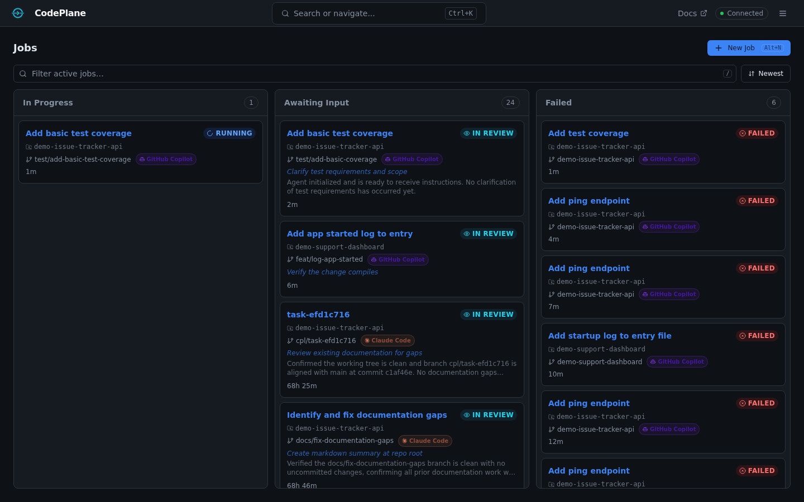
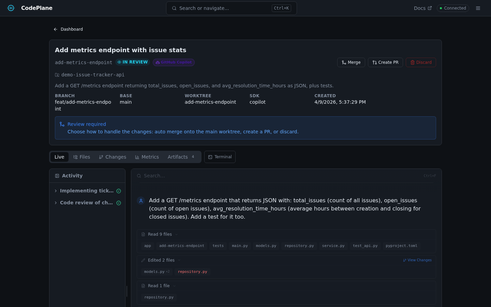

# Monitoring Jobs

CodePlane provides real-time visibility into agent execution without making you hunt through raw logs or guess what the agent is doing next.

Treat monitoring as active supervision, not passive observability. The point is to decide early whether the run is progressing, drifting, or about to do something expensive and unnecessary.

## What To Check First

1. Open the transcript to see whether the agent's current reasoning matches the task.
2. Check the plan and timeline for forward motion rather than repetition.
3. Use logs and metrics when you need to understand failures, retries, or cost spikes.

## Dashboard

The main dashboard shows all active jobs in a Kanban-style board with three columns:

- **In Progress** — Currently executing jobs
- **Awaiting Input** — Jobs waiting for operator approval
- **Failed** — Jobs that encountered errors

On mobile, the dashboard switches to a tab-based list view:

### Search & Filter

Use the search bar or press `/` to filter jobs by ID, title, repository, branch, or prompt content.

### Sort Options

Sort jobs by: newest, oldest, recently updated, or alphabetical.

## Job Detail View

Click any job card to open the detail view. It contains several tabs:

### Transcript

The primary monitoring view. Shows the agent's conversation as a chat-like interface:

- **Assistant messages** — The agent's reasoning and responses (rendered as Markdown)
- **Tool call groups** — Grouped tool invocations with name, arguments, result, and success/failure status
- **AI summaries** — Auto-generated summaries of related tool call groups
- **Operator messages** — Messages you've sent to the agent
- **Progress headlines** — Short status updates (e.g., "Analyzing codebase...")

You can send messages to the agent at any time using the input box at the bottom of the transcript. The agent receives your message as an operator instruction.

### Logs

Structured log output with level filtering:

- **Debug** — Detailed internal operations
- **Info** — Normal operation messages
- **Warning** — Potential issues
- **Error** — Failures and exceptions

Use the level dropdown to filter by severity.

### Timeline

Visual timeline showing the agent's progress through execution phases:

- Active phases are highlighted
- Completed phases show duration
- Future phases are dimmed

### Plan

The agent's planned steps with real-time status tracking:

- ✅ **Done** — Completed steps
- 🔄 **Active** — Currently executing
- ⏳ **Pending** — Not yet started
- ⏭️ **Skipped** — Agent decided to skip

### Metrics

Token usage and cost tracking per job:

- **Input/Output tokens** — With cache hit breakdown
- **Total cost** — Estimated cost for the job
- **LLM calls** — Number of API calls made
- **Tool calls** — Number of tools invoked
- **Context utilization** — How much of the context window is being used

## Job States

Jobs go through several states during their lifecycle. See [Job States Reference](../reference/job-states.md) for the complete state machine.

## Operator Actions

While a job is running, you can:

- **Send a message** — Type instructions in the transcript input
- **Cancel** — Stop the job immediately
- **Pause** — Forcefully pause execution (blocks all tool calls immediately, interrupts the current turn, sends a silent stop instruction to the agent)

### Follow-Up Jobs

From a job in the `review` state, you can create a **follow-up job** with a new instruction. The follow-up inherits the parent job's worktree and context, continuing where the previous job left off.
