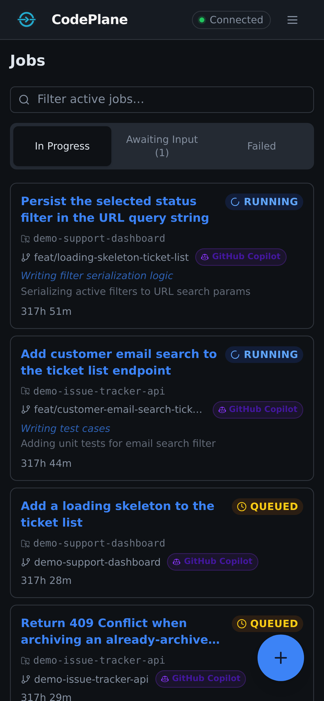

---
hide:
  - navigation
  - toc
---

# CodePlane

<div class="hero" markdown>

**Control plane for running and supervising coding agents**

Launch automated coding tasks against real repositories, watch everything the agent does in real time, and intervene when needed.

[Get Started](getting-started/index.md){ .md-button .md-button--primary }
[User Guide](guide/index.md){ .md-button }

</div>

<div class="screenshot-desktop" markdown>

</div>

## Why CodePlane?

CodePlane gives you **visibility and control** over autonomous coding agents. Instead of fire-and-forget, you get a real-time control plane where you can monitor execution, review changes, approve risky actions, and intervene at any point.

<div class="feature-grid" markdown>

<div class="feature-card" markdown>
### :material-play-circle: Job Orchestration
Launch coding tasks with a prompt, choose your AI model and SDK, and let the agent work against a real repository in an isolated Git worktree.
</div>

<div class="feature-card" markdown>
### :material-monitor-eye: Live Monitoring
Watch the agent's reasoning, tool calls, logs, and code changes in real time through a rich transcript view with progress tracking.
</div>

<div class="feature-card" markdown>
### :material-shield-check: Approval Gating
Risky operations — file writes, shell commands, network access — can be gated behind operator approval before they execute.
</div>

<div class="feature-card" markdown>
### :material-code-tags: Code Review
Syntax-highlighted diff viewer shows every change the agent makes. Browse the full workspace file tree at any point during execution.
</div>

<div class="feature-card" markdown>
### :material-cellphone-link: Remote Access
Access the UI from your phone or another device via Dev Tunnels. Monitor and control jobs from anywhere over HTTPS.
</div>

<div class="feature-card" markdown>
### :material-microphone: Voice Input
Speak your prompts and instructions directly into the browser. Local Whisper transcription keeps your data private — nothing leaves your machine.
</div>

<div class="feature-card" markdown>
### :material-source-merge: Merge & PR
When a job completes, merge changes directly, use smart merge, or create a pull request — all from the UI.
</div>

<div class="feature-card" markdown>
### :material-console: Terminal Sessions
Integrated terminal with multi-tab support lets you run commands alongside the agent, inspect the workspace, or debug issues.
</div>

</div>

<div class="screenshot-desktop" markdown>

</div>

## Multi-SDK Support

CodePlane works with multiple AI coding agent SDKs:

- **GitHub Copilot** — Use any model available through the Copilot platform
- **Claude Code** — Direct integration with Anthropic's Claude SDK

The agent adapter pattern means adding new SDKs is straightforward — each SDK is wrapped behind a common interface.

## Architecture at a Glance

```
┌──────────────────────────────────────────────────────────┐
│                    Operator Browser                      │
│              React + TypeScript Frontend                 │
│          REST (commands/queries) + SSE (live)            │
└────────────────────────┬─────────────────────────────────┘
                         │ HTTP / SSE / WebSocket
┌────────────────────────▼─────────────────────────────────┐
│               FastAPI Backend (Python)                   │
│  REST API · SSE · Job orchestration · MCP server         │
│  Git service · Agent adapters · Approvals · Terminal     │
│  Voice transcription · Telemetry · Merge service         │
└────┬──────────┬──────────┬──────────┬──────────┬─────────┘
     │          │          │          │          │
┌────▼───┐ ┌───▼────┐ ┌───▼─────┐ ┌─▼──────┐ ┌─▼───────┐
│ SQLite │ │  Git   │ │Copilot  │ │ Claude │ │ Whisper │
│   DB   │ │  repos │ │  SDK    │ │  SDK   │ │ (local) │
└────────┘ └────────┘ └─────────┘ └────────┘ └─────────┘
```

<div class="screenshot-desktop" markdown>

</div>

<div class="screenshot-desktop" markdown>

</div>

<div class="screenshot-mobile" markdown>


</div>
