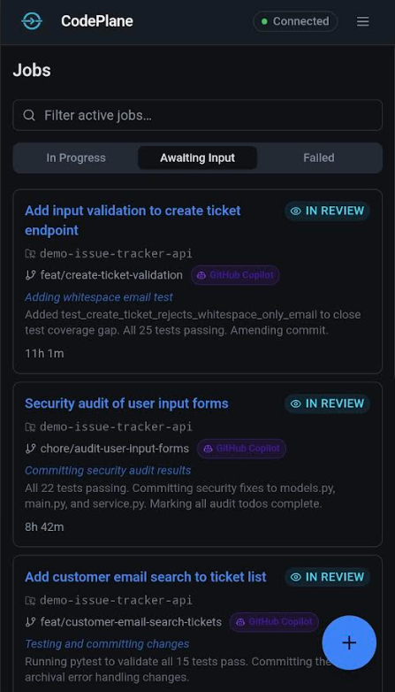

---
hide:
  - navigation
  - toc
---

{ width="180" }

# CodePlane

Run coding agents. Supervise from anywhere.

**No IDE. No terminal. Just a prompt.**

CodePlane runs Claude Code and GitHub Copilot on your workstation — supervise from any browser on your desktop, phone, or tablet. Review diffs, approve risky actions, track costs, and merge when you're ready.

[Quick Start](quick-start.md){ .md-button .md-button--primary }
[Usage Guide](guide.md){ .md-button }
[How It Works](architecture.md){ .md-button }

Works with <strong>Claude Code CLI</strong> and <strong>GitHub Copilot CLI</strong> &nbsp;·&nbsp; Open source, MIT license

## The Core Loop

1
### Launch a task
Pick a repository, write a prompt, choose an agent and model. The agent runs in an isolated Git worktree — your working directory is never touched.

2
### Supervise the run
Watch the transcript, logs, plan progress, and cost data while the agent works. Send messages to steer it if needed.

3
### Gate risky actions
File writes, shell commands, and destructive operations can require your approval before they execute.

4
### Land or discard
Review the diff, then merge, create a PR, or discard — based on what the agent actually produced.

## Supported Agents

CodePlane works with **GitHub Copilot CLI** and **Claude Code CLI**. Install and authenticate either CLI, select your agent and model per job — CodePlane manages the underlying SDKs and handles the rest.

External agents can orchestrate CodePlane programmatically through its built-in [MCP server](mcp-server.md) — compatible with VS Code, Claude Desktop, Cursor, and any MCP-compatible client.

## What You Get

### :material-play-circle: Task Orchestration
Launch jobs with a prompt and model selection. Each job runs in its own Git worktree for safe, concurrent execution.

### :material-cellphone-link: Mobile-First & Remote
Run on your workstation, control from any browser — phone, tablet, or desktop. UI is touch-optimised. Remote access out of the box via Dev Tunnels or Cloudflare Tunnels.

### :material-monitor-eye: Live Visibility
Transcript, logs, timeline, plan steps, and token costs — all streaming in real time as the agent works.

### :material-shield-check: Approval Gates
Risky operations pause for your review. Approve, reject, or trust the session to auto-approve the rest.

### :material-code-tags: Diff Review & Merge
Syntax-highlighted diffs, workspace browsing, and merge/PR/discard controls — all built in.

### :material-chart-line: Cost Analytics
Track token usage, costs, model performance, and tool health across all jobs.

