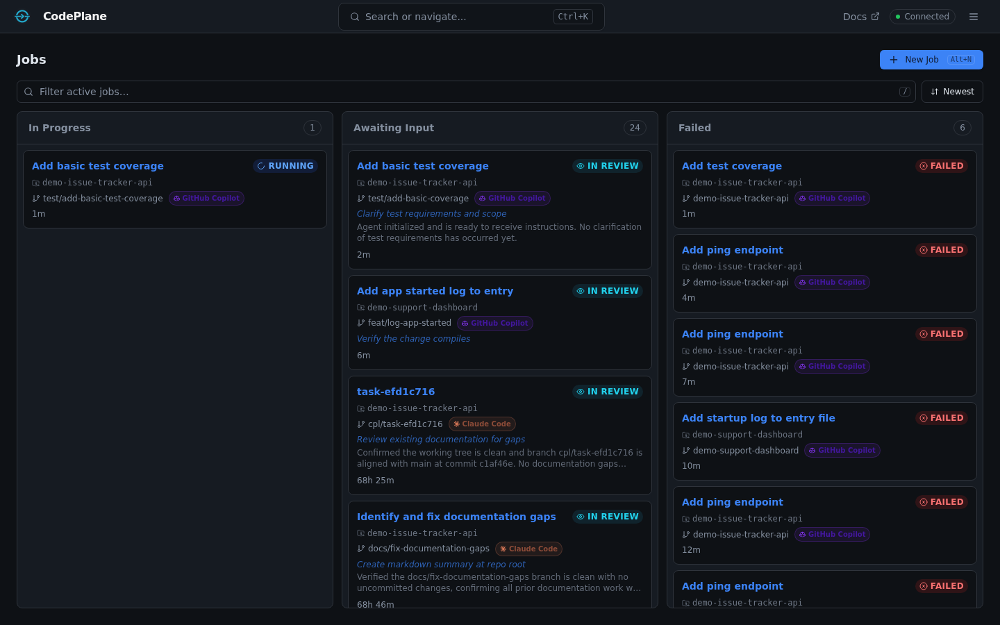
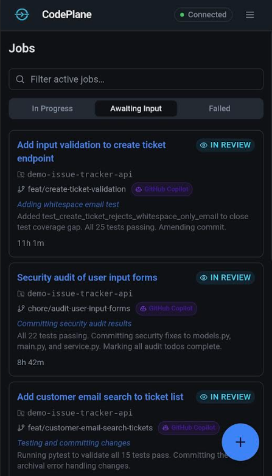

---
hide:
  - navigation
  - toc
---

{ width="180" }

# CodePlane

Orchestration and observability for coding agents. Bring your own CLI.

**Keep using Claude Code or Copilot in your terminal. CodePlane watches, analyzes, and adds the layers they don't have.**

A local server that launches agent jobs headless or mirrors the native CLI sessions you already run. You get supervision, cost intelligence, structural review, decision trails, and workspace memory. The agents do the work; CodePlane makes it reviewable.

[Quick Start](quick-start.md){ .md-button .md-button--primary }
[Usage Guide](guide.md){ .md-button }
[How It Works](architecture.md){ .md-button }

Works with <strong>Claude Code CLI</strong> and <strong>GitHub Copilot CLI</strong> &nbsp;·&nbsp; Open source, MIT license

## Two Modes, One Pipeline

A
### Launch through CodePlane
Write a prompt, pick a repo and model. The agent runs headless in an isolated worktree. Review the diff when it's done — approve from your phone or desktop.

B
### Mirror your native sessions
Run `claude` or `copilot` in your terminal as usual. CodePlane auto-discovers the session via file-tailing and ingests it — full dashboard, cost tracking, and trail enrichment with zero workflow change.

Either way, you get the same intelligence: trail enrichment, cost attribution, structural review, and workspace memory.

## What You Get

### :material-play-circle: Orchestration & Supervision
Launch headless jobs, gate risky actions for approval, supervise from any device. Push notifications for approvals and completions.

### :material-graph: Decision Trail
What the agent did, why it did it, where it backtracked. Full reasoning history — not just a transcript.

### :material-shield-check: Structural Risk Scoring
Breaking vs. additive changes, coupling risks, merge confidence verdict — before you read a single line of diff.

### :material-chart-line: Cost Intelligence
Every turn classified by activity. Waste patterns surfaced across jobs — rework, rereads, cost escalation.

### :material-brain: Workspace Memory
Per-repo knowledge that carries forward. Each new job starts smarter than the last.

### :material-book-open-variant: Narrative Review
Answers "why was this change made?" with verified file references. No hallucinated summaries.

## Bring Your Own CLI

CodePlane doesn't contain an AI model. It wraps the agent CLIs you already have installed and authenticated — Claude Code and GitHub Copilot. Install, authenticate, and CodePlane handles the rest.

## Supported Agents

| Agent | Managed (headless) | Mirrored (native CLI) |
|-------|-------------------|-----------------------|
| Claude Code | Yes | Yes |
| GitHub Copilot | Yes | Yes |

External agents can also orchestrate CodePlane programmatically through its built-in [MCP server](mcp-server.md).

## The Core Loop

1
### Launch or discover
Create a job from the UI, or just start a native CLI session in a registered repo. Either way it appears on your dashboard.

2
### Supervise
Watch the transcript, plan progress, and live cost while the agent works. Send messages to steer if needed.

3
### Gate risky actions
File writes, shell commands, and destructive operations can require your approval before they execute.

4
### Review with intelligence
Structural risk scoring, narrative review, and motivation provenance — not just a diff.

5
### Land or discard
Merge, create a PR, or discard — based on what the agent produced and what the review tells you.

