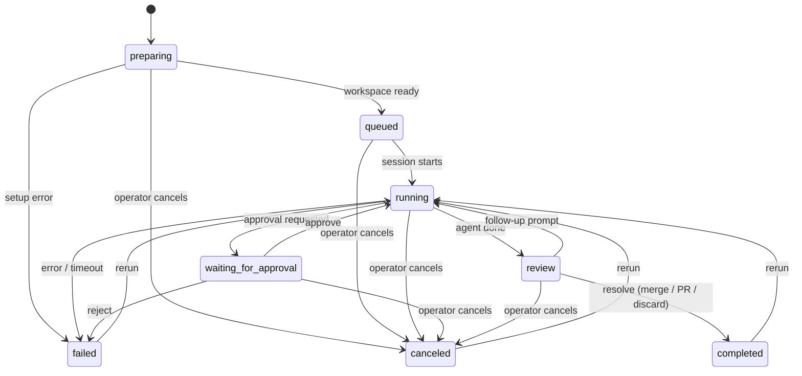

# Job States Reference

Every job in CodePlane follows a state machine that governs its lifecycle.

## State Machine

- **Approve** transitions `waiting_for_approval` → `running`
- **Reject** transitions `waiting_for_approval` → `failed`
- **Rerun** is available from any terminal state (`completed`, `failed`, `canceled`)

## States

| State | Description | Terminal? |
|-------|-------------|-----------|
| `preparing` | Job created, workspace being set up | No |
| `queued` | Workspace ready, waiting to start | No |
| `running` | Agent is actively executing | No |
| `waiting_for_approval` | Agent paused, waiting for operator to approve/reject an action | No |
| `review` | Agent completed successfully, awaiting operator review (merge/PR/discard) | No |
| `completed` | Job resolved — changes merged, PR created, or discarded | Yes |
| `failed` | Job failed due to error, timeout, or heartbeat loss | Yes |
| `canceled` | Job was canceled by the operator | Yes |

## Valid Transitions

| From | To | Trigger |
|------|----|---------|
| `preparing` | `queued` | Workspace setup complete |
| `preparing` | `failed` | Setup error |
| `preparing` | `canceled` | Operator cancels during setup |
| `queued` | `running` | Agent session starts |
| `queued` | `canceled` | Operator cancels before start |
| `running` | `waiting_for_approval` | Agent requests permission for risky action |
| `running` | `review` | Agent completes task successfully |
| `running` | `failed` | Error, timeout, or heartbeat loss |
| `running` | `canceled` | Operator cancels |
| `waiting_for_approval` | `running` | Operator approves |
| `waiting_for_approval` | `failed` | Operator rejects |
| `waiting_for_approval` | `canceled` | Operator cancels |
| `review` | `completed` | Operator resolves (merge/PR/discard) |
| `review` | `running` | Operator creates follow-up job |
| `review` | `canceled` | Operator cancels |
| `completed` | `running` | Operator reruns |
| `failed` | `running` | Operator reruns |
| `canceled` | `running` | Operator reruns |

## Restart Recovery

By default, `cpl down` and `cpl restart` request a pause for running sessions
before stopping the server. Runtime shutdown preserves active job state, and
startup recovery resumes recoverable managed jobs in place. The emitted
`session.resumed` event uses reason `"server_restart"`.

Recovery is not unconditional. Jobs with an unavailable worktree fail, as do
plan-mode jobs interrupted while awaiting approval because their in-memory
approval context cannot be reconstructed. Other startup-recovery errors roll
back that recovery attempt and are logged; no broader resume guarantee is made.
Forced shutdown (`--force`) skips the graceful pause request and does not
provide the graceful pause guarantee.

## Heartbeat Watchdog

The runtime emits a canonical `session.heartbeat` event every 30 seconds while
a managed session is active. It carries the session identifier, timestamp,
last-activity timestamp, and active-tool details when available. These events
support session-health display and stall-sidecar checks; the current state
machine does not define a heartbeat-timeout failure transition.

## Job IDs

Jobs use sequential IDs in the format `job-{N}` (e.g., `job-1`, `job-2`, `job-3`), backed by an internal SQLite autoincrement sequence.
