> The operator's job is verification, not comprehension.
> Structural intelligence turns a 47-file diff into a ranked shortlist
> of what actually needs human judgment.

---

## 1. Problem Statement

### 1.1 The Review Problem

An operator supervising an agent job faces a fundamental information asymmetry:
the agent touched 47 files across 3 sessions, but the operator sees a flat diff.
Nothing in the current review surface communicates structural impact — which
changes break callers, which are additive, which are cosmetic.

The operator must either:

* Read every diff line (expensive, doesn't scale)
* Approve on faith (risky, defeats the purpose of supervision)
* Reject and re-run (wasteful, demoralizing for long jobs)

### 1.2 The Gap

CodePlane knows *what* the agent did (trail nodes, steps, diffs). It does not
know *what those changes mean structurally* — reference counts, breaking vs.
additive classification, dependency graph impact, test coverage correlation,
or cross-module coupling.

CodeRecon knows all of these things. It maintains a tiered structural index
per repository that answers questions about symbol references, call graphs,
module communities, and semantic diffs.

### 1.3 Circles of Impact

The integration touches every stage of a job's lifecycle:

| Stage | Without CodeRecon | With CodeRecon |
|-------|-------------------|----------------|
| Pre-execution | Agent gets flat file listing | Agent gets structural context, ref counts, community map |
| During execution | No structural feedback | Cycle detection, scaffold checkpoints, community drift warnings |
| Review | Flat diff | Structural triage with risk scoring and impact graphs |
| Merge | Operator judgment alone | Merge confidence score based on reference certainty |
| Post-resolution | Summary only | Structural analytics (coupling delta, test coverage correlation) |

---

## 2. CodeRecon Technical Foundation

### 2.1 Tiered Index Architecture

CodeRecon maintains a multi-tier index per repository, each tier adding semantic
depth:

| Tier | Name | Technology | Coverage | What It Knows |
|------|------|-----------|----------|---------------|
| 0 | Lexical | Tantivy | 90+ languages | Full-text token search, file paths, content hashes |
| 1 | Structural | Tree-sitter + SQLite | 90+ languages | Functions, classes, signatures, imports, call sites |
| 2 | Type-aware | Language-specific | Subset | Resolved types, generic instantiations, trait impls |
| 3 | Behavioral | LLM-assisted | On-demand | Intent, contracts, invariants |

For CodePlane's review use case, Tier 1 (structural) provides the critical
foundation. Every function, class, method, and module boundary is known, with
reference relationships classified by certainty.

### 2.2 Reference Tiers

References between symbols are classified by confidence:

| Ref Tier | Meaning | Source |
|----------|---------|--------|
| PROVEN | Confirmed by type system or import resolution | Tier 2+ analysis |
| STRONG | Structural match (same name + compatible signature) | Tier 1 cross-file |
| ANCHORED | Lexical match with structural context | Tier 0 + Tier 1 heuristic |
| UNKNOWN | Name match only, no structural confirmation | Tier 0 fallback |

The distribution of reference tiers for a change directly indicates review risk.
A function modification where all callers are PROVEN is safe. A modification
where callers are UNKNOWN requires human verification.

The UI never exposes raw tier names. User-facing labels:

| Internal Tier | UI Label | Rationale |
|---|---|---|
| PROVEN | Verified | Confirmed via type system or imports — the strongest guarantee |
| STRONG | Inferred | Structural match without full type confirmation |
| ANCHORED | Inferred | Grouped with STRONG — distinction is not meaningful to reviewers |
| UNKNOWN | Unverified | Needs manual check — cannot be confirmed automatically |

### 2.3 Worktree Column Key

CodeRecon indexes once per repository. The index supports multiple worktrees
(branches, agent sandboxes) via a column key that partitions structural facts
by worktree identity. This means:

* One daemon serves all active jobs against the same repo
* No re-indexing when switching between branches
* Structural queries are worktree-scoped automatically
* Agent sandboxes get instant structural context from the shared index

### 2.4 Core Capabilities

**Semantic Diff** (`semantic_diff`): Compares two commits structurally. Returns
per-symbol classification: added, removed, modified (signature vs. body),
moved. Includes reference impact for each change.

**Graph Analysis** (NetworkX): Module-level dependency graph with Louvain
community detection. Identifies clusters of related files, cross-community
coupling, and dependency cycles.

**Recon Tool** (`recon`): Multi-stage ranked retrieval. LightGBM first-pass
scoring + TinyBERT re-ranking. Returns contextually relevant code given a
natural language query.

**Scaffolds** (`scaffold`): Compact structural representation of a file —
imports + hierarchical symbol list without implementation bodies. 10–50x more
compact than full source.

**Checkpoints** (`checkpoint`): Snapshot structural state at a point in time.
Enables before/after comparison across agent actions.

**Refactoring** (`refactor`): Plan/execute/commit workflow for structural
changes with impact preview.

---

## 3. Integration Architecture

### 3.1 SDK Over Stdio

CodeRecon exports a Python SDK that spawns the daemon as a child process.
Communication is over stdio using NDJSON (newline-delimited JSON), not HTTP
or MCP.

**Why not in-process**: The daemon maintains persistent state (indexes, file
watchers, graph caches) that must survive across individual job lifecycles.
A child process model gives clean lifecycle boundaries without shared memory
corruption risk.

**Why not HTTP**: The daemon is local-only. HTTP adds serialization overhead,
port management, and firewall concerns for zero benefit. Stdio is zero-config
and inherently secured to the parent process.

### 3.2 High-Level Architecture

```text
┌─────────────────────────────────────────────────────────────┐
│ CodePlane Backend                                            │
│                                                             │
│  ┌───────────────┐    ┌──────────────────┐                  │
│  │ RuntimeService│    │ CodeReconService  │◄── single surface│
│  └───────┬───────┘    └────────┬─────────┘                  │
│          │                     │                            │
│          │              ┌──────┴──────┐                     │
│          │              │  SDK Handle  │                     │
│          │              └──────┬──────┘                     │
│          │                     │ stdio (NDJSON)             │
│          │              ┌──────┴──────┐                     │
│          │              │ CodeRecon   │                     │
│          │              │ Daemon      │                     │
│          │              │ (child proc)│                     │
│          │              └─────────────┘                     │
│          │                     │                            │
│          │              ┌──────┴──────┐                     │
│          │              │ Repo Index  │                     │
│          │              │ (Tier 0-3)  │                     │
│          │              └─────────────┘                     │
└──────────┴──────────────────────────────────────────────────┘
```

### 3.3 NDJSON Protocol

Each line on stdio is a complete JSON object with a `type` field:

```json
{"type": "request", "id": "uuid", "method": "semantic_diff", "params": {...}}
{"type": "response", "id": "uuid", "result": {...}}
{"type": "event", "topic": "index_progress", "data": {"repo": "...", "phase": "tree_sitter", "pct": 45}}
{"type": "error", "id": "uuid", "code": "NOT_INDEXED", "message": "..."}
```

Events are unsolicited — the daemon pushes index progress, file watcher
notifications, and health signals without a preceding request.

### 3.4 CodeReconService

`CodeReconService` is the single integration surface between CodePlane and
CodeRecon. No other service imports the SDK or speaks NDJSON.

```python
class CodeReconService:
    """Wraps the CodeRecon SDK. Manages daemon lifecycle and repo handles."""

    async def start(self) -> None: ...
    async def stop(self) -> None: ...

    # Repo management
    async def add_repo(self, path: str, name: str) -> RepoHandle: ...
    async def remove_repo(self, name: str) -> None: ...
    async def get_repo(self, name: str) -> RepoHandle | None: ...
    async def list_repos(self) -> list[RepoStatus]: ...

    # Structural queries (delegated to repo handles)
    async def semantic_diff(self, repo: str, base: str, head: str) -> SemanticDiff: ...
    async def scaffold(self, repo: str, path: str) -> Scaffold: ...
    async def graph_communities(self, repo: str) -> list[Community]: ...
    async def graph_cycles(self, repo: str) -> list[Cycle]: ...
    async def recon(self, repo: str, query: str, **kwargs) -> list[ReconResult]: ...
    async def checkpoint(self, repo: str, label: str) -> Checkpoint: ...

    # Health
    async def repo_health(self, repo: str) -> RepoHealth: ...
    async def daemon_health(self) -> DaemonHealth: ...
```

### 3.5 Lifespan Integration

The daemon starts with CodePlane and stops with CodePlane:

```python
@asynccontextmanager
async def lifespan(app: FastAPI):
    coderecon = app.state.coderecon_service
    await coderecon.start()       # spawns daemon child process
    try:
        yield
    finally:
        await coderecon.stop()    # SIGTERM → graceful shutdown
```

---

## 4. Daemon Lifecycle Management

### 4.1 Startup Sequence

1. `CodeReconService.start()` spawns the daemon via SDK
2. SDK sends `{"type": "request", "method": "health"}` — waits for response
3. On response, daemon is alive. Load persisted repo catalog.
4. For each known repo, send `{"method": "repo_activate", "params": {"name": "...", "path": "..."}}`
5. Daemon begins background re-indexing for stale repos (file watcher catches up)

### 4.2 Shutdown

1. `CodeReconService.stop()` sends `{"method": "shutdown"}`
2. Daemon flushes index state to disk, closes file watchers
3. Daemon exits. SDK reaps child process.
4. If daemon doesn't exit within 5s, SIGKILL.

### 4.3 Crash Recovery

| Scenario | Detection | Recovery |
|----------|-----------|----------|
| Daemon crashes | SDK detects EOF on stdio | Auto-restart with exponential backoff (1s, 2s, 4s, max 30s) |
| Daemon hangs | Health check timeout (10s) | SIGKILL + restart |
| Repeated crashes (3x in 60s) | Backoff counter | Enter degraded mode — all CodeRecon features disabled, UI shows warning |
| CodePlane crash | Daemon is child process | Daemon dies with parent (SIGHUP) |

### 4.4 Graceful Degradation

When the daemon is unavailable, CodePlane continues to function. All
CodeRecon-powered features degrade to their pre-integration state:

| Feature | Degraded behavior |
|---------|-------------------|
| Review dashboard | Falls back to flat diff view |
| Impact graph | "Structural analysis unavailable" placeholder |
| Merge confidence | Not shown — operator uses manual judgment |
| Agent tools | `recon` tool returns error, agent proceeds without |
| Repo health | Last-known status shown as stale |

---

## 5. Repository Onboarding

### 5.1 What "Add Repo" Means

Adding a repository to CodePlane currently means pointing at a Git directory.
With CodeRecon, adding a repo means initiating a full structural index. This
is a new UX — a pipeline with visible progress, not an instant action.

### 5.2 Onboarding Flow

```text
User clicks "Add Repository"
    │
    ▼
[Path / URL input] → validate Git repo exists
    │
    ▼
[Onboarding started] → CodeReconService.add_repo(path, name)
    │
    ▼
[Progress UI] ← SSE events from daemon via event bridge
    │
    ├── Phase: Cloning (if URL)         ░░░░░░░░░░ 0%
    ├── Phase: File discovery            ██░░░░░░░░ 15%
    ├── Phase: Tier 0 (lexical index)    ████░░░░░░ 40%
    ├── Phase: Tier 1 (structural parse) ██████░░░░ 65%
    ├── Phase: Graph construction        ████████░░ 85%
    └── Phase: Ready                     ██████████ 100%
    │
    ▼
[Repo card shows "Ready" with health indicators]
```

### 5.3 Event Stream During Onboarding

The daemon emits progress events that the event bridge translates to SSE:

```json
{"type": "event", "topic": "index_progress", "data": {"repo": "codeplane", "phase": "tier0_lexical", "files_done": 342, "files_total": 891, "pct": 38}}
{"type": "event", "topic": "index_progress", "data": {"repo": "codeplane", "phase": "tier1_structural", "files_done": 100, "files_total": 891, "pct": 11}}
{"type": "event", "topic": "index_complete", "data": {"repo": "codeplane", "duration_ms": 14200, "files": 891, "symbols": 12450}}
```

### 5.4 Pipeline Phases

| Phase | What Happens | Duration (1k files) | Resumable |
|-------|-------------|---------------------|-----------|
| File discovery | Walk tree, apply ignores | <1s | N/A |
| Tier 0 (lexical) | Tantivy tokenization + indexing | 2–5s | Yes |
| Tier 1 (structural) | Tree-sitter parse, symbol extraction | 5–15s | Yes |
| Graph construction | Build dependency graph, run community detection | 1–3s | No (fast enough) |

Total for a 1k-file repo: 10–25 seconds. For a 10k-file monorepo: 2–5 minutes.

### 5.5 Large Repo Handling

Repos over 5k files trigger a staged activation:

1. Tier 0 completes first — repo becomes queryable for lexical search
2. Tier 1 indexes in background — structural queries progressively available
3. Graph builds after Tier 1 completes — community/cycle analysis last

The UI reflects partial readiness: "Lexical search ready. Structural analysis
indexing (65%)..."

### 5.6 Re-Indexing

File watchers detect changes and trigger incremental re-indexing. Full re-index
is triggered by:

* User request ("Rebuild index")
* Git force-push detected (ref rewrite)
* Index corruption detected (checksum mismatch)

---

## 6. Index Health and Freshness

### 6.1 Freshness Model

Each repo's index tracks staleness:

| Staleness | Meaning | Visual |
|-----------|---------|--------|
| Fresh (<30s behind HEAD) | File watchers caught up | Green dot |
| Slightly stale (30s–5m) | Incremental re-index in progress | Yellow dot |
| Stale (>5m behind HEAD) | Background indexing or watcher failure | Orange dot |
| Unknown | Daemon unavailable | Gray dot |

### 6.2 Repo Health Dashboard

Per-repo card showing:

* Index tier coverage (which tiers are complete)
* Symbol count, file count
* Last indexed commit SHA
* Staleness indicator
* Community count (structural modularity metric)
* Cycle count (structural debt indicator)

---

## 7. Lifecycle Stage Integration Map

### 7.1 Pre-Execution: Structural Recon

Before an agent job starts, CodePlane can prime the agent with structural
context about the target area:

```python
# In RuntimeService, before agent session begins:
if coderecon.is_available(repo):
    context = await coderecon.recon(repo, task_description)
    scaffolds = [await coderecon.scaffold(repo, f) for f in context.top_files]
    communities = await coderecon.graph_communities(repo)
    # Inject into agent system prompt or initial context
```

This gives the agent awareness of module boundaries, existing patterns, and
structural context before it writes a single line.

### 7.2 During Execution: Structural Feedback

At step boundaries (detected by StepTracker), CodePlane can run lightweight
structural checks:

| Check | Trigger | Action |
|-------|---------|--------|
| Cycle detection | Step boundary with new file writes | Warn operator if new cycles introduced |
| Community drift | Step boundary | Warn if agent is touching 3+ unrelated communities |
| Scaffold checkpoint | Every N steps | Snapshot structural state for later diff |

These are operator-facing warnings, not agent-blocking. The agent continues
working; the operator sees structural signals in real time.

### 7.3 Review: Verification Dashboard

The primary integration surface. See §9 for full design.

### 7.4 Merge: Confidence Score

At merge time, run a final `semantic_diff` between the merge base and the
proposed HEAD:

* **HIGH confidence**: All modified symbols have PROVEN or STRONG references
  to their callers. Test files updated for modified signatures. No new cycles.
* **MEDIUM confidence**: Some ANCHORED references. Most changes are additive.
  Minor structural concerns.
* **LOW confidence**: UNKNOWN references present. Breaking changes without
  confirmed caller updates. New dependency cycles.

HIGH confidence jobs can be auto-merged (with operator opt-in). LOW confidence
requires explicit operator confirmation with the specific concerns highlighted.

### 7.5 Post-Resolution: Structural Analytics

After merge, persist the structural delta for historical analysis:

* Coupling delta (did this job increase or decrease cross-community coupling?)
* Test coverage correlation (did structural changes get test updates?)
* Cycle introduction rate per agent/SDK
* Community coherence trend over time

---

## 8. Agent Tool Provisioning

### 8.1 Pre-Bound Tools

When an agent job starts against an indexed repo, CodeReconService provisions
tools that the agent can invoke during execution:

| Tool | SDK Method | Agent Use Case |
|------|-----------|----------------|
| `recon` | `sdk.repo(name).recon(query)` | Find relevant code for a task |
| `scaffold` | `sdk.repo(name).scaffold(path)` | Get compact structural overview of a file |
| `graph_communities` | `sdk.repo(name).graph_communities()` | Understand module boundaries |
| `graph_cycles` | `sdk.repo(name).graph_cycles()` | Check for circular dependencies |
| `checkpoint` | `sdk.repo(name).checkpoint(label)` | Save structural snapshot for later comparison |
| `semantic_diff` | `sdk.repo(name).semantic_diff(a, b)` | Compare structural state between two points |

### 8.2 Tool Selection

Not all agents need all tools. Tool provisioning is configurable per-job or
per-repo:

* **Minimal**: `recon` + `scaffold` (read-only context gathering)
* **Standard**: Minimal + `checkpoint` + `semantic_diff` (structural awareness)
* **Full**: All tools including `graph_*` (architectural work)

### 8.3 Usage Tracking

Tool invocations are recorded as trail nodes (`kind: tool_call`,
`tool_names: ["recon"]`). This enables:

* Measuring which structural tools agents actually use
* Correlating tool usage with job success rate
* Identifying agents that would benefit from more/fewer structural tools

---

## 9. Review UX: The Verification Dashboard

### 9.1 Design Principle

The review surface organizes changes by structural category, not file path.
An operator reviewing a 47-file diff sees:

* 3 breaking changes (modified signatures with downstream callers)
* 8 body changes (implementation modified, signature stable)
* 22 additive (new functions, classes, modules)
* 14 non-structural (comments, formatting, config)

This immediately communicates where attention is needed.

### 9.2 Triage Bar

Visual summary strip at the top of the review view:

```text
🔴 3 breaking  │  🟡 8 body  │  🟢 22 additive  │  ⚪ 14 non-structural
[████░░░░░░░░░░░░░░░░░░░░░░░░░░░░░░░░░░░░░░░░░░░] 2/47 reviewed
```

Each segment is clickable — filters the change list to that category.

### 9.3 Change Cards

Each structural change gets a card showing:

| Field | Source |
|-------|--------|
| Symbol name + kind | `semantic_diff` result |
| Change type | Breaking / Body / Additive / Non-structural |
| Reference count | Number of callers/users of this symbol |
| Ref tier breakdown | PROVEN: 4, STRONG: 2, UNKNOWN: 1 |
| Test coverage | Which test files reference this symbol |
| Risk score | Composite (see §9.4) |
| File path + line range | Location in diff |

### 9.4 Risk Scoring

Composite risk per change:

```text
risk = f(structural_severity, ref_tier_distribution, test_coverage)
```

| Factor | Weight | Scoring |
|--------|--------|---------|
| Structural severity | 0.4 | Breaking=1.0, Body=0.5, Additive=0.1, Non-structural=0.0 |
| Reference uncertainty | 0.35 | Proportion of UNKNOWN refs among total refs |
| Test coverage gap | 0.25 | 1.0 if no test mentions this symbol, 0.0 if tests updated |

Changes with risk > 0.7 are flagged for explicit operator attention.
UNKNOWN references always penalize — they represent unverified assumptions.

### 9.5 Impact Graph

Drill-down from any change card. Shows the reference graph radiating outward
from the changed symbol:

```text
                    ┌─────────────┐
                    │ changed_fn()│ ← MODIFIED (body)
                    └──────┬──────┘
                           │
              ┌────────────┼────────────┐
              │            │            │
        ┌─────┴─────┐ ┌───┴───┐ ┌─────┴─────┐
        │ caller_a()│ │test_x()│ │ caller_b()│
        │  PROVEN   │ │ PROVEN │ │  UNKNOWN  │ ← needs attention
        └───────────┘ └────────┘ └───────────┘
```

Each node shows:

* Symbol name and file
* Reference tier (color-coded)
* Whether the caller was also modified in this job
* Test file indicator

### 9.6 Scaffold View

For low-risk additive changes, the full diff is often unnecessary. The scaffold
view shows:

```python
# file: backend/services/new_service.py (ADDED)
# ─── imports ───
from backend.models import Job
from backend.persistence import JobRepository

# ─── classes ───
class NewService:
    def __init__(self, repo: JobRepository): ...
    async def process(self, job: Job) -> Result: ...
    async def validate(self, job: Job) -> bool: ...

# ─── module-level ───
_DEFAULT_TIMEOUT = 30
```

This is 10–50x more compact than the full source. Operators can verify the
structural shape (correct dependencies, reasonable API surface) without reading
implementation details for low-risk additions.

### 9.7 Community Clustering

Changes grouped by detected module community:

```text
Community: "persistence" (5 changes)
  ├── job_repo.py — body change (risk 0.3)
  ├── trail_repo.py — body change (risk 0.2)
  ├── event_repo.py — additive (risk 0.1)
  ├── base_repo.py — breaking (risk 0.8) ⚠️
  └── migrations/0015.py — non-structural (risk 0.0)

Community: "api" (3 changes)
  ├── routes/jobs.py — body change (risk 0.4)
  ├── routes/trail.py — additive (risk 0.1)
  └── schemas.py — additive (risk 0.1)

⚠️ Cross-community: 2 changes touch both "persistence" and "services"
```

The cross-community warning flags coupling — changes that bridge module
boundaries warrant extra scrutiny.

### 9.8 Cycle Warnings

If the job introduced new dependency cycles that didn't exist at baseline:

```text
⚠️ New cycle introduced:
  services/job_service.py → services/trail_service.py → services/job_service.py

This cycle did not exist at the job's baseline commit.
```

---

## 10. Multi-Session Intelligence

### 10.1 The Multi-Session Problem

Long jobs span multiple agent sessions. Each session may have different
context, different intent, or even contradictory directions. The review surface
must account for this reality.

### 10.2 Session Segmentation

At each session boundary, run `semantic_diff` between the session's start SHA
and end SHA. This produces per-session structural change sets that can be
attributed and compared.

### 10.3 Timeline View

```text
Session 1 (2h ago) — "Implement auth middleware"
  ├── Added: AuthMiddleware, TokenValidator, 3 route decorators
  ├── Modified (body): UserService.authenticate()
  └── Risk: 0.2 (all additive, well-tested)

Session 2 (45m ago) — "Fix auth + add rate limiting"
  ├── Modified (breaking): AuthMiddleware.validate() ← signature changed
  ├── Added: RateLimiter, rate_limit_config
  ├── Modified (body): 4 route handlers
  └── Risk: 0.6 (breaking change to code written in Session 1)

⚠️ Direction change: Session 2 modified Session 1's public API
```

### 10.4 Direction Change Detection

Heuristic: if Session N modifies symbols that Session N-1 *added*, this
indicates a direction change. The agent revised its own earlier work, which
may signal confusion, scope creep, or legitimate iteration.

Detection: compare the "added" set from session N-1 against the "modified"
set from session N. Overlap triggers the warning.

### 10.5 File Ownership

In multi-session jobs, track which session last modified each file. The diff
viewer annotates file headers:

```text
── backend/services/auth.py (Session 1 + Session 2) ──
```

Files touched by multiple sessions get extra review weight — they represent
areas the agent revisited.

### 10.6 Messy Session Warning

When a single session touches symbols in 3+ unrelated communities with no
clear structural relationship:

```text
⚠️ Session 2 spans 4 unrelated module communities:
  persistence, api, services, config

Consider whether this session conflates multiple concerns.
```

---

## 11. The Review Story

### 11.1 The Problem the Story Solves

The dashboard is spatial — cards, bars, graphs. It answers "what should I look
at?" but not "what happened here, and should I be worried?" An operator
reviewing a complex multi-session job needs a document that can be read
top-to-bottom, one that explains the structural picture as a coherent
narrative rather than a collection of data points.

The review story is that document. It is a first-class review artifact,
coequal with the Dashboard, Timeline, and Full Diff tabs. It is not a summary
of agent activity (that's the activity story from StoryService). It is a
report on what the changes *mean* structurally — the kind of document a senior
engineer would write when reviewing a large PR for a colleague who wasn't in
the room.

### 11.2 Writing Principles

The story is generated text, but it must read like it was written by a person
who respects the operator's time. The following principles govern all story
generation, informed by empirical research on how people read on the web
(Nielsen 1997, Moran 2023) and code review effectiveness (SmartBear/Cisco,
Google eng-practices).

#### 11.2.1 Inverted Pyramid

Every section leads with its conclusion. The operator reads the first sentence
of each section and either stops (they have enough) or continues (they want
detail). This matches how 79% of web users scan rather than read linearly.

**Bad**: "In Session 2, the agent modified AuthMiddleware.validate() by adding
a scope parameter, which changed the signature from (token: str) → bool to
(token: str, scope: str) → bool. This is a breaking change because..."

**Good**: "AuthMiddleware.validate() is a breaking change — 1 of 7 callers is
unverified. [Details follow for those who want them.]"

#### 11.2.2 Cognitive Load Budget

SmartBear research shows defect detection drops sharply beyond 400 LOC
reviewed. The story must respect the same cognitive limits:

* **Attention section** (breaking changes): max 5 items narrated in full. If
  more exist, show top 5 by risk score and summarize the rest as a count.
* **Body changes section**: max 10 items. Beyond that, group by community and
  give per-community summaries, not per-symbol narratives.
* **Additive section**: never narrate more than 7 items individually. Use
  aggregation patterns (see §11.6) for the rest.

These limits are the story's equivalent of the 400-LOC review threshold.
Beyond them, prose becomes noise.

#### 11.2.3 Progressive Disclosure

The story has two levels of detail:

1. **Level 1 (always shown)**: The complete generated narrative. Fits in a
   single screen for typical jobs. Uses bold leads, bullet points, and
   one-sentence summaries.
2. **Level 2 (on demand)**: Expandable detail blocks within the narrative.
   Click to reveal full reference lists, complete file manifests, or raw
   scaffold output. Never auto-expanded.

This matches NNGroup's progressive disclosure principle: show core information
by default, secondary information on request. Most operators never expand
Level 2.

#### 11.2.4 Scannable Structure

Every story uses identical heading structure. The operator builds muscle memory
for where to look:

* Bold **symbol names** as anchors for eye-scanning
* Inline `code` spans for function names, variables, and expressions
* One structural fact per sentence — never compound
* Bullet points for lists of 3+ items (not prose)
* Numbers when sequence or magnitude matters
* No promotional language, no hedging, no filler

#### 11.2.5 Brevity Through Omission

If something is unremarkable, it is not mentioned. The story does not report
that 14 non-structural changes exist unless one of them has an unusual
property. It does not enumerate files that were added to the correct community
with correct dependencies. Silence means "nothing concerning here."

The story earns trust by being short when things are fine and long when things
are not.

### 11.3 Story Structure

```text
┌──────────────────────────────────────────────────────────┐
│ REVIEW: "Add authentication middleware"                  │
│ 47 files · 3 breaking · MEDIUM confidence                │
├──────────────────────────────────────────────────────────┤
│                                                          │
│ ## Attention Required                                    │
│ (Breaking changes with full structural context)          │
│                                                          │
│ ## Structural Concerns                                   │
│ (Cycles, UNKNOWN refs, community drift — if any)         │
│                                                          │
│ ## What Changed                                          │
│ (Body changes, grouped by community)                     │
│                                                          │
│ ## What Was Added                                        │
│ (Additive code — scaffolds or aggregates)                │
│                                                          │
│ ## Session History                                       │
│ (Per-session chapters — only for multi-session jobs)     │
│                                                          │
│ ## Verdict                                               │
│ (Merge confidence + specific blockers)                   │
│                                                          │
└──────────────────────────────────────────────────────────┘
```

The header is a one-line summary: task title, file count, breaking count,
confidence level. An operator can glance at the header and decide whether to
read further.

Sections are ordered by **attention priority**, not chronology. "Attention
Required" is first because it contains the only content that might block a
merge. "Structural Concerns" is second because it contains the only content
that might indicate architectural debt. Everything else is informational.

Sections that would be empty are omitted entirely. A clean job with 5 additive
files and no breaking changes produces a story with only "What Was Added" and
"Verdict."

### 11.4 Content Density Rules

Not all changes deserve the same level of narrative detail. The story adapts
its density based on the structural character of each change.

#### 11.4.1 Density Levels

| Level | When Used | Format |
|-------|-----------|--------|
| Full narration | Breaking changes, UNKNOWN refs | Complete paragraph with symbol, old/new signature, caller list, test status, risk |
| Summary narration | Body changes in active code | One sentence: what changed, ref count, risk |
| Grouped aggregate | Multiple similar changes in same community | "5 route handlers updated to pass scope parameter (all PROVEN)" |
| Count only | Low-risk homogeneous changes | "14 non-structural changes (formatting, comments)" |
| Omitted | Zero-risk, zero-interest | Not mentioned at all |

#### 11.4.2 Escalation Rules

A change escalates to a higher density level when:

* It has UNKNOWN references (always full narration)
* It touches a symbol with >10 callers (always at least summary)
* It introduces or participates in a cycle (full narration)
* It spans multiple communities (at least summary)
* It was modified in multiple sessions (at least summary)

A change de-escalates (or is omitted) when:

* It is purely additive with 0 external callers
* It is a test file that mirrors a production change
* All its references are PROVEN and callers are updated
* It is a mechanical change (rename, move, reformat)

### 11.5 Edge Cases: Non-Narrative Content

The current section title is "The Review Story" but real jobs produce changes
that resist narration. These edge cases are common enough to require explicit
design decisions.

#### 11.5.1 Large Documentation Changes

**Problem**: An agent updates a 1500-line README.md or adds 800 lines of API
docs. You cannot narrate this line-by-line, and showing it inline is absurd.

**Strategy**: Documentation changes are non-structural by definition (no
symbols, no refs, no callers). The story acknowledges them with a metadata
block, not prose:

```text
📄 Documentation (3 files, +1,847 / -203 lines)
   README.md — major rewrite (content review recommended)
   docs/api-reference.md — new file
   docs/configuration.md — section additions

   These files have no structural impact. Review for accuracy
   and completeness outside the structural story.
```

The key insight: documentation changes need a *different kind of review*
(content accuracy, clarity, completeness) that structural analysis cannot
provide. The story explicitly signals this rather than pretending to analyze it.

**Threshold**: Any non-code file change over 200 lines gets this treatment.
Under 200 lines, a one-line mention suffices ("Updated README with new API
examples").

#### 11.5.2 Generated Code and Migrations

**Problem**: A database migration adds 150 lines. An OpenAPI schema generates
400 lines of TypeScript types. Structural analysis of generated code is noise.

**Strategy**: Generated files are detected by path patterns or file headers
and presented as a metadata block:

```text
🔧 Generated / Migrations (2 files, +187 lines)
   alembic/versions/0015_add_role.py — schema migration
   src/api/types.ts — regenerated from OpenAPI spec

   Generated content. Verify the source (schema/spec), not the output.
```

The story does not narrate individual symbols in generated files. It may note
when a migration corresponds to a structural change elsewhere ("The new `role`
column in trail_nodes supports the transcript role tracking added above").

#### 11.5.3 Bulk Renames and Moves

**Problem**: An agent renames a module, touching 200 files. Each file has a
one-line import path change. Structurally this is 200 "body changes" but the
actual risk is near zero.

**Strategy**: Detect bulk rename/move patterns (high file count, low per-file
diff size, consistent change pattern) and collapse into a single entry:

```text
📦 Bulk rename: `backend.utils` → `backend.common` (47 files)
   All import paths updated. No signature changes.
   Structural risk: negligible (verified by ref analysis — all verified).
```

**Detection heuristic**: If >10 files share the same single-line diff pattern
(e.g., import path substitution), treat as bulk operation.

#### 11.5.4 Vendor and Dependency Updates

**Problem**: Lock file changes (package-lock.json, uv.lock) add thousands of
lines. Dependency bumps touch no application code.

**Strategy**: Lock files are always omitted from the story. Dependency
manifest changes (pyproject.toml, package.json) get a one-line mention:

```text
📦 Dependencies: added `pydantic-settings>=2.0` (pyproject.toml)
```

If a dependency addition corresponds to new application code that imports it,
the story notes the connection in the relevant narration: "Added RateLimiter,
which depends on the new `redis` package added in this job."

#### 11.5.5 Pure Deletions

**Problem**: An agent removes 3 files and 15 functions. Deletion risk is the
inverse of addition — callers may break.

**Strategy**: Deletions are treated as breaking changes if the deleted symbols
had external callers. The story narrates them in "Attention Required":

```text
**UserCache** (deleted) — had 4 callers:
  - SessionService.get_user() (verified) — updated to use direct DB query
  - AuthMiddleware.cache_lookup() (verified) — updated to use Redis
  - legacy_handler.py:23 (unverified) — NOT updated ⚠️
  - test_cache.py (verified) — test file also deleted

1 unverified caller remains. Manual verification required.
```

Deletions with 0 external callers are low-risk and get summary treatment:
"Removed 3 unused helper functions (0 external callers)."

#### 11.5.6 Very Small Jobs

**Problem**: A 3-file change with 1 body modification. Generating a full story
is overkill — it would be longer than the diff itself.

**Strategy**: Below a complexity threshold, the story collapses into a
single-paragraph verdict:

```text
## Verdict

3 files changed. 1 body modification to `JobService.start()` (4 callers,
all verified, all stable). No breaking changes, no structural concerns.
Merge confidence: HIGH.
```

**Threshold**: Jobs with ≤5 structural changes AND 0 breaking changes AND 0
UNKNOWN refs produce the collapsed single-paragraph form. The operator gets
the critical information (confidence level) without scrolling through sections
that would each contain one sentence.

#### 11.5.7 Mixed Jobs (Critical Logic + Bulk Content)

**Problem**: A job adds 5 lines of critical auth logic AND 400 lines of
documentation AND 200 lines of generated types. The critical logic must not be
buried.

**Strategy**: The story's attention-priority ordering handles this naturally.
Breaking/body changes appear first in "Attention Required." The documentation
and generated content appear in collapsed metadata blocks at the end. The
five-line auth change gets full narration while the 600 lines of non-structural
content get two metadata blocks totaling four lines.

**Principle**: Structural significance determines narrative investment, not
line count. Five lines that change a public API with unverified callers get more
story space than 1500 lines of documentation.

### 11.6 Aggregation Patterns

When content exceeds density limits (§11.4.2), the story uses specific
aggregation patterns rather than simply truncating.

#### 11.6.1 Community Rollup

Instead of narrating 15 individual body changes:

```text
## What Changed

**persistence community** (5 body changes, avg risk 0.3)
All modifications are internal implementation changes. Signatures stable.
Highest risk: `BaseRepository.execute()` (risk 0.4, 8 callers, all verified).

**api community** (4 body changes, avg risk 0.2)
Route handler updates to pass new `scope` parameter. All callers verified.

**services community** (6 body changes, avg risk 0.5)
Includes 2 changes with >10 callers. See Dashboard for per-symbol detail.
```

The community rollup tells the operator which *areas* changed and their
aggregate risk, without forcing them to read 15 individual paragraphs.

#### 11.6.2 Pattern Grouping

When multiple changes share the same structural pattern:

```text
**8 route handlers** updated to pass `scope` parameter to
`AuthMiddleware.validate()`. All changes are mechanical (adding one argument).
All callers verified. No individual risk.
```

One sentence replaces eight. The operator understands the pattern without
seeing each instance.

#### 11.6.3 Additive Batch

For large numbers of additions:

```text
## What Was Added

**RateLimiter** (services/rate_limiter.py) — new service:
    class RateLimiter:
        __init__(config: RateLimitConfig): ...
        allow(key: str) → bool: ...
        reset(key: str) → None: ...
    Called by: AuthMiddleware.validate() (verified), 3 route decorators (verified).

**+ 14 more additions** (all in auth community, 0 external callers)
    ► Expand to see scaffolds
```

The first few additions get scaffolds (if they have callers or architectural
significance). The rest are collapsed behind an expansion point. The operator
can expand if curious, but the default state communicates "nothing concerning
in the remaining 14."

### 11.7 Generation Pipeline

The story is generated from structural data, not from raw diffs:

```text
semantic_diff result
    + triage categorization
    + density level assignment (§11.4)
    + edge case detection (§11.5)
    + aggregation pattern selection (§11.6)
    + community clustering
    + cycle analysis
    + session segmentation (if multi-session)
         │
         ▼
    Story template (structured input, not free-form)
         │
         ▼
    LLM prompt (structural facts + writing rules)
         │
         ▼
    Review story (markdown)
```

The LLM receives:

* Structural facts as typed JSON (symbol names, change types, ref counts,
  tier distributions, community memberships, test correlations)
* Density assignments (which changes get full narration vs. summary vs.
  aggregate)
* Edge case classifications (which files are docs/generated/bulk)
* Writing rules (inverted pyramid, brevity, no filler, no hedging)

The LLM does NOT receive:

* Raw diff content (it narrates structure, not code)
* Previous story versions (no anchoring to past output)
* Score targets or thresholds (no gaming)
* The operator's approval history (no bias)

#### 11.7.1 Template vs. Free Generation

The story is not fully free-form LLM output. It follows a template:

1. **Header**: Deterministic. Generated from triage counts + confidence score.
   No LLM involved.
2. **Section headings**: Fixed. Always the same headings in the same order.
3. **Metadata blocks** (docs, generated, bulk): Deterministic. Formatted
   directly from file classifications.
4. **Narrated sections**: LLM-generated from structural facts + writing rules.
5. **Verdict**: Semi-deterministic. Confidence level and blocker list are
   computed; the connecting prose is LLM-generated.

This hybrid approach means the story's structure is always predictable (the
operator knows where to look) while the narration within sections is natural
and contextual.

### 11.8 Per-Session Chapters

For multi-session jobs, the "Session History" section narrates each session's
structural contribution:

```text
## Session History

### Session 1: "Implement auth middleware" (2h ago, 35min)
Added AuthMiddleware and TokenValidator. All new code — 0 external callers.
Established the auth community boundary. Low structural risk.

### Session 2: "Fix auth + add rate limiting" (45min ago, 20min)
⚠️ Direction change: modified Session 1's public API.
AuthMiddleware.validate() signature changed. 4 route handlers updated
(all verified). Added RateLimiter as cross-cutting concern — this is the
source of community drift.
```

**Direction change detection**: If Session N modifies symbols that Session N-1
*added*, this is flagged. The operator sees that the agent revised its own
earlier work — which may signal confusion, scope creep, or legitimate
iteration.

**Session chapter density**: Follows the same density rules as the main story.
A session that only adds files gets one sentence. A session that introduces
breaking changes gets full narration.

### 11.9 Verdict Section

The story closes with a merge recommendation tied to structural evidence:

```text
## Verdict

**Merge confidence: MEDIUM**

Blocking for HIGH:
• 1 unverified reference to validate() in legacy_handler.py
• New cycle: job_service → trail_service → job_service

If legacy_handler.py is dead code, confidence rises to HIGH.
The cycle should be resolved before merge.
```

The verdict is actionable. It names specific blockers and states what would
resolve them. It does not hedge ("might be an issue") or recommend ("consider
reviewing") — it states facts and their implications.

For HIGH confidence jobs: "No structural concerns. All references verified.
Safe to merge."

### 11.10 Review Story vs. Dashboard vs. Agent Narrative

The Review tab has three peers in the tab bar. The Review Story (this
section) shares structural data with the Dashboard but differs in format.
The Agent Narrative (§11A) is an entirely separate surface with its own
data source.

| Dimension | Dashboard | Review Story (§11) | Agent Narrative (§11A) |
|-----------|-----------|--------------------|-----------------------|
| Format | Spatial (cards, graphs, bars) | Linear (read top-to-bottom) | Chronological prose with trail beat asides |
| Question answered | What should I look at? | Is this safe to merge? | Do I trust this agent's judgment? |
| Data source | CodeRecon structural diff | CodeRecon structural diff | Trail enrichment, activity tracker, telemetry spans |
| Best for | Quick triage, scanning | Deep comprehension, complex jobs | Understanding agent reasoning and self-correction |
| Interaction | Click to filter, expand, drill | Read, search, copy | Hover symbols, select text to ask questions |
| Adapts to job size | Fixed layout | Scales from 1 paragraph to multi-page | Scales from summary to multi-activity arc |
| Generation cost | Instant (structured data render) | Async (LLM, ~5-10s) | Async (LLM, ~5-10s) |
| Offline/export | Requires live UI | Exportable as markdown/PDF | Exportable as markdown/PDF |

All three views are accessible from the tab bar:
`Dashboard | Timeline | Narrative | Review | Full Diff`.
The dashboard is the default landing tab.

### 11.11 Story as Approval Artifact

When an operator approves a job, the story at that moment is persisted as the
review record — a human-readable document explaining what was reviewed and
why it was approved.

This serves:

* **Audit trails**: Compliance teams can verify that structural review
  occurred before merge
* **Team handoffs**: A new operator can read the story to understand the
  approval context
* **Post-incident review**: "What did we verify before merging this?"
* **Pattern analysis**: Over time, which types of changes get approved with
  LOW confidence? Which cause incidents?

The persisted story includes a cryptographic hash of the structural diff at
approval time, ensuring that the story cannot be retroactively claimed to cover
changes that were added after approval.

### 11.12 Failure Modes and Degradation

| Failure | Story behavior |
|---------|----------------|
| CodeRecon daemon unavailable | "Structural analysis unavailable. Review the full diff manually." |
| LLM generation fails | Show deterministic header + metadata blocks only. Skip narrated sections. |
| LLM generation times out (>30s) | Return partial story (header + whatever sections completed) with "Generation incomplete" note |
| Structural diff too large (>500 changes) | Use community-rollup for everything. No per-symbol narration. |
| No structural changes (only docs/config) | "No structural code changes. Content review only." + metadata blocks |

The story never blocks the review flow. If generation fails entirely, the
operator still has the Dashboard and Full Diff tabs available immediately.

### 11.13 Visual Reference: Story by Job Class

The mockups below show four representative scenarios using real CodePlane
service names. All structural analysis data is approximated (CodeRecon is
not yet integrated). The source HTML lives in
[mockups/review-story-mockups.html](mockups/review-story-mockups.html).

#### 11.13.1 Small Clean Job (Density Level 1)

Three files, one body change to `AnalyticsService.aggregate()`, two additive
methods. All callers verified, no breaking changes. The story collapses to a
single-paragraph verdict — no sections, no scrolling.

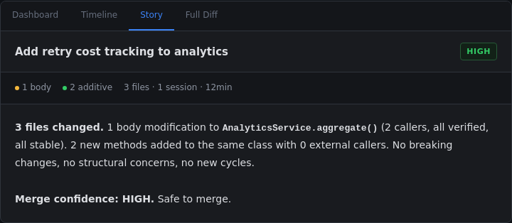

#### 11.13.2 Breaking Changes Across Multiple Sessions (Density Level 4)

Signature-breaking change to `ApprovalService.create_request()` with 7
callers across 3 modules — one unverified reference in `mcp/tools/approval_tool.py`
that uses dynamic dispatch. Two sessions, with a direction change in Session 2
that introduced the return-type break on `resolve()`. Full story: Attention
Required → Structural Concerns → What Changed (community-grouped) →
What Was Added (with scaffold blocks) → Session History → Verdict.

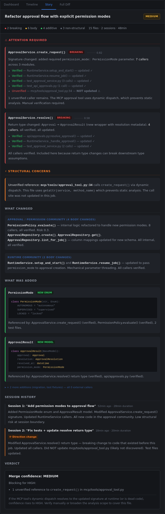

#### 11.13.3 Bulk Rename + Documentation (Density Level 2)

Fifty-three files but only 1 structural change (`BaseRepository.__init__()`
body modification). The 34-file rename collapses into a single metadata block.
Documentation and config formatting collapse into their own blocks. The story
surfaces the one real change and buries the noise.

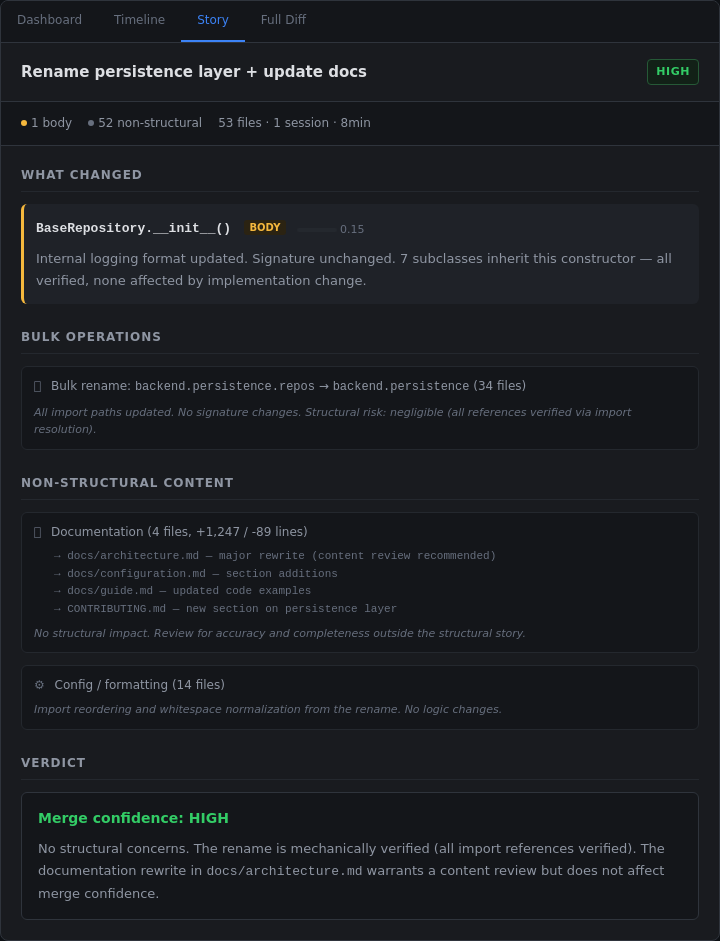

#### 11.13.4 Mixed Critical Logic + Bulk Content (Density Level 3)

Breaking change to `RuntimeService.setup_and_start()` (high fan-in entry
point) mixed with a new `CostAttributionService`, migration, docs, and tests.
The story leads with the breaking change, groups the analytics community
changes, shows the new service scaffold, then pushes migrations/docs/tests
into collapsed non-structural blocks. Verdict explains why MEDIUM despite
all callers being verified.

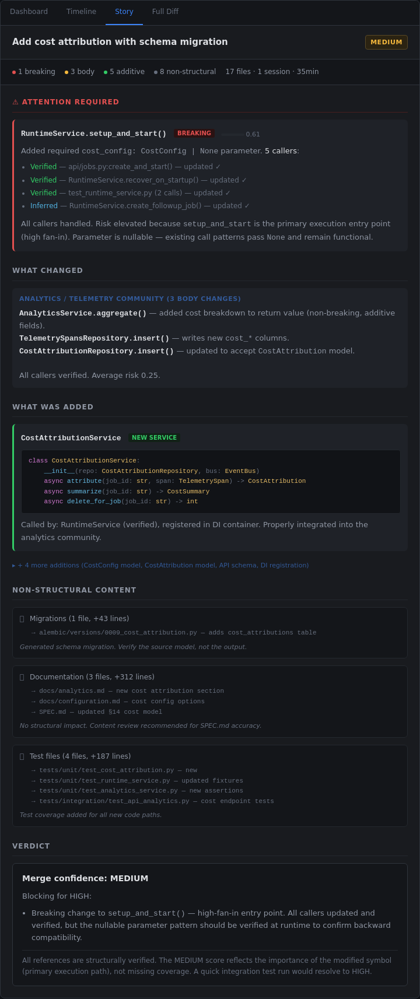

---

## 11A. The Agent Narrative

The Review Story (§11) answers "Is this safe to merge?" by analyzing what
changed in the code and where the structural risk lies. The Agent Narrative
answers a different question: "Do I trust this agent's judgment?" It puts
the reviewer inside the agent's head as it worked — what it explored, what
surprised it, where it changed course, and what it was uncertain about.

These are two distinct lenses on the same job. The Review Story is a forensic
analysis of the output. The Narrative is a documentary of the process.

### 11A.1 Why a Narrative Layer

Three research threads converge on the same conclusion: people understand and
trust complex processes better when they can follow the reasoning, not just
inspect the result.

**Literate programming (Knuth, 1984).** Programs are best understood as
"webs" of ideas explained in the order best for human comprehension — not
the order the compiler demands. The narrative is Knuth's "record of the train
of thought" applied to agent-executed work. He found that literate programs
were *better* than non-literate ones because the act of explaining forces
explicit reasoning.

**Explainable AI (XAI).** Trust requires three things: ability (the system
can do the job), reliability (it does it consistently), and benevolence (it
is trying to do right by you). The structural story demonstrates ability.
The narrative demonstrates benevolence and reliability — it shows the agent
catching its own errors, deliberating between alternatives, and flagging
uncertainty. The DARPA XAI program calls this the "glass box" model: the
operator can understand the system's cognition both in real time and after
the fact.

**Trust calibration (Google PAIR Guidebook).** "Users should not implicitly
trust the AI system in all circumstances, but rather calibrate their trust
correctly." A structural report that says "all callers verified" invites
over-trust. A narrative that says "I initially missed a dependency, caught
it during test verification, and fixed the DI wiring" calibrates trust to
the appropriate level — the agent is competent but not infallible, and it
has the judgment to self-correct.

### 11A.2 Narrative vs. Review Story vs. Existing Story Service

CodePlane already has three story-like features. The narrative sits alongside
them, not in competition:

| Layer | Question answered | Perspective | Data source | Time axis |
|---|---|---|---|---|
| **Review Story** (§11) | Is this safe to merge? | Third-person structural analysis | CodeRecon structural diff | Static snapshot of final state |
| **Agent Narrative** (§11A) | Do I trust this agent's judgment? | First-person cognitive journey | Trail enrichment, activity tracker, plan steps | Chronological arc through work |
| **StoryService** (existing) | What was edited and why? | First-person file-edit walkthrough | Telemetry spans, motivation summaries | Chronological file edits |
| **Trail Summary** (existing) | Quick status? | Third-person factual digest | Trail nodes (goals, decisions, backtracks) | Compressed summary |

The StoryService generates a per-file walkthrough with `[[N]]` embedded diff
cards and inline `` `code` `` spans for symbol names and expressions — "I added
a guard in `processOrder()` that checks `order.status`: [[3]]". The narrative
operates at a higher altitude: it covers the *intellectual journey* through the
task, including exploration, dead ends, direction changes, and verification
arcs. The StoryService output can be embedded *within* the narrative's execute
phases as the detailed diff layer.

### 11A.3 What Makes an Interesting Narrative

Not every agent action deserves narration. An agent that reads 40 files is
exploring; the interesting moments are the ones that reveal judgment:

| Beat type | Source data | Why it matters |
|---|---|---|
| **Decision** | `decide` semantic nodes (from trail enrichment) | Shows deliberate choice between alternatives |
| **Backtrack** | `backtrack` semantic nodes + `supersedes` linkage | Shows the agent was wrong and corrected course — the most trust-building beat |
| **Insight** | `insight` semantic nodes | Shows the agent discovered something non-obvious |
| **Approval gate** | `request` nodes + `ApprovalResolved` events | Shows where human judgment was required |
| **Verification failure** | `verify` nodes with "fail" in outcome | Shows the agent tested its own work and caught problems |
| **Direction change** | Activity boundary + plan step transition | Shows the task evolved from the original prompt |
| **Error and recovery** | `JobFailed` events, retry telemetry | Shows resilience (or lack of it) |

A job with zero decisions, zero backtracks, and zero approval gates has no
narrative worth telling. The tab should collapse to the executive summary
and point to the Review tab for the edit walkthrough. See mockup C.

### 11A.4 Narrative Structure

The narrative is chronological prose, not a phase-labeled document. Trail
beats (decisions, backtracks, insights) surface as colored aside blocks
woven into the timeline at the point they occurred. Activity groups
provide section structure when the job spans multiple work phases.

```text
Lede (one-paragraph summary of the task and why it matters)
    │
    ├── [Activity header — when multiple work phases exist]
    │     ├── Timestamp marker (session + relative time)
    │     ├── Read context (line ranges the agent examined)
    │     ├── Prose paragraph with findings and inline symbol references
    │     ├── Trail beat aside (DECIDE / BACKTRACK / INSIGHT / RETRY)
    │     ├── Inline diff block
    │     └── ... (more prose + beats as chronology demands)
    │
    ├── [Next activity header]
    │     └── ...
    │
    ├── Test results block
    └── Outcome paragraph (what was accomplished, what remains open)
```

Key structural elements:

**Lede.** One paragraph explaining *what the task was and why it
mattered* — not what the agent did. Always present, always first.

**Activity groups.** When the job has multiple distinct work phases
(from the activity tracker), changes are grouped under activity
headers: "Wire permission enum · 8 files". Single-activity jobs
omit the headers.

**Read context.** Compact `◀ file.py:12–47` citations showing the
exact lines the agent examined before writing. Rendered from
`file_read` telemetry spans (see §11A.11.1).

**Trail beat asides.** Color-coded left-border blocks for
`decide`, `backtrack`, `insight`, and `retry` nodes from trail
enrichment. Each names the constraint or finding that triggered
it. Asides are inline — they appear at the chronological point
where the agent made the decision, not in a separate section.

**Inline diffs.** Collapsed by default at Standard verbosity,
expanded at Detailed. Show the concrete code changes with
add/remove highlighting.

**Test results.** Pass/fail summary blocks. Always present if
the agent ran tests.

**Outcome.** What was accomplished, what remains open, what the
reviewer should manually verify. Appears after the final test
results.

### 11A.4.1 Prose Quality Principles

The narrative is only useful if the prose is better than reading raw diffs.
This requires non-trivial prompting:

**Lead with findings, not actions.** Every paragraph should open with what
the agent discovered, concluded, or decided — not what it did mechanically.
"The MCP caller uses dynamic dispatch" is a finding. "I read the MCP tool
file" is an action log entry. The reading is implied by the finding.
Read-context citations (the `◀ file.py:12–47` blocks from Layer 1) are
the exception — they appear as compact line-range markers *before* the
paragraph that describes what was found there. This is structural context,
not action narration.

**Specificity over summary.** "The model was carrying two different
concerns — the request and the outcome" tells the reviewer exactly what
was wrong. "I realized the model was becoming overloaded" tells them
nothing — they still have to read the code.

**Name the symbols.** Prose references concrete function names, class names,
and expressions using backtick-wrapped inline code — `validateInput()`,
`order.status`. The reader should know which symbol changed before they
see the diff card.

**Name the constraint.** Every decision should name what made it necessary.
"`recover_on_startup()` has no cost configuration available" is why the
parameter is nullable. Without the constraint, the decision is arbitrary.

**Mechanical work is one sentence.** Parameter threading across 8 files
is "Most of the work was mechanical — updating RuntimeService's two entry
points, the repository column mapping, and test fixtures." Not eight
paragraphs.

**Never narrate navigation.** "I opened X, then I searched for Y, then I
found Z" is never acceptable. The only thing that matters is Z.

### 11A.5 Verbosity Levels

The narrative supports three verbosity levels, matching StoryService's
existing convention:

| Level | Content | Target length |
|---|---|---|
| **Brief** | Executive summary + decisions/backtracks/insights only. No prose transitions, no diffs. | 80–150 words |
| **Standard** | Full arc with prose transitions between beats. Inline diffs collapsed. | 300–600 words |
| **Detailed** | Full arc with expanded diffs, exploration details, and alternatives considered at each decision point. | 600–1200 words |

The verbosity toggle appears in the tab header. Default is standard.

### 11A.6 Data Pipeline

No new data collection is required. The narrative is assembled entirely from
existing trail infrastructure:

```text
Trail Nodes (enriched)
  ├── goal, plan, insight, decide, backtrack, verify → arc beats
  ├── modify, explore, shell → phase classification
  ├── intent, rationale, outcome → prose fragments
  └── supersedes linkage → backtrack chains

Activity Tracker
  ├── activity groups → execute phase structure
  └── step titles → per-turn summaries

StoryService
  ├── [[N]] diff blocks → inline code cards
  ├── `backtick` spans → inline code references in prose
  └── motivation summaries (untruncated) → "why" annotations

Domain Events
  ├── ApprovalRequested/Resolved → approval gates
  ├── MergeConflict → trouble beats
  └── JobFailed → error arcs

SummarizationService
  └── decisions[], accomplished[] → resolve phase
```

Generation is a template + LLM hybrid (same approach as §11.7). The
template assembles the arc structure from deterministic data. The LLM
generates prose transitions between beats — converting "intent: add enum,
rationale: callers need explicit context" into "I made the parameter
required rather than optional. Every approval creation site should
explicitly declare its permission context."

Fallback when enrichment is incomplete: the narrative degrades to activity
titles + deterministic node data. Quality drops but the arc structure
survives.

### 11A.7 Relationship to the Review Tab

The Review tab (structural story from §11) and the Narrative tab answer
different questions and should cross-link:

- A breaking change in the Review tab links to the decision beat in the
  Narrative where the agent chose to make that change.
- An unverified reference in the Review tab links to the insight beat where
  the agent noted the dynamic dispatch pattern.
- A backtrack in the Narrative links to the diff in the Review tab showing
  the files that were re-modified.

The tab bar becomes: Dashboard | Timeline | **Narrative** | **Review** | Full Diff

"Narrative" is the agent's cognitive journey. "Review" is the structural
analysis. A reviewer can read either independently, or cross-reference
between them. For simple jobs, both may collapse to single paragraphs.

### 11A.8 Superseded

This section's visual reference has been replaced by the full scenario
gallery in §11A.12, which covers all narrative states including trail
beats, symbol hovers, selection-activated conversation, and activity
grouping.

### 11A.9 Anti-Patterns

| Anti-pattern | Risk | Mitigation |
|---|---|---|
| **The "everything went fine" non-narrative** | Boring, wastes time, reviewer skips the tab forever | Collapse to summary when decision+backtrack count is 0 |
| **Wall of text** | Overwhelming, defeats the purpose | Enforce word budget per verbosity level; collapse exploration and routine modifications |
| **Creative writing** | Patronizing, trust-destroying ("I elegantly refactored...") | System prompt enforces objectivity: no self-assessment, no hedging, no flair |
| **Action narration** | Tells the reviewer nothing they can't see in the timeline ("I read three files, then I searched for X") | Prose must lead with findings and insights, never with navigation or file-reading actions. See §11A.4.1. |
| **Fabricated reasoning** | The LLM invents rationale the agent never had | Narrative prose is constrained to trail node `intent`/`rationale`/`outcome` fields — these come from enrichment of actual transcript context, not from imagination |
| **Redundancy with Review tab** | Reviewer reads the same information twice | Narrative covers *process*; Review covers *output*. Cross-link rather than duplicate. |

### 11A.10 Open Questions

#### Decided

| Question | Decision | Rationale |
|----------|----------|-----------|
| Where does the existing StoryService output go? | Merged into the Narrative tab as the detailed-verbosity edit walkthrough | The Narrative already uses StoryService's diff blocks, symbol references, and motivation data. A separate "Story" tab would duplicate content. The tab bar is now `Dashboard \| Timeline \| Narrative \| Review \| Full Diff`. |
| How should multi-session narratives handle session boundaries? | Session breaks are timestamp markers and activity group boundaries, not discrete phase labels | If Session 2 redoes work from Session 1, the backtrack aside appears once at the point the agent changed course. Sessions fold into a single chronological flow. |
| Should the narrative use discrete labeled phases? | No — chronological prose with trail beat asides | The original arc model (`Goal → Explore → Plan → Execute → ...`) implied a phase-labeled document. The implemented design uses free-flowing chronological prose where trail beats surface as inline asides. This reads more naturally and handles jobs that don't follow a clean phase sequence. See §11A.4 and mockups A, D, G, H. |

#### Open

1. **Should the narrative be generated eagerly or on-demand?** The Review
   Story is generated post-completion (needs the full diff). The Narrative
   could be generated incrementally during execution — showing trail beat
   asides as they arrive via SSE as trail enrichment completes.

2. **Should the narrative support operator annotations?** A reviewer might
   want to mark a decision as "I disagree with this choice" — creating a
   record for future jobs. This intersects with the approval artifact
   (§11.11) and would need its own persistence model.

### 11A.11 Interactive Narrative Architecture

The narrative is not a static document. It is a living surface where every
code reference is interactive and the reviewer can converse with the agent
about any passage. Three layers build on top of the base narrative
generation (§11A.6) to create this experience.

#### 11A.11.1 Layer 1 — Read-Write Causality

**Problem.** The narrative says "I read auth.py" when the telemetry data
records exactly which lines were examined. Both agent SDKs (Copilot and
Claude) expose `startLine`/`endLine`/`view_range` on every file read tool
call. This data is persisted as `tool_args_json` on `job_telemetry_spans`
with `tool_category='file_read'`. The story service never queries it.

**Design.** For each `file_write` span, the story service queries
`file_read` spans from the same `turn_id` that precede the write
chronologically. Line ranges are extracted from `tool_args_json` and
attached to the `StoryReference` as structured read context:

```python
class ReadSpan(TypedDict, total=False):
    file: str
    startLine: int
    endLine: int

class StoryReference(TypedDict, total=False):
    # ... existing fields ...
    readContext: list[ReadSpan]
```

The prompt renders this as a "Read before writing" block per change, giving
the LLM concrete data to write "I examined `validate_token()` at lines
45–78 of auth.py" instead of "I read auth.py."

**Prompt instruction.** The GRANULARITY instruction replaces the generic
INLINE CODE section:

> Never say "I read file.py." You have the exact line ranges the agent
> examined. Name the region, the functions or classes found there, and
> what was discovered. When a read preceded a write, explain the causal
> chain. The reader should trace the agent's reasoning at the level of
> code regions, not filenames.

**Data source.** No new capture. Both SDKs already persist line-level read
granularity. The story service adds a query against `file_read` spans
grouped by `turn_id`.

#### 11A.11.2 Layer 2 — Symbol Index

**Problem.** The narrative references symbols like `` `validate_token()` ``
and `` `TokenConfig` `` using backtick-wrapped inline code. In the current
renderer, these are dead `<code>` spans — no interactivity, no way to see
what the symbol is, where it lives, or how the agent interacted with it.

**Design.** The LLM generates the symbol index as part of its single output
pass. After the narrative prose, it emits a `---SYMBOLS---` separator
followed by one line per referenced symbol:

```text
validate_token|auth.py|45|78|function|Validates JWT and returns Claims
TokenConfig|config.py|12|30|class|Token lifetime and signing settings
exp|auth.py|52||field|JWT expiration timestamp claim
```

Format: `name|file|startLine|endLine|kind|description`

The parser splits on `---SYMBOLS---`. Everything before is parsed as
narrative + `[[N]]` markers (existing logic). Everything after becomes a
`symbols` dict in the API response:

```typescript
interface SymbolEntry {
  file: string;
  startLine: number;
  endLine?: number;
  kind: string;
  description: string;
}

interface StoryResponse {
  blocks: StoryBlock[];
  symbols: Record<string, SymbolEntry>;
}
```

**Why LLM-generated, not regex.** Extracting symbol definitions from code
spans via regex is brittle across languages. The LLM already has every code
snippet and line range in its prompt context — it knows which symbols it
referenced and where they appear. The LLM outputs the index in a single
pass alongside the narrative. No post-processing, no second LLM call.

**Frontend rendering.** `renderInlineCode()` in `StoryBanner` looks up
each backtick span in the symbol index. If found, it renders as a
hoverable element using a `HoverCard`:

* **Trigger**: the symbol name, styled as interactive code
* **Content**: kind label, file:line location, one-line description,
  "View in diff →" jump link

If the symbol is not in the index, it renders as a plain `<code>` span.
Graceful degradation — the narrative reads identically whether or not the
index is present.

**Prompt instruction:**

> After your narrative, emit a line containing exactly `---SYMBOLS---`
> followed by one line per code symbol you referenced with backticks.
> Format: `name|file|startLine|endLine|kind|description` where kind is
> one of: function, class, method, field, type, variable, module,
> constant. endLine may be empty if unknown. description is ≤10 words.
> Only include symbols from the provided code context — never invent
> locations.

#### 11A.11.3 Layer 3 — Selection-Activated Conversation

**Problem.** The narrative is write-only. The reviewer can read it but
cannot ask "why did you choose JWT over sessions?" or "what else uses
this function?" The data to answer these questions exists in the trail
and telemetry — it just has no conversational surface.

**Interaction model.** The reviewer selects text in the narrative. A
floating action button appears at the selection: "Ask about this." Clicking
it opens a focused chat panel grounded in the selected passage.

```text
┌─────────────────────────────────────────────────────┐
│ [Story narrative text...]                           │
│                                                     │
│ I examined ████████████████████ and found            │
│ it wasn't ch██████████████████                      │
│         ┌──────────────────┐                        │
│         │ 💬 Ask about this │                        │
│         └──────────────────┘                        │
│                                                     │
│ ┌─────────────────────────────────────────────────┐ │
│ │ Re: "I examined validate_token..."              │ │
│ │                                                 │ │
│ │ Q: Why not check expiry at the middleware       │ │
│ │    level instead?                               │ │
│ │                                                 │ │
│ │ A: The agent considered middleware-level         │ │
│ │    validation but chose per-handler checks.     │ │
│ │    [trail beat: DECIDE] confirms it rejected    │ │
│ │    middleware because not all routes require     │ │
│ │    auth...                                      │ │
│ │                                                 │ │
│ │ [input: Ask a follow-up...]                     │ │
│ └─────────────────────────────────────────────────┘ │
└─────────────────────────────────────────────────────┘
```

**Grounding context assembly.** When the reviewer asks a question, the
system assembles a focused context — not the entire job history:

1. **Selected passage** — the highlighted text
2. **Adjacent story blocks** — narrative + reference blocks surrounding
   the selection
3. **Associated spans** — the `[[N]]` references near the selection,
   with their full span data (read context, write code, motivations)
4. **Related trail beats** — trail nodes whose files overlap with the
   referenced changes
5. **Symbol context** — entries from the symbol index mentioned in the
   selection
6. **Diff data** — the actual diff hunks for referenced files

**Endpoint:**

```text
POST /jobs/{job_id}/story/ask
{
  "question": "Why not check expiry at the middleware level?",
  "selectedText": "I examined validate_token at lines 45-78...",
  "blockIndices": [4, 5, 6],
  "spanIds": ["s3"]
}
```

The backend assembles grounding context from the referenced spans and
nearby trail nodes, calls the LLM with a system prompt that enforces
grounded answers ("cite specific trail beats and code regions, do not
speculate beyond the data"), and returns a response that renders with
the same symbol annotations from Layer 2.

**Thread model.** Each text selection opens a fresh conversation thread.
Follow-up questions within the thread carry forward. Selecting new text
or closing the panel starts a new thread. No persistent chat history
across selections.

**Responses use the same symbol rendering** — backtick-wrapped identifiers
in the answer are resolved against the story's symbol index. The
conversation surface has the same interactive code references as the
narrative itself.

#### 11A.11.4 Build Dependencies

Each layer is independently shippable and valuable:

| Layer | Ships | Depends on | Impact |
|---|---|---|---|
| L1: Read-write causality | Backend only | Nothing | Prose quality: "lines 45–78" instead of "auth.py" |
| L2: Symbol index | Backend + Frontend | L1 (richer data produces better index) | Every code reference becomes hoverable |
| L3: Conversation | Backend + Frontend | L2 (symbol rendering in responses) | The narrative becomes a dialogue surface |

### 11A.12 Visual Reference: Full Scenario Gallery

The mockups below show nine scenarios covering the full range of narrative
states — from clean jobs through complex multi-session arcs, retry chains,
trail beat integration, activity grouping, symbol hover interactions,
selection-activated conversation, and all three verbosity levels (Brief,
Standard, Detailed).

Source HTML:
[mockups/agent-narrative-mockups-v3.html](mockups/agent-narrative-mockups-v3.html)

#### 11A.12.1 Full Narrative — Multi-Session with Backtrack (Standard)

Two sessions, 48 minutes. The agent added permission modes to the approval
service, then changed course mid-job. Demonstrates trail beats (DECIDE,
BACKTRACK), read-write causality (lines 12–47 of approval_service.py),
activity grouping ("Wire permission enum", "Extract ApprovalResult"), and
interactive symbol references.

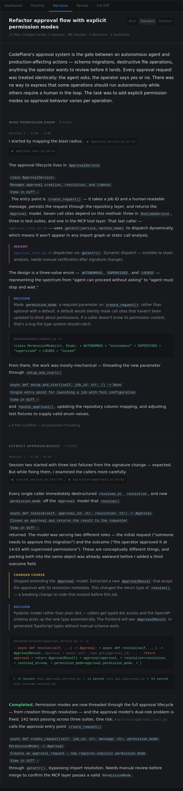

#### 11A.12.2 Brief Verbosity — Same Job, Compressed

Same job as A at Brief verbosity. Trail beats surface as compact aside
blocks. Symbols remain hoverable. Activity groups collapse into the lede.

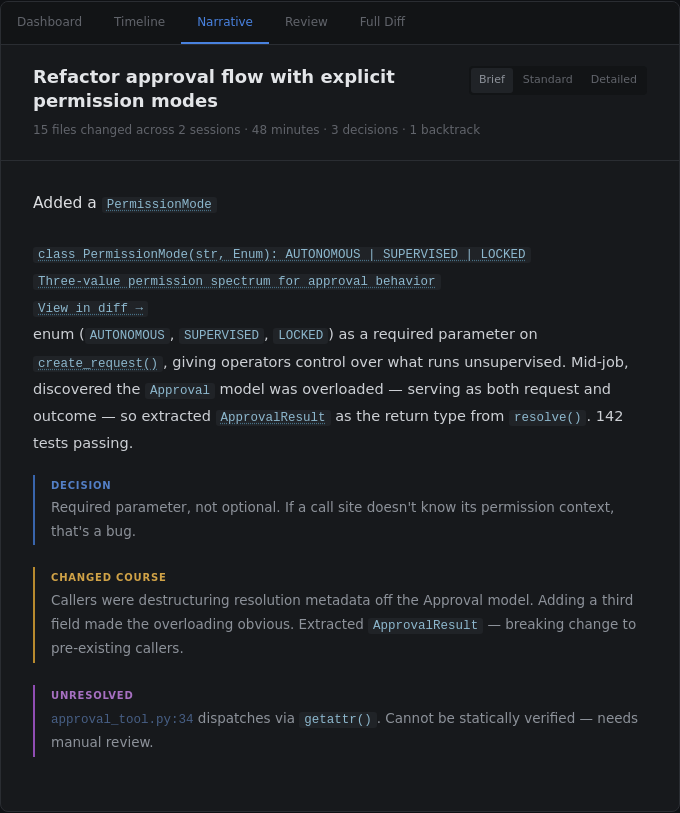

#### 11A.12.3 Small Clean Job — Narrative Collapses

Three files, 12 minutes, zero decisions, zero backtracks. No trail beats
to narrate. Read context shows the agent examined specific regions before
writing. Symbols are still interactive.

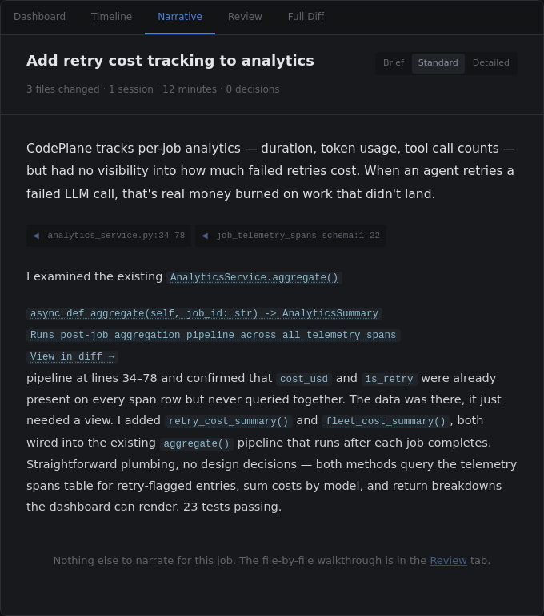

#### 11A.12.4 Error, Retry, and Recovery Arc

Single session. Agent hit a test failure, diagnosed it, fixed it, and
re-verified. Retry chain shown explicitly: first attempt failed with
`TypeError`, second succeeded after DI fix. Trail beat: INSIGHT about
the root cause.

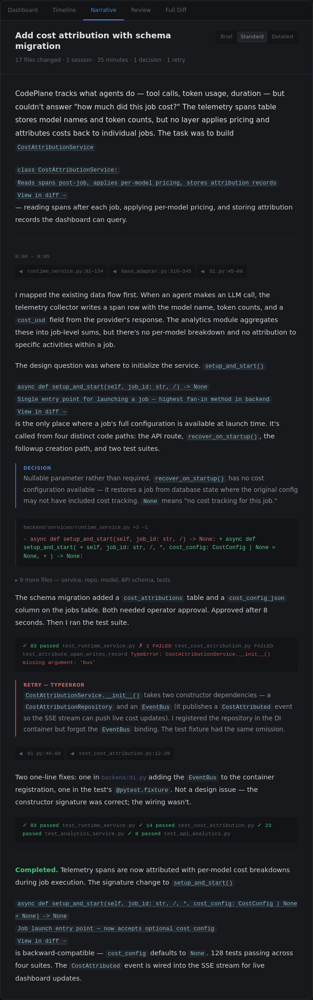

#### 11A.12.5 Symbol Hover — Interactive Code Reference

Demonstrates the Layer 2 symbol index interaction. Hovering
`` `validate_token()` `` shows: function signature, file:line location,
read/write context, and a "View in diff →" jump link. The popover uses
the same dark card chrome as the rest of the UI.

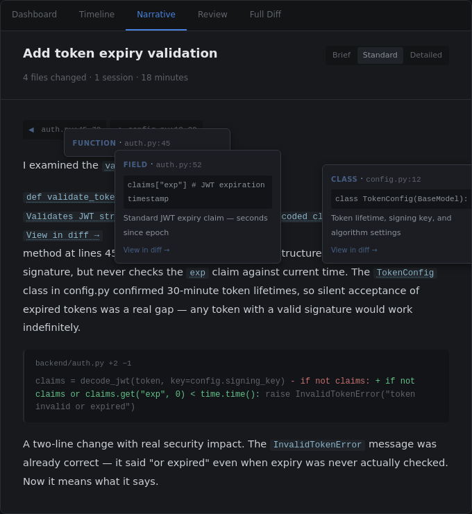

#### 11A.12.6 Selection-Activated Conversation

Demonstrates the Layer 3 interaction. The reviewer selects a passage about
a design decision, clicks "Ask about this," and asks a follow-up question.
The response cites a specific trail beat and references code regions with
the same hoverable symbols.

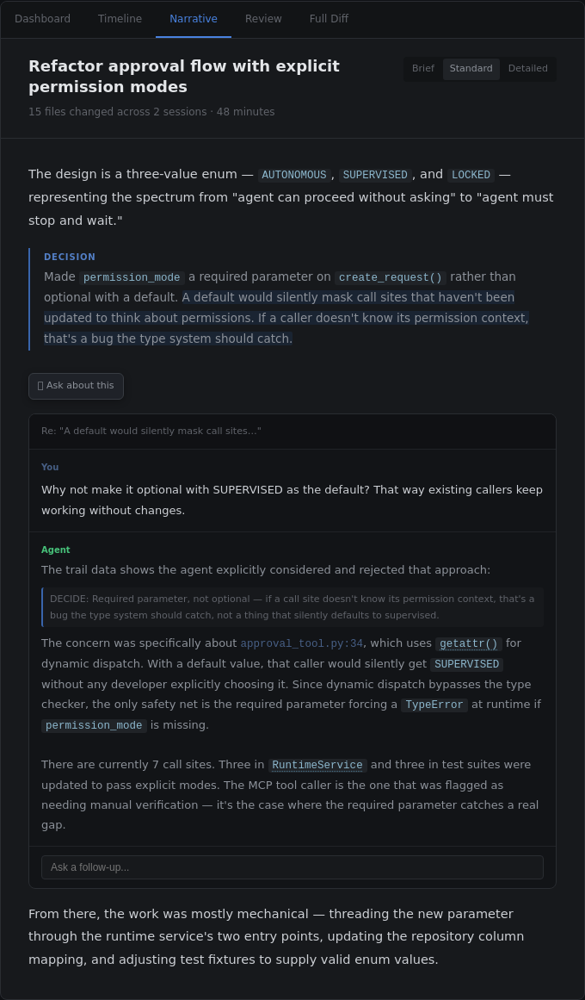

#### 11A.12.7 Activity-Grouped Narrative

A job with two distinct work phases: "Implement cost tracking" (service,
repo, model) and "Fix test infrastructure" (fixtures, DI wiring). Changes
are grouped under activity headers. Trail beats appear at activity
boundaries showing the transition.

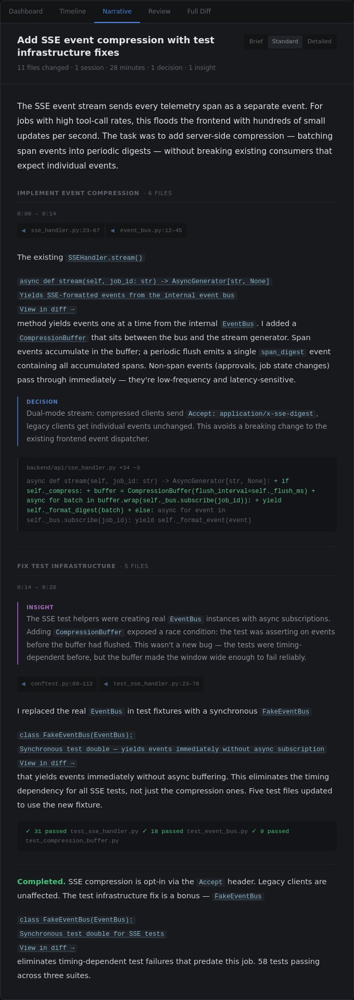

#### 11A.12.8 Multi-Decision Trail

A complex job with three sequential decisions, each building on the last.
The narrative weaves trail beats into the chronological flow rather than
listing them separately. Demonstrates DECIDE → INSIGHT → DECIDE chains.

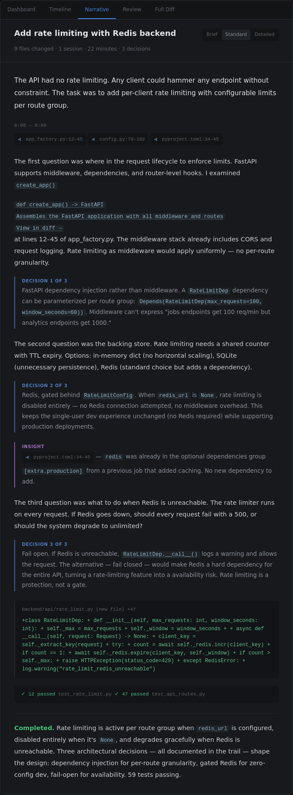

#### 11A.12.9 Detailed Verbosity — Same Job as A & B, Fully Expanded

Same approval-flow job at Detailed verbosity. All diffs are expanded inline
(not collapsed). Exploration reads are shown with full context. Each decision
includes an "Alternatives considered" block listing rejected approaches with
rationale. The MCP tool dynamic-dispatch diff is shown explicitly rather
than summarized. This is the maximum-information rendering — every code
change visible, every trade-off documented.

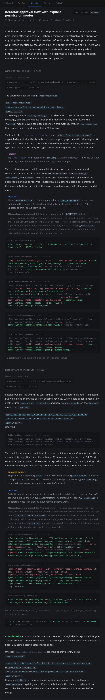

---

## 12. Event Bridge

### 12.1 Three-Layer Pipeline

```text
CodeRecon Daemon (NDJSON events on stdio)
    │
    ▼
CodeReconService (translates to domain events)
    │
    ▼
Event Bus (publishes typed events)
    │
    ▼
SSE Handler (pushes to frontend)
```

### 12.2 Event Mapping

| Daemon Event | Domain Event | SSE Event Type | Payload |
|-------------|--------------|----------------|---------|
| `index_progress` | `RepoIndexProgress` | `repo_index_progress` | repo, phase, pct |
| `index_complete` | `RepoIndexComplete` | `repo_index_complete` | repo, duration, stats |
| `index_error` | `RepoIndexError` | `repo_index_error` | repo, error, phase |
| `file_changed` | `RepoFileChanged` | (internal only) | repo, path, kind |
| `daemon_health` | `CodeReconHealthUpdate` | `coderecon_health` | status, uptime |
| `cycle_detected` | `StructuralCycleDetected` | `structural_warning` | job_id, cycle |
| `community_drift` | `CommunityDriftWarning` | `structural_warning` | job_id, communities |

### 12.3 Job-Scoped Events

During active jobs, structural events are scoped to the job that triggered them.
The frontend can subscribe to job-specific SSE channels and receive only
relevant structural signals.

---

## 13. Data Flow Diagrams

### 13.1 Repo Onboarding

```text
Operator                Frontend              Backend                  Daemon
   │                       │                     │                       │
   ├──"Add repo"──────────►│                     │                       │
   │                       ├──POST /repos────────►│                       │
   │                       │                     ├──add_repo(path)───────►│
   │                       │                     │                       ├── index begins
   │                       │◄─── SSE: progress ──┤◄── index_progress ────┤
   │                       │◄─── SSE: progress ──┤◄── index_progress ────┤
   │                       │◄─── SSE: complete ──┤◄── index_complete ────┤
   │                       ├── UI: "Ready" ──────►│                       │
   │◄──repo card updated───┤                     │                       │
```

### 13.2 Job Start Through Review

```text
Operator starts job
   │
   ▼
RuntimeService.start_job()
   ├── CodeReconService.checkpoint(repo, "baseline")     ← structural baseline
   ├── CodeReconService.recon(repo, task)                ← context for agent
   └── agent session begins
          │
          ├── (step boundaries)
          │    └── CodeReconService.graph_cycles(repo)   ← cycle check
          │
          ▼
       job completes
          │
          ▼
   CodeReconService.semantic_diff(repo, baseline, HEAD)  ← full structural diff
          │
          ▼
   Review dashboard populated with structural triage
          │
          ▼
   Operator reviews via Verification Dashboard
          │
          ▼
   CodeReconService.semantic_diff(repo, merge_base, HEAD) ← merge confidence
          │
          ▼
   Merge (auto or manual based on confidence)
```

### 13.3 On-Demand Drill-Down

```text
Operator clicks "Impact Graph" on a change card
   │
   ▼
Frontend: GET /api/repos/{repo}/symbols/{id}/references
   │
   ▼
Backend: CodeReconService.recon(repo, symbol_query, depth=2)
   │
   ▼
Daemon: multi-hop reference traversal from index
   │
   ▼
Response: graph nodes with tier annotations
   │
   ▼
Frontend: renders interactive impact graph
```

---

## 14. API Surface

### 14.1 Repo-Level Endpoints

| Method | Path | Purpose |
|--------|------|---------|
| POST | `/api/repos` | Add repository + begin indexing |
| GET | `/api/repos` | List all repos with health status |
| GET | `/api/repos/{name}` | Single repo detail + index status |
| DELETE | `/api/repos/{name}` | Remove repo + delete index |
| POST | `/api/repos/{name}/reindex` | Trigger full re-index |
| GET | `/api/repos/{name}/health` | Detailed health (staleness, tier coverage, stats) |
| GET | `/api/repos/{name}/communities` | Module community listing |
| GET | `/api/repos/{name}/cycles` | Dependency cycle listing |

### 14.2 Job-Level Endpoints

| Method | Path | Purpose |
|--------|------|---------|
| GET | `/api/jobs/{id}/structural-diff` | Semantic diff for job (baseline→HEAD) |
| GET | `/api/jobs/{id}/structural-diff/sessions` | Per-session semantic diffs |
| GET | `/api/jobs/{id}/merge-confidence` | Merge confidence score + breakdown |
| GET | `/api/jobs/{id}/impact-graph/{symbol_id}` | Reference graph for a symbol |
| GET | `/api/jobs/{id}/scaffold/{path}` | Scaffold view for a file |
| GET | `/api/jobs/{id}/triage` | Categorized change summary (breaking/body/additive/non-structural) |

### 14.3 Response Schemas

```python
class SemanticDiffResponse(CamelModel):
    base_sha: str
    head_sha: str
    changes: list[StructuralChange]
    summary: TriageSummary

class StructuralChange(CamelModel):
    symbol_id: str
    symbol_name: str
    symbol_kind: str  # function, class, method, module
    file_path: str
    line_range: tuple[int, int]
    change_type: str  # breaking, body, additive, non_structural
    ref_count: int
    ref_tiers: RefTierBreakdown
    test_files: list[str]
    risk_score: float
    session_id: str | None  # which session introduced this change

class RefTierBreakdown(CamelModel):
    proven: int
    strong: int
    anchored: int
    unknown: int

class TriageSummary(CamelModel):
    breaking: int
    body: int
    additive: int
    non_structural: int
    total_risk: float
    high_risk_count: int  # changes with risk > 0.7

class MergeConfidence(CamelModel):
    level: str  # HIGH, MEDIUM, LOW
    score: float
    factors: list[ConfidenceFactor]
    recommendation: str  # "Safe to auto-merge" | "Manual review recommended" | ...

class ConfidenceFactor(CamelModel):
    name: str
    value: float
    detail: str
```

### 14.4 SSE Events Summary

| Event Type | Payload | When |
|------------|---------|------|
| `repo_index_progress` | repo, phase, pct, files_done, files_total | During indexing |
| `repo_index_complete` | repo, duration_ms, file_count, symbol_count | Index finished |
| `repo_index_error` | repo, error, phase | Index failure |
| `coderecon_health` | status, daemon_uptime, active_repos | Periodic (30s) |
| `structural_warning` | job_id, warning_type, detail | During job execution |
| `merge_confidence_ready` | job_id, level, score | After job completion |

---

## 15. Frontend Architecture

### 15.1 Component Tree

```text
<ReviewView>
  ├── <ViewModeTabs />          [Dashboard | Timeline | Narrative | Review | Full Diff]
  ├── <TriageBar />             Visual category summary
  ├── <ChangeList>
  │     ├── <CommunityGroup>
  │     │     ├── <ChangeCard />
  │     │     ├── <ChangeCard />
  │     │     └── ...
  │     └── <CrossCommunityWarning />
  ├── <ImpactGraphPanel />      Drill-down (opens on card click)
  ├── <ScaffoldPanel />         Compact view for low-risk files
  └── <MergeConfidenceBar />    Bottom bar with score + action
```

### 15.2 Zustand Store Extensions

```typescript
interface CodeReconSlice {
  // Repo state
  repos: Record<string, RepoState>;
  repoIndexProgress: Record<string, IndexProgress>;

  // Job structural state
  jobStructuralDiff: Record<string, SemanticDiffResponse | null>;
  jobMergeConfidence: Record<string, MergeConfidence | null>;
  jobTriageFilter: ChangeType | null;  // current triage filter

  // Actions
  fetchStructuralDiff: (jobId: string) => Promise<void>;
  fetchMergeConfidence: (jobId: string) => Promise<void>;
  setTriageFilter: (filter: ChangeType | null) => void;

  // SSE handlers
  onRepoIndexProgress: (event: RepoIndexProgressEvent) => void;
  onStructuralWarning: (event: StructuralWarningEvent) => void;
}
```

### 15.3 View Modes

| Tab | Content | Data Source |
|-----|---------|-------------|
| Dashboard | Structural triage + change cards + risk | `/jobs/{id}/triage` + `/jobs/{id}/structural-diff` |
| Timeline | Per-session structural changes | `/jobs/{id}/structural-diff/sessions` |
| Narrative | Agent cognitive journey (see §11A) — trail beats, decisions, read-write causality, interactive symbols, selection-activated conversation | `/jobs/{id}/story` (async LLM generation via StoryService) |
| Review | Structural review story (see §11) — reads top-to-bottom as a structural change report with merge confidence | `/jobs/{id}/review-story` (async LLM generation) |
| Full Diff | Monaco diff viewer with structural overlays | Existing diff + structural annotations |

The Dashboard tab is the default. The Narrative and Review tabs generate on
first visit (~5–10s each) and cache until the job's diff changes. All tabs
degrade gracefully when CodeRecon is unavailable (daemon down or repo not
indexed).

### 15.4 DiffViewer Structural Overlays

When viewing full diffs, inline badges annotate changed functions:

```text
── backend/services/auth.py ──────────────────── Session 1 + Session 2 ──

  def validate(self, token: str, scope: str) -> bool:    ← BREAKING │ refs: 7 │ risk: 0.8
      """Validate token against scope."""
+     if not self._rate_limiter.allow(token):
+         raise RateLimitExceeded(token)
      decoded = self._decode(token)
      ...
```

Badges show: change type, ref count, risk level. Session ownership markers
appear on file headers for multi-session files.

---

## 16. Repository Settings and Configuration

### 16.1 Per-Repo Settings

| Setting | Default | Purpose |
|---------|---------|---------|
| `index_tiers` | `[0, 1]` | Which tiers to build (Tier 2+ is expensive) |
| `auto_reindex` | `true` | Whether file watchers trigger incremental re-index |
| `agent_tools` | `"standard"` | Tool set provisioned to agents (`minimal` / `standard` / `full`) |
| `cycle_check_on_step` | `true` | Run cycle detection at step boundaries |
| `community_drift_threshold` | `3` | Community count that triggers drift warning |
| `merge_confidence_auto` | `false` | Whether HIGH confidence allows auto-merge |

### 16.2 Global Settings

| Setting | Default | Purpose |
|---------|---------|---------|
| `coderecon_enabled` | `true` | Master switch for all CodeRecon features |
| `daemon_restart_max` | `3` | Max restart attempts before degraded mode |
| `daemon_health_interval` | `30` | Seconds between health checks |
| `index_parallelism` | `2` | Max repos indexing concurrently |

### 16.3 Database Schema Extensions

```python
class RepoRow(Base):
    __tablename__ = "repos"

    id: Mapped[str] = mapped_column(primary_key=True)
    name: Mapped[str] = mapped_column(unique=True)
    path: Mapped[str]
    added_at: Mapped[datetime]

    # CodeRecon state
    index_status: Mapped[str]       # pending, indexing, ready, error, degraded
    index_tiers: Mapped[str]        # JSON array of completed tiers
    last_indexed_sha: Mapped[str | None]
    last_indexed_at: Mapped[datetime | None]
    symbol_count: Mapped[int]
    file_count: Mapped[int]
    community_count: Mapped[int]
    cycle_count: Mapped[int]

    # Settings (JSON)
    settings: Mapped[str]           # JSON blob of per-repo settings
```

---

## 17. Migration Strategy

Six phases, each independently shippable. The system works correctly after
each phase — it just gains more structural intelligence.

### Phase 1: Foundation

* `CodeReconService` class with daemon lifecycle management
* Lifespan integration (start/stop with CodePlane)
* Crash recovery and graceful degradation
* Repo CRUD (add/remove/list) with index progress events
* Event bridge for index progress → SSE
* Database schema extension for repo state
* Global and per-repo settings

**Deliverable**: Operators can add repos and see indexing progress. No job
integration yet.

### Phase 2: Review Dashboard

* `semantic_diff` integration at job completion
* Triage categorization (breaking/body/additive/non-structural)
* Risk scoring pipeline
* Verification Dashboard frontend component
* Change cards with ref counts and tier breakdowns
* Impact graph drill-down
* Scaffold view for low-risk files
* Merge confidence score

**Deliverable**: Operators review completed jobs with structural intelligence.

### Phase 3: Multi-Session

* Per-session `semantic_diff` at session boundaries
* Timeline view with per-session structural summaries
* Direction change detection
* File ownership tracking
* Messy session warnings
* Session annotations in DiffViewer

**Deliverable**: Multi-session jobs show per-session structural breakdown.

### Phase 4: Agent Tools

* Tool provisioning at job start
* `recon`, `scaffold`, `checkpoint`, `semantic_diff` available to agents
* Tool usage tracking in trail nodes
* Configurable tool sets per repo

**Deliverable**: Agents can query structural context during execution.

### Phase 5: Execution-Time Signals

* Cycle detection at step boundaries
* Community drift warnings
* Structural checkpoint snapshots
* Real-time structural warnings via SSE

**Deliverable**: Operators see structural warnings during execution, not just
at review time.

### Phase 6: Repo Health and Analytics

* Repo health dashboard (staleness, tier coverage, stats)
* Community visualization
* Cycle visualization
* Historical structural analytics (coupling trends, test correlation)
* Structural story enrichment

**Deliverable**: Full structural observability across repository health and
job history.

---

## 18. Open Questions

### Decided

| Question | Decision | Rationale |
|----------|----------|-----------|
| Protocol | NDJSON over stdio | SDK spec mandates it. Zero-config, secure. |
| Daemon lifecycle | Child process of CodePlane | Dies with parent. Clean boundaries. |
| Index scope | Per-repo, worktree-partitioned | SDK design. One daemon serves all. |
| Review default view | Structural dashboard | Primary value proposition. Full diff is fallback. |

### Open

| Question | Recommendation | Risk if Wrong |
|----------|---------------|---------------|
| Tier 2 by default? | No — opt-in per repo. Expensive for large repos. | Slow onboarding for new repos. |
| Auto-merge at HIGH confidence? | Opt-in per repo. Conservative default. | Operator trust erosion if false positive. |
| Cycle check frequency | Every step boundary | Performance cost on large graphs. May need sampling. |
| Community detection algorithm | Louvain (SDK default) | May not match operator's mental model of modules. |
| Scaffold depth | 2 levels (classes + methods) | Too shallow misses nested structure. Too deep loses compactness. |
| Index storage location | Same machine as CodePlane | Can't share index across distributed deployments. |
| Staleness threshold tuning | 30s/5m defaults, configurable | Too aggressive = noise. Too lax = stale reviews. |
| Story enrichment model | Same model as existing story generation | May need different prompt structure for structural facts. |
